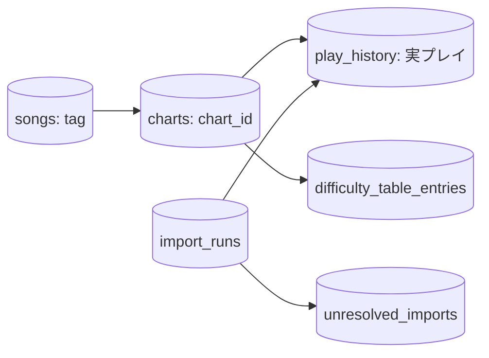

# IIDXProgressDashboard 仕様

更新：2026-09-30。対象：Beta3時点で確定したv1設計と、v1完了までの残範囲。実装済みかどうかは[Phase 1～6の統合解説](docs/README.md)と対応Issueで確認する。この文書は現行の設計契約を記し、当初案・検証時点の観測値を現行仕様として併記しない。旧仕様文書の全文は[整理前の記録](docs/archive/specs-v1-before-consolidation.md)に保存する。

## 目的と適用範囲

IIDX / INFINITASの**実際の1プレイを1履歴行**として保存し、クリア状況、スコア・BP推移、難易度表の進捗を表示するWindowsアプリケーションとする。悪化したプレイ、同じ内容の別プレイ、ランプ0でスコアのあるプレイも保持する。best一覧から架空の履歴を生成しない。

v1の入力は楽曲・譜面マスター、非公式難易度表、旧SQLite履歴、Reflux Session TSV。打鍵カウンタbest CSV、Reflux全曲best/tracker TSV、KONAMI公式CSVとPickleの直接取込は対象外。最終的な通常動作は新形式の`iidx-progress.db` 1ファイルを使い、Pythonや旧2DBを実行時依存としない。

## 識別子とデータモデル

- 曲の識別は`songs.tag`、譜面の内部識別は`charts.chart_id`。外部との標準的な譜面識別は`(tag, play_style, difficulty)`で一意とする。SP/DPとB/N/H/A/Lを区別し、曲名、level、Notesを内部IDにしない。履歴の取得・集計は`chart_id`単位。
- `play_history`には実プレイのスコア、ランプ、BP、日時、取得できた当時のlevel・Notesとオプション等を保存する。不明な任意項目はNULLとし、BP 0とは区別する。元データは`raw_data`に保全し、通常の集計には変換済み列を使う。
- 再計算可能な最高ランプ、ベストスコア、最小BP、最終日時、回数、Score Rate、DJ LEVELと進捗は初期実装で永続化しない。元の実スコアと当時Notesを書き換えない。
- DDLの正本は[001_initial.sql](Database/Migrations/001_initial.sql)と[002_external_song_ids.sql](Database/Migrations/002_external_song_ids.sql)。`schema_migrations`で版を管理する。SQLite外部キーは接続ごとに有効化し、SQL値にはパラメーターを使う。スキーマと変更・復旧の説明は[Phase 1](docs/phase1.md)を参照。
- `external_song_ids`は既存tagへの補助対応であり、内部song_idを新設しない。IDが変わっても保存済み履歴を自動付替えしない。

### ランプと未プレイ

| 値 | 意味 |
| ---: | --- |
| 0 | NO_PLAY |
| 1 | FAILED |
| 2 | ASSIST_CLEAR |
| 3 | EASY_CLEAR |
| 4 | CLEAR |
| 5 | HARD_CLEAR |
| 6 | EX_HARD_CLEAR |
| 7 | FULL_COMBO |

RefluxのPFCは7。ランプ0の**履歴あり**はプレイ済みで、**履歴なし**の未プレイと区別する。未知のランプを0へフォールバックしない。

## マスター取得・更新・照合

楽曲・譜面マスターはTextageの対象入力を検査・解析し、完全性と更新所有範囲を確認したうえで反映する。songsはtag、chartsは`(tag, play_style, difficulty)`をキーにUPSERTし、既存`chart_id`と履歴参照を維持する。完全取得で対象範囲から消えた曲・譜面は`is_active=0`とし、再登場時は同じ識別子で再有効化する。不完全取得・取得障害・不正入力から一括非アクティブ化を推測しない。

曲名は原表記と照合用正規化を分ける。共通のTitleNormalizer、aliasとChartResolverは曲名・tag・譜面条件・取得できたlevel/Notesを照合する。候補なし、複数候補、不正difficulty、level/Notes矛盾は理由と元行を`unresolved_imports`へ送る。非アクティブ譜面も過去履歴の候補にできる。外部楽曲IDは補助証拠とし、主経路と別曲を指す矛盾や外部側のみの一致は自動確定しない。確定済みのカタログ外18タグは完全一致で候補から除外し、診断を残す。詳細は[Phase 2](docs/phase2.md)。

## Importerの共通契約

ImporterはParse → Normalize → Resolve chart → Validate → Insertの責務を持ち、UIと集計を持たない。入力原本は読取専用で保全し、入力と出力の絶対パスおよび同一実体を検査する。処理可能な行を推測で捨てず、不正・未解決・競合の元行と理由を監査する。

`UNIQUE(source_system, source_record_key)`で**同じ元行の再取込**を冪等にする。元行の内容一致、日時の近さ、スコア一致によって別の実プレイを統合しない。履歴・未解決状態・件数と正常終了ログは定めたトランザクションで一括確定する。障害時はロールバックし、可能ならFAILEDを別途記録する。バックアップ失敗、ログ保存失敗、残存RUNNINGを成功扱いしない。共通のDB保全は[Phase 1](docs/phase1.md)、個別の境界は[Phase 3](docs/phase3.md)・[Phase 4](docs/phase4.md)。

### 旧SQLite履歴

`LEGACY_INFINITAS_LOG`は旧`play_history`の11列形式と`song_tag`付き12列形式を正式入力とする。自動候補は旧形式`iidx-progress.db`を優先し、`infinitas_log.db`も対応する。両DBを自動連結せず、優先候補が不正なら黙って切り替えない。ファイル名だけで新旧スキーマを判定しない。

呼出側が初回に発行・保存した移行元GUID＋旧idをキーとする。コピー・改名は同じID、別DBは別ID。同じキーで元列が変わったら競合保留とし、既存履歴を上書きしない。原行が不変な未解決行は再照合できる。旧日時`yyyy-MM-dd-HH-mm`はJST（UTC+09:00）としてUTCに変換する。秒00は保存形式の埋め値で、元日時・分精度・時刻帯を`raw_data`に保持する。旧`original_data`は元行JSON内で文字列のまま保存する。旧ランプ表記、TEXT level、BP NULL/0の変換と実入力検証は[Phase 3](docs/phase3.md)。

### Reflux Session TSV

`REFLUX_SESSION_TSV`はSessionファイルを入力単位とする。必須ヘッダーは`title`、`difficulty`、`lamp`、`exscore`、`date`。列番号固定で読まない。`lamp`は結果、`gauge`は使用ゲージであり、相互に推測しない。BPの`-`はNULL。best一覧の`reflux.tsv`は履歴として読まない。

初回発行して保存するSession GUID＋データ行番号をキーとする。コピー・改名は同じID、別Sessionは別ID。rolling hashは既存prefixの変更検出に用いる。途中編集・削除・列変更・既存時刻設定変更ではSession全体の追加を保留し、受理済み基準と履歴を保全する。UTF-8 BOM有無とLF/CRLF差は同一性を維持する。時刻はUTCが初期値、Localには明示TimeZoneIdを必須とし、曖昧・存在しない夏時間は不正行にする。対象の暫定1.17.0実SessionはUTC出力と確認済み。詳細は[Phase 4](docs/phase4.md)。

## 非公式難易度表

SP☆11 NORMAL/HARDはWiki、SP☆12 NORMAL/HARDは`iidx-sp12.github.io/songs.json`を採用元とする。表・ランク・エントリーを独立の識別子で保持し、`charts`に非公式難易度を埋め込まない。☆12の空評価UNRATEDとWikiの未定UNDECIDEDを区別する。表のNORMAL/HARDは譜面難易度のN/Hではない。

取得・解析・照合・差分確認・反映を分ける。完全取得かつ有効な表は一意に照合できた正常行を反映し、照合未解決は元行を保持する。不完全取得、不正、重複競合は表全体を保留する。前回からの消失が1件でもあれば具体的な差分の確認までHELDとし、確認後も欠落エントリーを削除しない。保持評価と今回確認できた評価を区別する。再処理は現在受理した世代だけを対象とし、古い評価へ逆戻りさせない。詳細と検証は[Phase 5](docs/phase5.md)。

## UI・算出値

Phase 6の表示は`chart_id`を起点にし、履歴なしの譜面も表示する。ランク集計は最高ランプ、譜面一覧の「直近ランプ・スコア・BP」は同じ最新1プレイの値とする。直近BP NULLを過去値や最小BPで補わない。最小BPは有効なBPのみから計算し、全件NULLならNULL。ランプ0で履歴ありと履歴なしは別枠にする。

Score RateとDJ LEVELの通常表示は**現行譜面のNotes**を分母とする。当時Notesは履歴として保持する。現行NotesがNULLまたは0なら計算不能とし、当時Notesへ自動フォールバックしない。理論値`2 × 現行Notes`を超える保存スコアは生値を示し、算出値だけを計算不能にする。Score Rateは`score / (2 × Notes) × 100`を小数点以下2桁へ四捨五入して表示する。DJ LEVELは丸め前の整数比較で理論値の2/9～8/9を境界とし、F・E・D・C・B・A・AA・AAAに分類する。日時はUTC保存し、画面ではOSローカル時刻と使用ゾーンを示す。時系列は日時に安定した第二キーを加えて整列し、同時刻内の実際の先後が不明な場合を区別する。

スコア・BPグラフは実履歴に割り当てた1..Nのプレイ番号を共有する。BP NULLは点を作らず、有効点の間は接続して番号を詰めない。履歴の表示フィルタはDB行と集計を変更しない。Beta2のReflux取込、Beta3のPENDING案内・元行単位の手動確定も含め、実装範囲と検証の限界は[Phase 6](docs/phase6.md)を参照。

## 実装状態とv1完了条件

Phase 1～5の基盤API、Phase 6 Beta1～3の準備済みDBを使う表示・Reflux取込・未解決履歴の手動確定は実装済み。これを全入力の通常運用接続やv1全体の完了と同一視しない。未完了項目は対応Issueに残し、各[Phase文書](docs/README.md)に現在の主な残課題を示す。

v1完了には、通常の保存先と起動時初期化、マスター・旧履歴・Reflux・難易度表の運用導線、未解決・失敗・復旧の案内、chart単位の表示を通常利用で確認することが必要である。旧Pythonと旧2DBを通常実行から外し、対象RIDで.NET 8 self-contained / single-fileを検証する。`System.Windows.Forms.DataVisualization`のGAC参照とWebView2 Runtime・Loader等の配布条件を確認し、Python・旧2DBがない環境で起動、取込、表示を検証する。publish成功だけで完了とはしない。

旧履歴の複数DB調停、登録済み履歴の訂正、譜面改定と誤照合の区別、同名複数tagの追加根拠、外部IDの実データでの価値、難易度表未解決行の手動判断は未完了であり、根拠なく自動確定しない。新しい仕様判断が必要なら、対応Issueと既存元行・履歴の保全を確認して決める。
