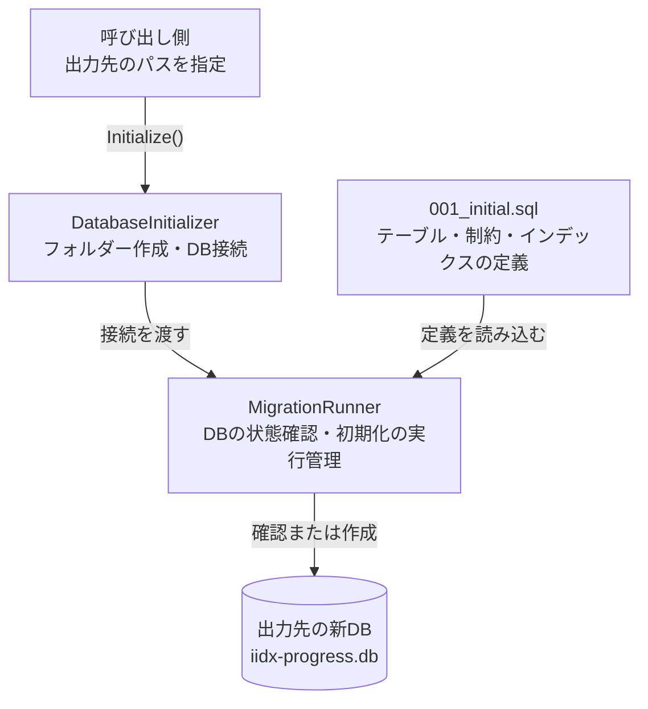
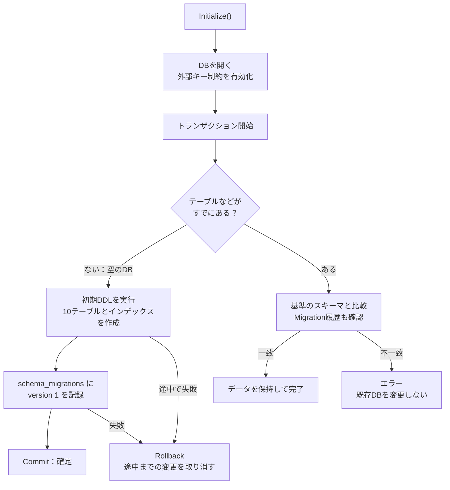
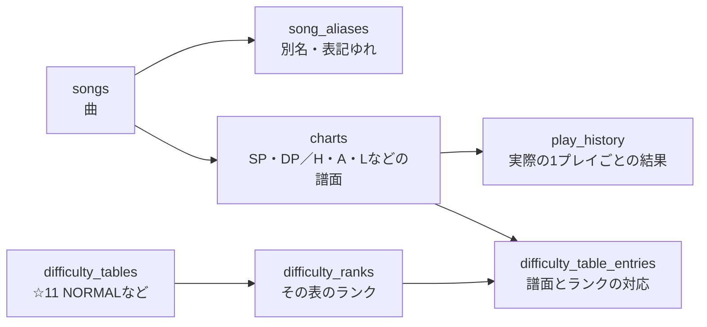
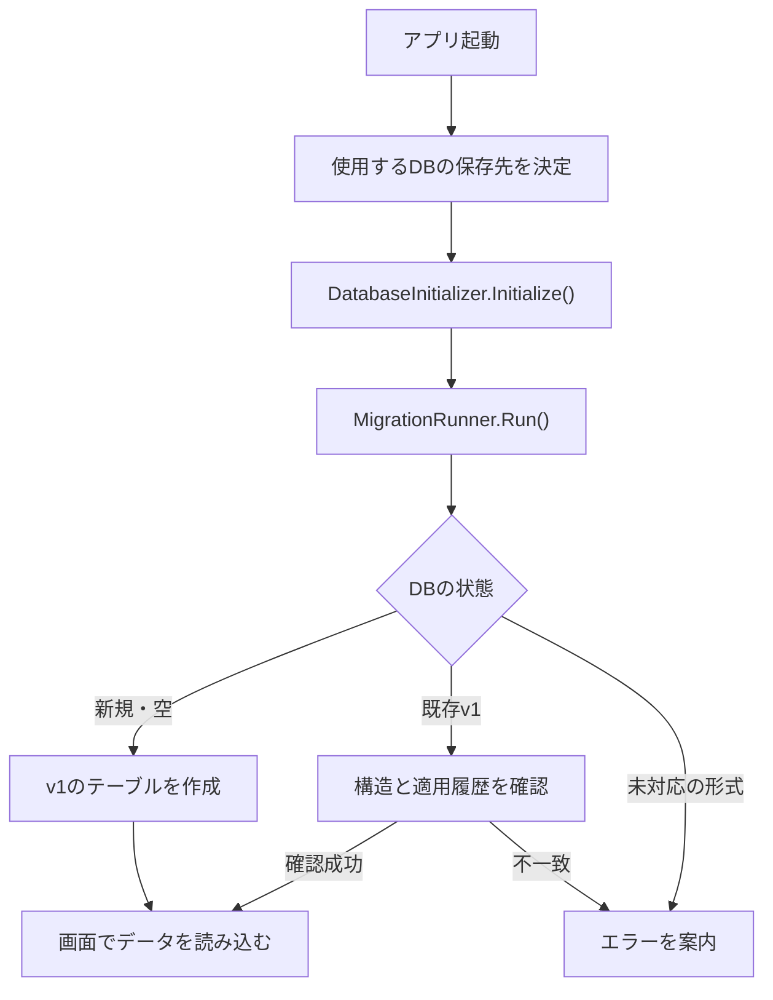

# Phase 1：新DB基盤の解説

この文書は、Phase 1で追加したDB基盤の役割と処理の流れを、後から学び直せるようにまとめたものです。Phase 1実装時点の説明であり、将来のMigrationやImporterの実装とは区別してください。

今回の変更は、**これからマスターやプレイ履歴を入れていくためのDBを、安全に作成・確認する仕組み**です。

テーブルを作るSQLだけでなく、「初回なのか」「すでに作成済みなのか」「別形式のDBを誤って指定していないか」を判断する処理を追加しています。既存画面からの接続は後続フェーズなので、今のところ画面上の動作は変わりません。

## 1. 追加した3つのファイルの関係



| ファイル | 担当すること |
| --- | --- |
| [DatabaseInitializer.cs](../Database/DatabaseInitializer.cs) | **どこにDBを置き、どう接続するか** |
| [MigrationRunner.cs](../Database/MigrationRunner.cs) | **このDBに何を実行してよいか** |
| [001_initial.sql](../Database/Migrations/001_initial.sql) | **どんな構造のDBを作るか** |

呼び出し側は、次のように使います。

```csharp
using IIDXProgressDashboard.Database;

var database = new DatabaseInitializer(
    Path.Combine("output", "iidx-progress.db"));

database.Initialize();

using var connection = database.OpenConnection();
```

`Initialize()` は作成・確認用です。`OpenConnection()` はその後の読み書き用で、ファイルがなければエラーにします。パスの間違いで空のDBが知らないうちに作られるのを防ぐため、この2つを分けています。

出力先は呼び出し側が指定します。`data/` の入力原本とは別の場所を使用します。通常利用の保存場所や、入力・出力パスの照合は後続フェーズで扱います。

## 2. Initialize() の処理



**スキーマ**は、テーブル・列・制約・インデックスなどの「DBの構造」です。曲名やスコアといった保存データそのものとは別です。

既存DBの確認では、メモリー上に初期DDLから一時的な見本DBを作り、その構造と比較しています。さらに `schema_migrations` に「version 1を適用済み」という記録が1行だけあることも確認します。

ファイル名が `iidx-progress.db` でも、それだけでは新DBと判断しません。以前の作業で作られた同名の旧DBを誤って使わないための処理です。

現在はSQL定義を厳密に比較します。そのため、外部ツールで同じ意味の別表記に書き換えたDBも拒否する場合があります。この確認は構造とMigration履歴の確認であり、保存された全データの意味上の正しさまで検証するものではありません。

## 3. トランザクションで初期化をひとまとまりにする

例えば10テーブルのうち、4つ目を作るところで失敗した場合です。

```text
テーブル1作成 → テーブル2作成 → テーブル3作成 → 失敗
                     ↓
              ここまでの作成も取り消す
```

これにより、「一部のテーブルしかないのに、作成済みとして残る」という状態を防ぎます。最後のバージョン記録も同じまとまりに含むため、**構造の作成と『作成済み』の記録が両方成功して初めて確定**します。

コードでは、最後の `transaction.Commit()` が確定です。途中で例外が起きると、`using` によるトランザクションの破棄時に取り消されます。ただし、空のDBファイルやフォルダーが残ることはあります。

`BeginTransaction(deferred: false)` では、書き込み用のトランザクションを最初に開始します。スキーマを確認してから作成するまでの間に、別の書き込み処理が割り込むのを防ぐ意図があります。

## 4. DBの中心は「曲 → 譜面 → 実プレイ履歴」

次の図は、主要テーブルの関連を示したものです。矢印は関連の方向を簡略化しており、すべての外部キーを表したものではありません。



例えば同じ曲でも、SPAとSPHには別々の `chart_id` が付きます。プレイ履歴はこの `chart_id` を参照するため、後続の実装で別譜面のスコアやランプを混ぜずに扱えます。

難易度表も独立しているので、同じSPAに対して「NORMAL表では地力B、HARD表では地力C」を保存できます。

この図の7テーブルに、管理用の3テーブルが加わって合計10個です。

| 管理テーブル | 記録すること |
| --- | --- |
| `schema_migrations` | どのバージョンのDB構造を適用したか |
| `import_runs` | いつ、何を取り込み、どういう結果になったか |
| `unresolved_imports` | 譜面を特定できないなど、解決待ちの取込データ |

今回はこれらの**保存先を作った段階**です。マスターを取得したり、未解決データを登録したりする処理は、これから実装します。

## 5. DB自身にも不正な書き込みを拒否させる

DDLには、次のようなルールも含まれています。

- 存在しない譜面を参照する履歴は登録できない。
- 同じ曲・SP/DP・難易度の譜面を重複登録できない。
- ランプは0〜7、スコアは0以上に限定する。
- 履歴から参照されている譜面を削除できない。
- 同じ `source_system` と `source_record_key` の組み合わせを重複登録できない。
- BP不明の `NULL` と、BPゼロの `0` を両方保存できる。

外部キー制約を接続ごとに有効にしているのは、「参照先が存在すること」などのルールを実際に働かせるためです。テーブルに外部キーを定義することと、その接続で制約を有効にすることの両方が必要です。

## 6. SQLファイルの配布方法

`001_initial.sql` はプロジェクトファイルで `EmbeddedResource` に指定しています。ビルド時にアセンブリへ埋め込まれるため、実行時に別途SQLファイルを探す必要がありません。

`MigrationRunner.ReadInitialSql()` は `GetManifestResourceStream()` で埋め込みSQLを読みます。実行時の作業ディレクトリによってSQLの読み込み先が変わることを防いでいます。

仕様書のDDLにあったトランザクション開始・終了、外部キーの有効化、Migration履歴のINSERTはC#側へ移しています。SQLは構造の定義を担当し、C#が実行の順序と確定・取り消しを管理します。

## 7. テストで確認したこと

[DatabaseTests.cs](../tests/IIDXProgressDashboard.Tests/DatabaseTests.cs) は、個人データを使わず、一時ディレクトリに作った合成DBで検証します。

| 検証 | 確認すること |
| --- | --- |
| 新規作成・再実行 | 10テーブルができ、再実行しても履歴が消えない |
| 制約違反 | 不正な参照・値・重複・削除を拒否する |
| 値の保持 | BPのNULL/0、ランプ0でスコアがある履歴を保持する |
| 譜面・難易度表 | 別譜面とNORMAL/HARDの評価を独立して保持できる |
| 既存DBの保全 | 旧形式や改変されたDBを拒否し、ファイル内容が変わらない |
| 途中失敗 | DDL途中で失敗しても作成途中のテーブルが残らない |
| 接続先の誤り | 通常接続で存在しないDBを勝手に作らない |

Phase 1実装時の実行結果は18件すべて成功でした。ソリューション全体のビルドも成功していますが、既存依存パッケージの互換性警告は残っています。

再実行する場合は、リポジトリ直下で次を実行します。

```powershell
dotnet build IIDXProgressDashboard.sln
dotnet test tests/IIDXProgressDashboard.Tests/IIDXProgressDashboard.Tests.csproj
```

## 8. 今回の範囲と次の工程

`MigrationRunner` という名前ですが、現状で実装しているのは**「空のDBからv1を作る」「既存v1を確認する」ところまで**です。

将来のv1→v2更新や、旧DBからのプレイ履歴の移行はまだ含みません。非空DBのアップグレードを実装するときは、バックアップと復旧手順を先に用意します。

次のPhase 2では、この土台に曲・譜面マスターを入れ、外部の曲名から正しい譜面を特定する仕組みを作ります。既存UIの新DBへの接続はPhase 6です。

## 9. ユーザーはどこからMigrationを実行するのか

**Phase 1時点では、ユーザーが画面からMigrationを実行する入口はありません。** DB基盤を実装した段階で、現在呼び出しているのは自動テストだけです。

今後の接続案は、アプリの起動処理で、**使用するDBの保存先が決まった後、画面がデータを読み始める前に自動実行する**形です。以下は実装済みの起動フローではなく、後続フェーズで組み込む想定です。



呼び出し自体は、次のコードです。`databasePath` は事前に決定した出力先のパスです。

```csharp
var database = new DatabaseInitializer(databasePath);
database.Initialize();
```

接続先の候補は [Program.cs](../Program.cs) の起動処理ですが、保存先・エラー表示・UIを固めない実行方法はまだ実装していません。既存UIを新DBへ接続するPhase 6で組み込む想定です。起動時に自動実行すれば、ユーザーが毎回「Migration実行」ボタンを押す必要はありません。

今回のMigrationは**DBのテーブル構造を用意する処理**です。旧DBからプレイ履歴を移す処理は別のImporterが担当します。また、現在対応しているのは新規作成と既存v1の確認までで、将来のv1→v2更新は未実装です。

関連資料： [仕様書](../SPECS.md)、[DB基盤の利用方法](../Database/README.md)、[作業ルール](../AGENTS.md)。
