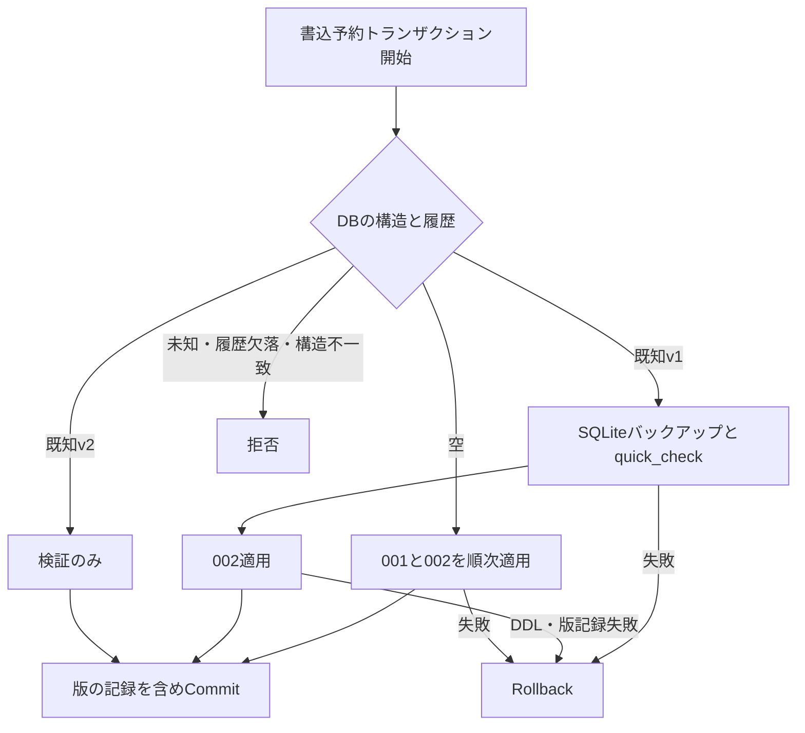

# 外部楽曲ID追加：DB基盤フォローアップ

実装時点：2026-09-23。今回の対象はテーブルとMigrationのみ。取得処理・Resolver変更は後続工程である。アプリケーション仕様v1とDBスキーマのversion 2は別の番号として扱う。

## テーブルとカラム

[002_external_song_ids.sql](../Database/Migrations/002_external_song_ids.sql)はユーザー提供SQLを基準とする。提供SQLとの差は、依頼本文の初期値指定に従った`source_name DEFAULT 'IIDX_DATA_TABLE'`の追加のみ。

| カラム | 役割 |
| --- | --- |
| source_name | 外部ソース名をTEXTで保持。初期値IIDX_DATA_TABLE。ソースマスターは作らない |
| external_song_id | 外部ソースの数値IDをINTEGERで保持。source_nameとの複合主キー |
| title | 外部ソースの曲名。songs.titleとは独立 |
| normalized_title | 後続の取得処理が既存TitleNormalizerで正規化して保存する。DB単体での自動正規化はしない |
| tag | songs.tagへのFK。更新CASCADE、削除RESTRICT |
| is_active | 初期値1、0/1のみ。活動状態の更新方針は後続のProviderで扱う |
| created_at / updated_at | 既存マスター同様CURRENT_TIMESTAMPで初期化。更新時のupdated_at設定は書込側の責任 |

同じ数値IDを異なるソースが持てる。同じtagへの複数IDも許容する。タイトルの一意制約やsongsの主キー変更、内部song_id、ソースマスターは追加しない。INTEGERはSQLiteの型親和性であり、提供SQLにないSTRICTや型検査CHECKは追加していない。入力値の整数検証は後続取得処理でも行う。

## 適用と保全

[MigrationRunner](../Database/MigrationRunner.cs)は埋め込みSQLを版順に適用する。[001_initial.sql](../Database/Migrations/001_initial.sql)は変更しない。[DatabaseInitializer](../Database/DatabaseInitializer.cs)を含め、既存のRunner呼出し箇所はv1からの更新にも対応する。

- 新規DBは履歴に1、2を記録する。既存v1は既存の版1記録を保持し2を追加する。現行版の再実行ではバックアップを増やさない。
- 適用履歴は1から連続していることを要求する。各版のテーブル・インデックス等の作成SQLを厳密比較し、旧形式・未知版・履歴と構造の不一致を拒否する。
- ファイルDBの更新前に、隣接する`<DB名>.pre-v2-<GUID>.bak`を作る。確定済みWALも含めるため単純なファイルコピーを使わない。書込予約中の別の読取専用接続からSQLiteのバックアップAPIを使う。
- バックアップ作成中は`.bak.incomplete`とし、検証・接続終了後に`.bak`へ改名する。作成・検証・改名の失敗時はDB更新を開始しない。未完了ファイルは復旧に使わない。バックアップ類はGit対象外。
- 空DBと一時的なメモリーDBにはファイルバックアップを作らない。DDLと版記録は同一トランザクションで取り消す。
- songs、charts、履歴の既存行・識別子は変更しない。今回、個人DBへのMigrationは実行していない。

## 復旧手順

通常の適用失敗はRollbackされるため、原因を解消して再試行する。手動復旧が必要なら、アプリと対象DBを使う全接続を終了し、現在のDBと付随するWAL/SHM/journalを別の保全場所にまとめて退避する。完成済み`.bak`を別の新規パスへコピーし、読み取り専用で`PRAGMA integrity_check`、`PRAGMA foreign_key_check`、`schema_migrations`と保存行を確認してから使用する。古い付随ファイルを復旧コピーと混在させない。原本やバックアップを上書きしない。新版アプリで初期化すれば再度v2へ更新される。

## 検証と後続工程

[DatabaseTests](../tests/IIDXProgressDashboard.Tests/DatabaseTests.cs)で新規作成・再実行、v1更新と履歴保持、通常/WALのバックアップ、DDL後の版記録失敗時のRollback、未知構造・欠けた版の拒否、複合主キー・FK・活動状態・NULL制約・独立タイトルを合成データで確認する。既存テスト全体は回帰確認として実行するが、Importerの全仕様を新しく再検証するものではない。

実行結果：`dotnet build IIDXProgressDashboard.sln --no-restore`成功（既存依存の互換性警告・既存コードの警告あり、エラー0）。全体テスト451件成功。バックアップ完成ファイルの改名処理を追加した後、DBテスト25件を再実行して成功。実データ更新、ディスク容量不足・OS権限障害の実機試験、手動復旧操作は未実施。

後続ではIIDX Data Tableの「楽曲情報」を外部ID、「曲名」をtitleとして取得するProviderを追加し、その後に共通Resolverへ補助経路を追加する。タグ優先、両経路の同一一致は自動確定、タグのみ一致は自動確定、異なる曲への一致とタグ不一致＋外部ID一致は手動判断、双方不一致は従来処理、という依頼方針を維持する。Phase 3・4・5に専用外部ID判定を分散させず、共通Resolverを使用する。取得・正規化・登録API・手動判断UI・Resolver統合テストは今回未実装。
