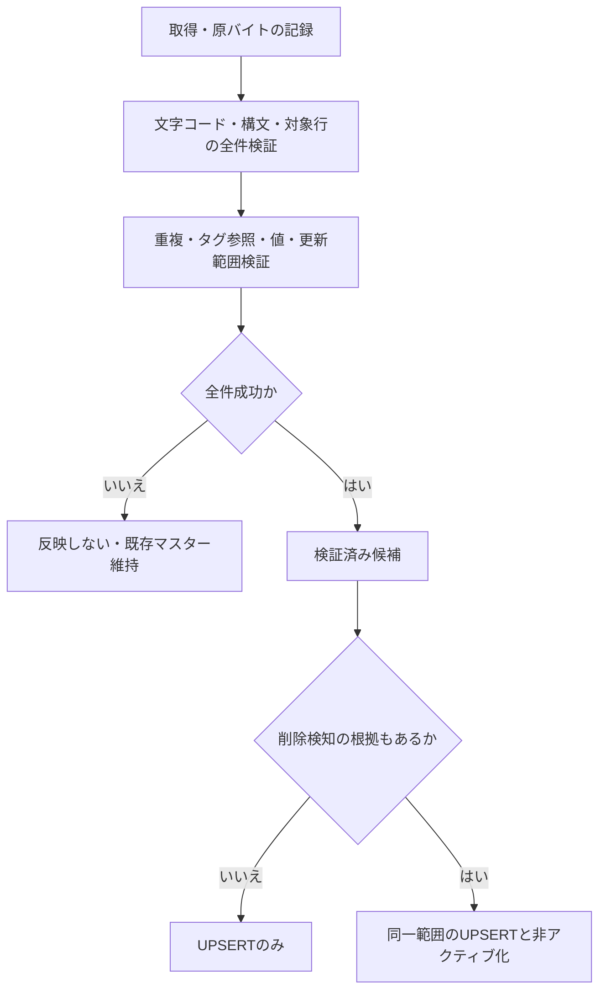

# Phase 2-1：Textage取得・入力・更新契約

2026-09-07調査。[Issue #4 項目1](https://github.com/xidinor/IIDXProgressDashboard/issues/4)の5項目について、観測した外部仕様とアプリ側で採用する方針を分けて記録する。Provider・DB更新の実装は項目2・3で行う。

## 1. 取得元と文字コード

取得元は[Textage譜面集](https://textage.cc/score/)。ページHTMLのscript srcが以下の9ファイルを参照することを実際に確認した。独立した公式APIや版付きリリースとしては扱わない。

| 相対URL（基点 https://textage.cc/score/） | 役割 | 採用用途 |
| --- | --- | --- |
| titletbl.js | titletbl、列定数、SS | 必須：曲情報 |
| actbl.js | actbl、A〜F | 必須：譜面カタログと現行基準のレベル |
| datatbl.js | datatbl、BPM等の関数 | 必須：ノーツ数（BPMは今回対象外） |
| scrlist.js | vertbl、表示・収録条件 | 必須：バージョン名、意味の調査 |
| cstbl.js / cstbl1.js / cstbl2.js | cstbl[1]〜[17] | 比較資料：CS版差分。自動上書きには使わない |
| cltbl.js / stepup.js | 別表示用情報 | Provider入力対象外 |

7ファイルすべてHTTP 200、Content-Typeはapplication/javascript。ページはshift_jisを宣言し、JS配信バイトは厳密なUTF-8としては不正。CP932で復号した内容は7ファイルすべて配置済みUTF-8の内容と一致した。これは今回取得時点の一致であり、ユーザーによる当初取得の時刻を証明しない。

採用方針：HTTP取得はCP932を明示して不正バイトを拒否する。ローカル入力はUTF-8を初期契約とし、元の配信バイトを使う場合はCP932を明示選択する。自動推測や文字置換で続行しない。先行TextageSourceReaderはUTF-8の7ファイル読込だけに対応しており、ネットワーク入力・4必須＋3比較資料への分離・CP932選択は項目2の変更対象。

各入力のURLまたはローカル名、取得開始・終了UTC、文字コード、バイト数、元バイトSHA-256、HTTP ETag/Last-Modified（あれば）を記録する。バージョン名と取得版は別物。actbl冒頭のpspver（2015年表記）はデータ更新日時として採用しない。今回のLast-Modifiedはtitletblが2026-08-27、datatblが2026-09-06、CSファイルは2009〜2020年と異なり、全ファイルの日時一致は完全性条件にできない。

## 2. 入力構造と解析契約

外部JSは実行しない。コメントを文字列と区別できる字句解析を用い、対象の代入・オブジェクト・配列を終端まで読む。関数本体等は構文境界を確認して対象外にする。行単位の正規表現やevalでの抽出は本番Parserに採用しない。

| 対象 | 配列・変数の意味 |
| --- | --- |
| titletbl[tag] | [versionIndex, titleId, option, genre, artist, title, subtitle（任意）] |
| vertbl | versionIndexから表示名。配列後のvertbl[35]代入も読む |
| SS | 配置データでは35。未知の変数は推測しない |
| actbl[tag] | [songFlags, level0, flags0, …, level10, flags10, 追加表示情報（任意）] |
| datatbl[tag] | [notes0, …, notes10, BPM文字列] |
| cstbl[版][tag] | actbl同様の対。ただし版ごとの旧尺度・差分あり |

数値リテラルと宣言済みA〜F定数、引用符付き文字列、エスケープ、コメント、末尾カンマを扱う。文字列のfontcolorは表示装飾として引数も構文確認して除去する。任意関数呼出しは許さない。未対応の式・配列長・代入は診断して失敗させる。

曲名・サブタイトルのHTMLは表示テキストに変換し、HTML entityを復号する。空でない副題を空白1つで連結する。エスケープや文字列内の角括弧で解析を切らない。原JSと位置を診断に残し、照合用TitleNormalizerは項目4で別途確定する。artist/genreも装飾を除去する。

tagはそのまま識別子として保持。versionIndexからversion_nameを解決し、sort_indexは旧Pythonとの互換方針としてversionIndexを使う。titleIdは内部IDへ転用しない。既知のダミー__dmy__は理由付きで除外する。未知のversionIndexをUnknownで埋めず失敗する。

## 3. 譜面・不明値・不存在

typeをtとすると、notesIndex=t、levelIndex=2t+1、flagsIndex=2t+2。

| t | Textage表示 | 新形式 |
| --- | --- | --- |
| 0 | SBo（旧BEGINNER列） | 自動統合対象外 |
| 1 | SB | SP/B |
| 2 / 3 / 4 / 5 | SN / SH / SA / SX | SP/N・H・A・L |
| 6 | DB | DP/B |
| 7 / 8 / 9 / 10 | DN / DH / DA / DX | DP/N・H・A・L |

SBoとSBを1つのSP/Bに潰さない。配置例19novemではnotesが402と257で異なる。v1キーに版区別がないため、t=0は別途診断し、旧BEGINNERの履歴はノーツ矛盾等をResolverで未解決にする。SB不存在時のSBoへのフォールバックもしない。別版を表すtag（511と511_hs等）は同名でも維持する。

scrlistのget_sdataのコメントと実装から、flagsのbit1（値2）は公式12段階、bit2（値4）はAC収録、bit0（値1）はTextage譜面データへのリンク存在。リンクがないことは譜面不存在を意味しない。

採用規則：

- level値>0を譜面存在の根拠にする。値2のbitが立ち、1〜12ならlevelへ保存する。旧尺度なら正の値でもlevel=NULLとし、元値・フラグを診断情報に保持する。負数や12段階宣言で範囲外なら不正。
- notes>0だけが存在の根拠の場合も、対応するactblのtagと所定の列がある場合に限り譜面を作り、level=NULLにする。level 0は新DBへ0で保存しない。
- 存在根拠のある譜面でnotes=0ならノーツ不明としてNULLにする。Textage全体の0表現を一般のプレイBP 0や履歴notes 0へ波及させない。
- level=0かつnotes=0かつflags=0ならそのslotは不存在であり、chartを作らない。flagsだけが正など矛盾するslotは推測せず不正入力として報告する。
- datatblのtag欠落・必要列不足はファイル間不整合として取得不完全。単なる不明値と区別し、DB反映しない。存在が確認できない全SP/DP×5譜面を生成しない。

調査用の行パターン集計ではactbl 2,661行、同一tag重複0、SBo正値82、SB正値820、DB正値13。t=1〜10の正値のうち12段階bitなしは1,294slot。これは全文Parser検証ではなく観測値であり、固定の期待件数にしない。DP/Bを省略すると実在slotを失う。

## 4. 更新対象とAC/CS・INFINITAS

採用する更新範囲を `TEXTAGE_ACTBL_CATALOG_V1` とする。titletblの実曲をsongsの候補にし、actblとdatatblに共通するtagのt=1〜10を上記規則でchartsへ変換する。actblにない曲は曲情報のみとし、CS表から推測で譜面を補わない。

AC現行収録に限定しない。actblにある削除曲・CS由来曲も過去履歴の照合用に保持する。is_activeはこのカタログに現在存在することを表し、INFINITASで現在遊べるかどうかを表さない。履歴から参照する非アクティブ譜面も削除しない。

AC/CSの結合順は「actblを正として採用、cstblは比較専用」と確定する。同じtag・slotでCSとレベルが異なってもactblを上書きしない。CS間の差も版を保持して診断する。CSにしかないslot・SBoは今回の自動更新範囲外であり、必要時は独立した版別入力の設計を行う。既存Pythonで作った譜面件数との一致を目標にしない。

INFINITASはscrlistのpush_check1/2にsongFlagsの値2・4・8を使った分岐がある。ただし譜面列のAC収録bitによるフィルターに表示経路間の相違があり、これを「現時点のINFINITAS全譜面」の確定仕様としない。v1はINFINITAS専用フィルターをマスター更新へ使わず、広いカタログから照合する。利用可能曲の表示が必要になった場合は別の仕様・確認が必要。

## 5. 完全性と失敗時の契約

取得成功はHTTP成功ではない。以下をすべて満たして検証済み候補とする。

1. 必須4ファイルが同一取得処理で読み込め、空でなく文字コードが正しい。ローカルは確定した入力一式を読込前後のハッシュで検査する。
2. 対象リテラルの開始から終了までを検証し、全対象行が解析済みまたは既知の除外として説明される。途中切断、未知式、不正行がない。
3. titletbl内・actbl内・datatbl内および各CS版内でtag重複がない。出力chartキーも一意。同じ内容の重複も黙って上書きしない。CS版をまたぐ同じtagは重複エラーにしない。
4. 必要なtag・version・列の参照が解決し、値の範囲と不存在規則に矛盾がない。除外対象を除き曲・譜面が空なら失敗。
5. sourceと範囲識別子・Parser規則版・取得記録が確定し、前回と比較できる。ネットワークは再検証（ETag等、利用できなければ再取得ハッシュ）で取得中の変更を検出する。

上流に全件リストの署名・manifest・原子的snapshotの保証は確認できていない。形式的に正しい一部欠落を上の検査だけで必ず検出できるとは主張しない。このため、削除を伴う更新では前回同一範囲との差分を提示し、欠落が意図したカタログ変更であることを確認した範囲だけを非アクティブ化可能にする。初回登録には既存項目の非アクティブ化を行わない。範囲外や由来不明のDB項目を欠落扱いしない。所有範囲の記録方式は項目3で設計し、記録がない間は非アクティブ化を無効にする。

部分取得のDB反映はv1では許さない。手動で一部ファイル・行だけを渡して全体取得に昇格させない。通信失敗、必須欠落、復号失敗、不正行、重複、未知形式、空入力、キャンセルは全体失敗とし、マスターを書き換えない。CS比較入力を指定した場合にその解析が失敗したときも、比較成功として扱わず実行を失敗させる。明示的なCS比較なしモードはカタログ完全性を変えない。

DB反映の原子性・バックアップ・import_runs記録は項目3の担当。今回の決定では、成功した一部行だけのコミットや、不正行を除いてSUCCESSにすることは認めない。

## 6. 合成fixtureへの落とし込みと完了範囲

| fixture | 期待する判定 |
| --- | --- |
| 日本語CP932配信／UTF-8ローカル | 同じモデル、元バイトhashは別。不正復号は失敗 |
| コメント、エスケープ、fontcolor、副題HTML、SSとvertbl[35] | 元の識別子と表示テキストを保持 |
| 10種slotとSBoの別ノーツ | 10種を別chartとして扱い、SBoはSP/Bへ統合しない |
| 旧尺度level正値、12段階level正値、notes 0 | level NULL／数値、notes NULLを区別 |
| 全0slot／tag欠落／範囲外level／flagsのみ正値 | 不存在／不完全／不正／不正を区別 |
| AC/CSで同一tagのlevel差、CSだけのslot | actbl維持、CSだけのslotを作らない |
| 正規の__dmy__と未知version | 既知除外／失敗 |
| 切断、重複、空、未知式、キャンセル | 更新なし、理由を返す |
| 正常だが前回より一部tag欠落 | 自動非アクティブ化なし、差分確認待ち |

項目1の成果はこの契約と調査記録。Parserの全文検証・全件モデル化・DB反映・fixtureの自動テストは未実装であり、項目2以降で行う。配信元の未知bit全体や版別譜面同一性を確定したことにはしない。未確認の範囲は自動更新対象から外した。

追加ファイルは現在不要。配信元との文字列一致まで確認できたため、当初の取得時刻不明は今回の調査を妨げない。将来INFINITAS収録状態やCS専用・旧BEGINNERまで扱う場合は、その版・取得条件・譜面同一性の追加調査が必要になる。

今回の検証は外部HTTP応答と実ファイルの読取比較、限定的な数値行集計、文書差分確認。個人DBは開いていない。コード変更なしのためビルド・テストは再実行していない。先行読込基盤の23件成功は[前回記録](phase2-1-textage-input-explained.md)を参照。
