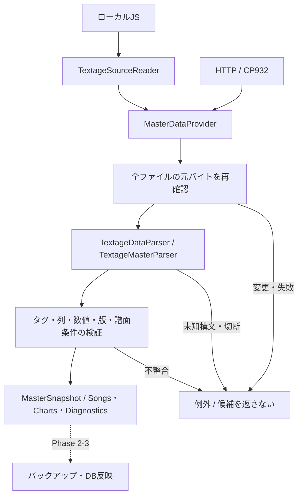

# Phase 2-2：マスター取得・解析のC#実装

2026-09-11実装。[Issue #4の項目2](https://github.com/xidinor/IIDXProgressDashboard/issues/4)を対象とする。[Phase 2-1入力契約](phase2-1-textage-source-contract.md)をもとに、DBへ渡す前の曲・譜面候補を取得・検証する。DB反映はPhase 2-3、曲名正規化は2-4、譜面照合は2-5で行う。

## 構成と失敗時の境界

Phase 2-2の作業ブランチは `codex/phase2-2-master-provider`。ファイルは次のように配置する。公開型の名前空間は `IIDXProgressDashboard.Master` を維持し、既存の呼出し方を変えない。内部の `TextageDataSyntax` は役割に合わせて `TextageDataParser` に改名した。

```text
Master/
├── MasterDataProvider.cs        # 取得・解析の入口
├── Models/                     # MasterSong / Chart / Snapshot / Diagnostic / Difficulty
└── Textage/                    # Reader、Parser、入力情報・設定
Properties/
└── AssemblyInfo.cs             # 内部Parserをテストへ公開する設定
tests/IIDXProgressDashboard.Tests/
├── DatabaseTests.cs
└── Master/
    ├── MasterDataProviderTests.cs
    └── Textage/                # Reader・Parserのテスト
```

モデル・入力設定は型名とファイル名を揃え、ReaderやSnapshotのファイルから分離した。処理内容やデータ契約は変更していない。



| ファイル | 役割 |
| --- | --- |
| [MasterDataProvider.cs](../Master/MasterDataProvider.cs) | ローカル・HTTPの取得と解析の非同期入口 |
| [TextageSourceReader.cs](../Master/Textage/TextageSourceReader.cs) | 厳密な復号、元バイト情報、読込後の再確認 |
| [TextageDataParser.cs](../Master/Textage/TextageDataParser.cs) | コメント・文字列・escape・配列・objectを区別する内部Parser |
| [TextageMasterParser.cs](../Master/Textage/TextageMasterParser.cs) | 許可した代入の解析、モデル変換、全体検証 |
| [MasterSnapshot.cs](../Master/Models/MasterSnapshot.cs) | 曲・譜面候補、診断、取得情報、更新範囲 |

呼出し側が指定したファイルを読み取るだけで、ファイルの作成・上書き、DB接続、UI更新は行わない。入力原本・旧DBに影響はない。トランザクション・import_runsへの記録・バックアップは今回の実装対象外。途中失敗では候補の一部を返さず例外で通知する。

## APIの使い方

```csharp
var provider = new MasterDataProvider();

// 既定はUTF-8、カタログ必須4ファイル。CSは比較用に明示選択する。
var local = await provider.ReadLocalAsync(inputDirectory,
    new TextageReadOptions(IncludeCsComparison: true), cancellationToken);

// 配信元の生バイトを保存した入力なら文字コードを明示する。
var cp932 = await provider.ReadLocalAsync(inputDirectory,
    new TextageReadOptions(TextageEncoding.Cp932), cancellationToken);

// HttpClientの生成・寿命は呼出し側で管理する。
var remote = await provider.FetchAsync(httpClient,
    includeCsComparison: false, cancellationToken: cancellationToken);

// 通信なしの構文・意味検証も可能。
var candidate = new TextageMasterParser().Parse(sourceSnapshot, cancellationToken);
```

Providerのカタログ必須入力はtitletbl.js、scrlist.js、datatbl.js、actbl.js。CS比較を選ぶとcstbl.js、cstbl1.js、cstbl2.jsの3つも必須になる。比較データはACを上書きせず、差分とCS専用tagを診断する。

先行実装との互換性のため、Readerの従来の `ReadAsync(directory, cancellationToken)` はUTF-8の7ファイル契約を維持した。4ファイル入力やCP932を使う場合はoptionsを受け取るオーバーロードを使う。Providerはoptionsの既定値として4ファイルを使用する。この区別はReaderの既存ブラックボックステストを維持するためのもの。

HTTP入力は [Textage譜面集](https://textage.cc/score/) 配下の固定ファイル名から取得し、CP932を明示する。ローカル・HTTPとも文字コードのfallbackや置換をしない。HTTP成功だけでは候補を返さず、復号・再取得ハッシュ照合・解析・意味検証まで行う。ETagとLast-Modifiedは取得できれば記録するが、現在の再検証は全ファイル再GETによるハッシュ比較で統一している。

SourceFileは内容とともに元バイト長・SHA-256、文字コード、取得開始・終了UTC、取得場所、HTTP応答情報を保持する。ローカルの場所はファイル名を保持し、個人の絶対パスは埋め込まない。BOMは文字列から取り除くが、ハッシュには含まれる。取得後の全ファイル再読込は変更検知用であり、上流の原子的snapshotを保証しない。

## 解析と変換の判断

- JS実行エンジンを使わず、対象データの許可した代入だけを読む。定数A〜Fは宣言値を検証し、CSファイルにはactblの宣言を引き継ぐ。SSとvertblへの添字代入、列定数を検証する。
- 配列・objectを再帰的に読み、重複tag、重複代入、CS版のファイル間重複、未知式・装飾、不正escape、未閉じ構文を拒否する。深すぎる入れ子にも上限を設ける。
- fontcolorは引数を検証して文字列だけを残す。HTMLタグを除去しentityを復号して副題を結合する。照合用の正規化はせず、別のtagを同名だけで統合しない。
- 実ファイルに含まれる表示用リストも値構文として検証する。scrlistのreferstr以降、datatblのfunction以降は表示コードとして扱い、文字列・コメント・正規表現リテラル・括弧・EOFを検査する。対象マスターの直接・添字・プロパティ代入は拒否する。この処理は汎用JavaScript文法検証器ではなく、表示コードを実行・解釈してマスターへ反映するものではない。
- songsはtag・title・artist・genre・version_name・sort_indexを作る。未知版をUnknownで補完せず、既知のダミーだけを理由付きで除外する。
- chartsはSP/DPのB/N/H/A/Lを区別する。旧difficulty長名の変換はMasterDifficultyで明示する。SBoはSP/Bへ統合せず、SBがなくてもフォールバックしない。
- 旧尺度levelとnotes不明はNULLへ変換する。全0slotからchartを作らず、flagsのみ存在、必要tag・列不足、負値、12段階範囲外、未知flagsは拒否する。

MasterSnapshotのScopeは `TEXTAGE_ACTBL_CATALOG_V1`、ParserVersionは `1`。CanDeactivateMissingは常にfalse。取得・解析成功だけで欠落項目の非アクティブ化を許可しない。DB更新の所有範囲と削除確認はPhase 2-3で接続する。

構文エラーはファイル名と文字位置、意味エラーは対象ファイル・tagなどを含むInvalidDataExceptionとして返す。元JSは入力SourceSnapshot側に保持される。ファイル不足はFileNotFoundException、HTTP失敗はHttpRequestException、キャンセルはOperationCanceledExceptionとして伝播する。

## 検証結果

合成fixtureは個人データ・実ネットワークに依存しない。

| テスト | 確認内容 |
| --- | --- |
| [TextageSourceReaderTests](../tests/IIDXProgressDashboard.Tests/Master/Textage/TextageSourceReaderTests.cs) | 従来の19件を維持。名前・内容・復号・原本・余分なファイル・キャンセル |
| [TextageMasterParserTests](../tests/IIDXProgressDashboard.Tests/Master/Textage/TextageMasterParserTests.cs) | 10譜面種別、NULL、不存在、SBo、HTML、未知式・版・列、欠落・重複、CS比較 |
| [TextageDataParserTests](../tests/IIDXProgressDashboard.Tests/Master/Textage/TextageDataParserTests.cs) | 内部状態・escape・コメント・nest・末尾comma・EOF・不正token・表示コード境界 |
| [MasterDataProviderTests](../tests/IIDXProgressDashboard.Tests/Master/MasterDataProviderTests.cs) | ローカル4ファイル、UTF-8/CP932、HTTP再検証、通信・復号・解析失敗、取得途中キャンセル |

配置整理後も自動テストは合計114件成功、失敗・スキップ0。既存DBテストも含む。ソリューション全体のビルドも成功（エラー0、既存パッケージ互換性・Nullable等の警告21件）。新処理の通常動作はC#のみで、追加パッケージやPython実行依存はない。

実データは独立して読み取り検証した。配置済み7ファイルすべてで対象代入の構文解析が成功した。ただしカタログ全体の意味検証は、actblのfirstemoのSP/Bがlevel=0・notes=0・flags=1であるため拒否された。これはPhase 2-1で定めた「flagsだけのslotを推測でchart化しない」条件に合致する。原本を補正せず、以降の実データ行がすべて意味検証済みとは報告しない。

今回HTTP境界は合成HttpMessageHandlerで検証し、実ネットワーク経由のFetchAsyncは未実行。ローカル原本の全件モデル化成功、DB反映・参照保全・Resolver統合は未確認であり、Phase 2全体の完了ではない。

## 次の工程

Phase 2-3でMasterSnapshotを新DBへ安全に反映する処理を実装する。配置済みデータを実際に登録する前に、firstemoのような外部データと契約の不整合について取得元の意味を追加調査する必要がある。今回の実装では不正行を除いて完全snapshotにする変更は行っていない。
