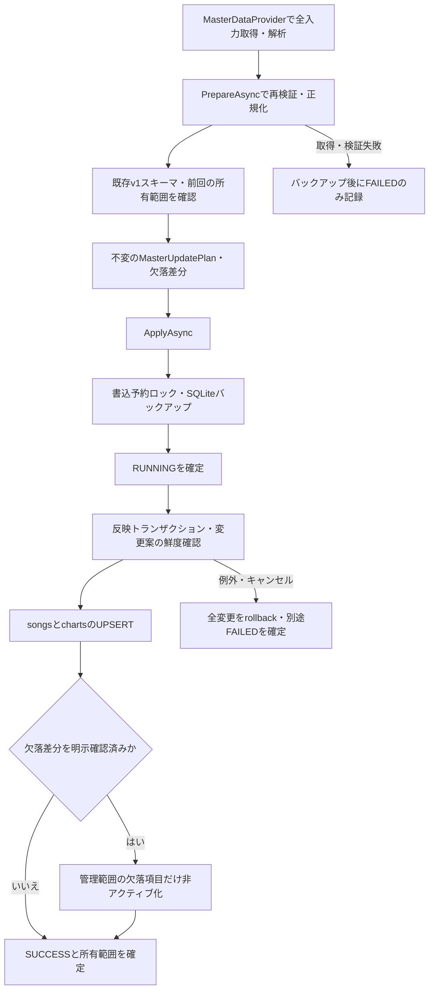

# Phase 2-3：マスターの安全なDB反映

2026-09-11実装。[Issue #4の項目3](https://github.com/xidinor/IIDXProgressDashboard/issues/4)が対象。作業ブランチは `codex/phase2-3-safe-master-update`。
[入力契約](phase2-1-textage-source-contract.md)、[Provider実装](phase2-2-master-provider-explained.md)、[仕様第6章](../SPECS.md)を前提とする。

## 構成と使い方



| ファイル | 役割 |
| --- | --- |
| [MasterUpdateService.cs](../Master/MasterUpdateService.cs) | 取得・検証・変更案の生成、UPSERT、活動状態、実行ログ |
| [MasterUpdatePlan.cs](../Master/Models/MasterUpdatePlan.cs) | 検証済み候補と欠落差分。外部から構築・変更できない |
| [MasterChartKey.cs](../Master/Models/MasterChartKey.cs) | tag・SP/DP・B/N/H/A/Lの組 |
| [MasterUpdateState.cs](../Master/Models/MasterUpdateState.cs) | options_jsonに保存する版付き所有範囲 |
| [MasterUpdateResult.cs](../Master/Models/MasterUpdateResult.cs) | 実行ID、バックアップ先、反映件数 |
| [DatabaseBackup.cs](../Database/DatabaseBackup.cs) | SQLiteのオンラインバックアップと整合性検査 |
| [MasterUpdateServiceTests.cs](../tests/IIDXProgressDashboard.Tests/Master/MasterUpdateServiceTests.cs) | 個人データ・通信不要のDB保全テスト |

初期化済みの新v1 DBを呼出し側で指定する。サービスはDBファイルを暗黙作成せず、`DatabaseInitializer.OpenConnection` と `MigrationRunner` を使って外部キーと既存スキーマを確認する。旧形式・空・未知スキーマは拒否する。

```csharp
// outputPathは入力原本とは別の新v1 DB。初期化は反映処理とは別工程。
var database = new DatabaseInitializer(outputPath);
database.Initialize();
var provider = new MasterDataProvider();

// Phase 2-4で共通TitleNormalizerへ接続済み。
var service = new MasterUpdateService(database, backupDirectory);
var plan = await service.PrepareAsync(
    ct => provider.ReadLocalAsync(inputDirectory, cancellationToken: ct), cancellationToken);

// 通常はUPSERTのみ。単に欠落しただけでは無効にしない。
var result = await service.ApplyAsync(plan, cancellationToken: cancellationToken);
```

非アクティブ化する場合は、反映前に `plan.MissingSongs` と `plan.MissingCharts` を提示し、その一式が意図したカタログ変更であると確認してから、**そのplan** を `ApplyAsync(plan, confirmMissing: true, ...)` に渡す。確認画面の接続はPhase 6。引数のtrueは確認結果を渡すためのAPIであり、Providerの成功だけからtrueにしない。Providerの `CanDeactivateMissing=false` は維持する。

Phase 2-3時点では正規化関数と規則版を必須指定していた。Phase 2-4で共通TitleNormalizerへ接続し、暫定の関数指定APIを終了した。空結果なら反映しない動作と、aliasを自動生成しない方針は維持する。詳細は[Phase 2-4](phase2-4-title-normalizer-alias-explained.md)を参照。

DB処理はTask.RunでUIスレッドから分離する。`IProgress<int>` は処理したUPSERT候補数を通知する。通知時点では未commitなので成功件数と解釈しない。UIでは `Progress<int>` をUIスレッドで作成して渡す。

## 取得・検証と反映の境界

部分取得の反映は許可しない。取得delegateが成功した後も、元入力をParserで再解析し、Songs/Chartsの一致を確認する。公開recordを `with` で部分集合へ書き換えた候補は拒否する。検証後は独立した配列・読取専用リストに固定する。上流にmanifestがないため、形式的に正しい欠落を再解析だけで検知できるとは扱わない。

Prepareは成功時にDBを書き換えず、songs/charts全行と成功したマスター実行ログの内容から変更案の基準hashを作る。Applyの書込トランザクション内で再照合し、確認後の別更新があればFAILEDとして拒否する。確認済みplanの再利用も成功runの追加によって拒否されるため、同じ入力を再実行するときはPrepareからやり直す。

UPSERTはsongsのtag、chartsの3列一意キーを使う。chart_id・created_atはUPDATEしない。title、normalized_title、artist、genre、version_name、sort_index、level、total_notes、is_active、updated_atを反映する。NULLのlevel/notesはNULLのまま保存する。更新時刻はUTCのO形式。既存alias・履歴・難易度表には書き込まず、改名前タイトルの自動alias化もしない。

## 所有範囲と消失・再登場

DDL v1を変更せず、`import_runs.options_json` の `FormatVersion=1` に次を保持する。

- Scope、ParserVersion、NormalizerVersion、入力ファイル名・元バイトhash等から作ったFingerprint。
- このサービスが新規登録した曲tag・譜面キーの累積集合 `OwnedSongs` / `OwnedCharts`。
- 欠落確認の有無と、非アクティブ化した曲・譜面件数。

最新の同source_type/source_nameのSUCCESSだけを根拠にする。初回から存在する行は情報更新しても削除管理の所有権を得ない。以前の管理項目が今回欠落しても累積集合から除かず、後日の確認・再登場に備える。成功ログの不明な形式・Parser版は、所有範囲を推測せず拒否する。これらのログは管理範囲の原本なので削除・間引きの対象にしない。将来複数Providerの所有権調停やログ保管期間を設ける場合は専用テーブルへのMigrationを検討する。

前回 `A,B,C,D`、今回 `A,B,C` の場合、通常反映ではDを維持し、確認付き反映のみDをinactive化する。範囲外の有効譜面が残る曲自体はinactive化しない。曲だけ残って一部譜面が消えた場合も譜面キー単位で判断する。再登場では同じキーにUPSERTしてis_active=1に戻す。履歴等の参照がある項目も削除せず残す。

## トランザクションと実行ログ

| 段階 | 保存内容・失敗時の動作 |
| --- | --- |
| 取得・全件検証 | 成功時はマスター変更なし。失敗時はバックアップ後にFAILEDだけ記録 |
| Apply準備 | 書込予約ロック中、別の読取専用接続でバックアップ。その成功後にRUNNINGを確定 |
| Apply本体 | 新たな書込トランザクションで基準hash確認、全UPSERT、確認済み欠落反映、SUCCESS・所有範囲を一括commit |
| 途中例外・キャンセル | 本体を全rollbackした後、別の書込でFAILED・理由を確定 |

source_typeは `MASTER`、source_nameは `TEXTAGE_ACTBL_CATALOG_V1`。履歴Importerのsource_systemとは別の実行ログ区分。

`records_read` は全件検証済みの曲数＋譜面数。検証完了前の失敗は0で、読み取ったJS行数ではない。`records_imported` はcommit済みUPSERT件数で、同値再適用も数える。非アクティブ化件数はoptions_jsonと戻り値へ別記する。`records_unresolved=0`、PARTIALは使わない。欠落未確認のSUCCESSは「全候補のUPSERT成功」を意味し、「全欠落を処理した」意味ではない。

キャンセルはFAILED、messageは `CANCELLED`。RUNNING後の例外にはDataの `MasterImportRunId` と `MasterBackupPath` も付けて呼出し側へ返す。DBアクセス不能・未知スキーマ・バックアップ失敗時は、DBログを無理に保存せず例外で通知する。取得失敗とログ保存失敗が重なった場合はAggregateExceptionで両方を保持する。

プロセスの強制終了・電源断時にはRUNNINGが残ることがある。SUCCESSへの自動昇格はしない。本体トランザクションがcommitされていなければSQLiteがrollbackする。FAILED記録自体も失敗した場合は両例外を返す。自動再試行・RUNNINGの復旧画面は今回対象外。

## バックアップ・復旧

[Issue #3項目4](https://github.com/xidinor/IIDXProgressDashboard/issues/3)と共用できる `DatabaseBackup.Create` を追加した。今回の接続先はマスター更新だけで、将来のv2 Migrationへの自動接続は未実装。

保存先は呼出し側が明示する。`master-UTC日時-GUID.db` をCreateNewで作成し、SQLite BackupDatabaseとintegrity_check成功後だけ更新へ進む。WAL内の確定データも保存する。既存バックアップは上書き・自動削除しない。作成途中の失敗ファイルは調査用に残る可能性があるので、存在だけで有効と判断しない。初期化済みv1 DBはスキーマを持つため、ユーザーデータ0件でもバックアップする。

復旧手順：

1. アプリとDBに接続する他のツールを終了し、すべての接続を閉じる。
2. 復旧前のDBと存在する `-wal` / `-shm` を一式で別場所に保全する。稼働中のDBをコピーして復旧用としない。
3. 対象バックアップを**別の新しいDBパス**へコピーする。旧ファイルの上書きや古いWALとの混在を避ける。
4. コピーをDatabaseInitializer.Initializeでスキーマ検証し、integrity_checkがok、foreign_key_checkが0行であることを確認する。履歴件数・対象chart_idも確認する。
5. 呼出し側の出力DB設定を復旧済みの新しいパスへ切り替えて再起動する。通常UIのパス設定はIssue #3 / Phase 6で接続する。

バックアップ時点より後の更新・履歴は復旧先に含まれないため、現在DBの保全を省略しない。通常の反映失敗はまず自動rollbackとFAILEDを確認し、毎回バックアップへ置換する必要はない。

## 検証・残課題

合成fixtureで初回・同一入力再適用・情報更新、全10譜面種別、NULL、chart_idとcreated_at、履歴・alias・難易度表参照、確認なし欠落・確認付き消失・再登場、範囲外保全、確認後の別更新、変更案の不変性、取得・解析失敗、SQL実行後の例外・キャンセル、バックアップ失敗、未知スキーマ・所有記録、WALバックアップ・別パスへの復旧を検証する。

実行結果：

- `dotnet test tests/IIDXProgressDashboard.Tests/IIDXProgressDashboard.Tests.csproj --no-restore`：131件成功、失敗・スキップ0。既存114件に今回17件を追加。
- `dotnet build IIDXProgressDashboard.sln --no-restore`：成功、エラー0。初回コンパイルは既存の互換性・Nullable等の警告21件、最終増分ビルドはパッケージ互換性警告6件。今回追加コードの警告なし。
- SDKディレクトリへのアクセス制限で通常実行できなかったため、許可を得て制限外で実行した。既存の復元済み依存を使用し、パッケージ更新は行っていない。

DBスキーマとMigration版はv1のまま。配置済み `data/` の実DBとJS原本には書き込んでいない。実ネットワーク・実データ全件反映・WinForms動作は今回未実施。Phase 2-2で報告したfirstemoの入力矛盾も変更しておらず、実データへの反映前に別途調査が必要。

次はPhase 2-4のTitleNormalizer / alias、その後2-5のChartResolver。今回の完了は安全なDB反映APIであり、Phase 2全体・v1・Issue #3全体の完了ではない。
