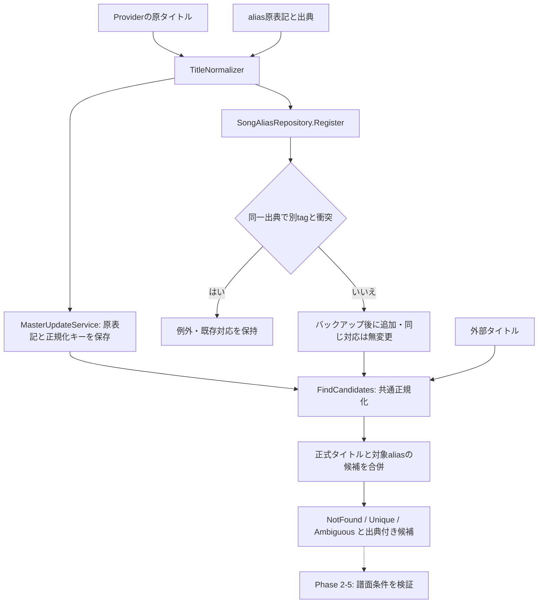

# Phase 2-4: TitleNormalizerとaliasの共通化

対象は[Issue #4 第4節および第6.4節](https://github.com/xidinor/IIDXProgressDashboard/issues/4)。実装時点は2026-09-11。[仕様](../SPECS.md)第6章の既存DDLと第9章の照合フローを基に、曲候補を収集する部分を実装した。chart_idの決定はPhase 2-5で行う。

## 構成とデータの流れ



| ファイル | 役割 |
| --- | --- |
| [TitleNormalizer](../Matching/TitleNormalizer.cs) | 決定的・冪等な共通正規化と規則版 |
| [SongTitleMatch](../Matching/SongTitleMatch.cs) | 異なるtag数による結果と原表記・出典の証拠 |
| [SongAliasRepository](../Database/SongAliasRepository.cs) | alias追加・再登録・衝突拒否と曲候補の参照 |
| [MasterUpdateService](../Master/MasterUpdateService.cs) | 共通規則を使ったマスター保存と規則版の実行ログ記録 |

## 採用した正規化規則

規則版は `nfkc-invariant-upper-space-v1`。NFKC → ToUpperInvariant → NFKC → Unicode空白の前後除去・連続空白をASCIIスペース1個へ圧縮、の順で処理する。nullは例外、空・空白のみは空文字になる。alias登録とマスター反映は空キーを拒否し、外部タイトル検索では候補なしとする。不正Unicodeは補正せず例外を伝える。

| 入力例 | キー／扱い |
| --- | --- |
| `ＡｂＣ　Ｄ` | `ABC D` |
| `ｶﾞ` / `ガ` | `ガ` |
| 分解したe＋結合アクセント / `é` | `É` |
| `Ⅸ` / `IX`、`①` / `1` | NFKCで同じキーになるため複数tagなら曖昧 |
| `A-B` / `AB`、`A B` / `AB` | 異なるキーを保持 |
| `A†`、`A (Remix)`、波ダッシュ、ゼロ幅スペース | 削除しない |

旧Pythonは空白・記号や†などを削除していたが、その規則は移植しない。NFKC自身による全角記号や互換文字の統合は行うため、正規化キーは曲IDではない。HTML除去・entity decodeは取得元Parserの責務とし、外部タイトル・aliasへの二重decodeや注釈の推測除去は行わない。原表記は別列にそのまま保持する。

## 検索順・出典・衝突

正式タイトルを収集した後、対象aliasを収集し、両方のtagを合併する。正式タイトル・manual・出典別aliasの間に勝者を決める優先順位は設けない。仕様の「必要ならalias」を、安全性のため正式タイトル一致時も衝突確認する形に具体化した。原表記の完全一致も曖昧な正規化候補を勝手に絞る根拠にはしない。

- 出典指定時は指定出典と `manual`、未指定時は全出典のaliasを検索する。他出典のaliasは指定出典の検索には混ぜない。
- `source_name` はDBのBINARY比較に合わせた大小区別の識別子。空・前後空白を拒否し、勝手にtrimや大文字化しない。手動出典は正確に `manual` とする。
- 異なるtagが0件ならNotFound、1件ならUnique、複数ならAmbiguous。同じtagへの正式タイトル・複数aliasの一致は1候補で、証拠はすべて残す。
- 同一出典・同じ正規化aliasの別tag登録は例外。同じtagの再登録は原表記・note・作成日時を上書きしない。別出典の衝突は保存でき、全出典検索やmanualとの合併で検出する。
- 非アクティブ曲も候補に含む。過去履歴での譜面の活動状態の判断はPhase 2-5で扱う。

## DB保全と互換性

DDL変更はない。既存v1のスキーマ確認と接続ごとの外部キー有効化、パラメーター化SQLを利用する。空DB・未知DBの暗黙初期化はしない。登録は書込予約トランザクション内で衝突とtag存在を確認し、SQLiteバックアップ後に1件追加してcommitする。失敗時はrollbackし例外を返す。バックアップ失敗時は追加しない。戻り値にalias_id、追加有無、バックアップパスを返す。これはImporterではなく、import_runsには記録しない。

復旧時は利用中の接続を閉じ、戻り値のBackupPathを**別の新規出力パス**へコピーしてDatabaseInitializerで検証する。詳細は[Phase 2-3のバックアップ説明](phase2-3-safe-master-update-explained.md)を参照。バックアップのファイル接頭辞は共通ヘルパーの `master-` を使用する。

Phase 2-3の任意正規化による既存キーはそのままでも検索できるよう、原表記を共通規則で再計算して候補を読む。検索はDBを更新しない。登録時も既存aliasの原表記を再計算し、古いキーで一意制約をすり抜ける別tag登録を防ぐ。保存キー自体との衝突も拒否する。現段階は全曲・対象aliasを走査する実装で、大量取込用キャッシュや索引の一括再生成は未実装。

MasterUpdateServiceのコンストラクターは `(database, backupDirectory)` に変更し、任意正規化関数を渡す暫定APIを終了した。以降のマスター更新は共通キーと規則版を保存する。取得範囲外の曲や既存aliasの保存キーを一括変換しない。改名時も手動aliasを保持し、旧タイトルの自動alias化は行わない。必要な旧名は出典と対応tagを確認して明示登録する。

```csharp
var service = new MasterUpdateService(database, backupDirectory);
var aliases = new SongAliasRepository(database, backupDirectory);
var registration = aliases.Register(tag, originalAlias, "manual", "確認した別表記");
var candidates = aliases.FindCandidates(externalTitle, "REFLUX_SESSION_TSV");
// Uniqueも曲候補の一意性だけ。chart_idは後続の譜面照合で確定する。
```

DB操作は同期API。UI接続時にはTask.Run等でUIスレッド外から呼び出す。今回UI接続と履歴取込は対象外。

## 検証と残課題

[正規化テスト](../tests/IIDXProgressDashboard.Tests/Matching/TitleNormalizerTests.cs)では表記ゆれ、文化非依存、冪等性、記号・空白境界の保持を検証。[aliasテスト](../tests/IIDXProgressDashboard.Tests/Matching/SongAliasRepositoryTests.cs)では正式名衝突、出典内・出典間・manual衝突、原表記保全、再登録、バックアップ内容・失敗、SQL特殊文字を検証。[マスター更新テスト](../tests/IIDXProgressDashboard.Tests/Master/MasterUpdateServiceTests.cs)ではProvider→DB→共通候補検索、改名後のmanual保持、旧名非自動登録と既存参照保全を検証する。

全検証は合成入力と一時DBで実施。個人の `data/` や通信には依存せず、実データ移行・GUI動作確認は未実施。Phase 2-5のChartResolver、履歴の未解決行保存・再処理は後続工程であり、Phase 2全体やv1全体の完了ではない。

実行結果（2026-09-11）：`dotnet build IIDXProgressDashboard.sln` 成功（0エラー、既存コード・依存由来の27警告）。`dotnet test tests/IIDXProgressDashboard.Tests/IIDXProgressDashboard.Tests.csproj --no-build` は154件成功、失敗・スキップ0件。SDK参照がサンドボックスで拒否されたため、許可を得て制限外で実行した。`git diff --check` も成功。
