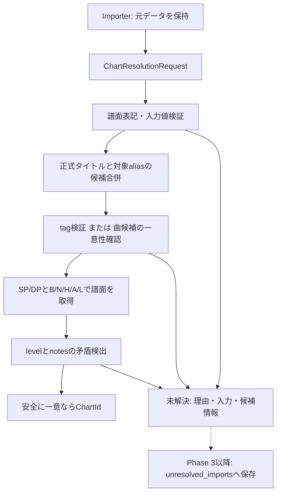

# Phase 2-5: ChartResolverと未解決結果の契約

対象は[Issue #4 第5節と関連する第6.5節](https://github.com/xidinor/IIDXProgressDashboard/issues/4)。実装時点は2026-09-11。[仕様第9～11章](../SPECS.md)を具体化し、過去履歴用の譜面照合を実装した。履歴取込・未解決行保存・再処理はPhase 3以降で接続する。

## 構成と処理



| ファイル | 役割 |
| --- | --- |
| [ChartResolution.cs](../Matching/ChartResolution.cs) | 共通入力、結果、理由、候補の公開契約 |
| [ChartResolver.cs](../Matching/ChartResolver.cs) | 入力検証、曲の一意性、譜面条件と任意値の整合性検証 |
| [SongAliasRepository.cs](../Database/SongAliasRepository.cs) | 既存の候補収集を同じ接続・読取トランザクションで再利用 |
| [ChartResolverTests.cs](../tests/IIDXProgressDashboard.Tests/Matching/ChartResolverTests.cs) | 合成DBで公開入出力と副作用を検証 |

## 入力と採用方針

```csharp
var resolver = new ChartResolver(database);
var result = resolver.Resolve(new ChartResolutionRequest(
    Title: "外部タイトル", Difficulty: "SPA", Level: 12,
    TotalNotes: null, SourceName: "REFLUX_SESSION_TSV"));
// result.IsResolvedのときだけresult.ChartIdを採用する。
```

- `Title`または`Tag`が必要。nullは未指定、明示された空文字・空白タイトル/tagは不正。両方指定時はタイトル・対象aliasの候補にtagが含まれることを必須とする。tagのみでも曲の存在と譜面条件を検証する。tagは大小区別で比較し、暗黙にtrimしない。
- `Difficulty`はSPB/SPN/SPH/SPA/SPL、DPB/DPN/DPH/DPA/DPL。または`PlayStyle`=SP/DPとB/N/H/A/L・BEGINNER/NORMAL/HYPER/ANOTHER/LEGGENDARIAの組合せ。複合表記と別指定styleが矛盾すれば不正。大小文字補正・空白除去・SBo/SB等のProvider専用slotへのfallbackはしない。
- 曲候補は[Phase 2-4](phase2-4-title-normalizer-alias-explained.md)と同じ正式タイトル・aliasの合併。指定出典とmanual、出典未指定なら全aliasを対象にする。正式名・manual・出典aliasに勝者の優先順位はない。
- 明示tagがなければ、**曲候補の段階で一意**な場合だけ進む。同名曲は譜面の有無・level・notes・活動状態でも絞らない。明示tagが曲名候補に含まれる場合は同名候補を確定できるが、以降の譜面・任意値検証は省略しない。仕様の「推測しない」を保守的に具体化した方針である。
- 曲と譜面が非アクティブでも過去履歴の候補に含める。削除前のプレイも照合できるようにし、活動状態は候補情報へ返す。現在の選曲用フィルターは本Resolverの責務外。
- levelは1～12、notesは0以上、未取得はnull。入力とマスターの双方が既知の場合だけ値を比較する。0 notesをnullへ変換しない。矛盾時に別譜面へ差し替えず、levelとnotes双方が矛盾すれば双方の理由を返す。

## 結果と未解決保存の契約

`IsResolved`は`ChartId.HasValue`。成功時はIssuesが空、失敗時はChartIdがnullでIssuesに理由が入る。Candidatesは指定譜面種別に一致する候補で、内部ID、tag、正式名、譜面条件、任意値、活動状態を保持する。TitleEvidenceは正式名・aliasの出典付き曲候補を保持し、譜面が存在しない曲や同名衝突も説明できる。失敗時のCandidatesのIDを登録先として使用してはならない。

| 理由コード | 意味 |
| --- | --- |
| INVALID_DIFFICULTY | 譜面表記が不正、styleとの矛盾 |
| INVALID_LEVEL / INVALID_NOTES | 任意数値が許容範囲外 |
| INVALID_SOURCE / INVALID_TAG / INVALID_TITLE | 入力識別情報の不正・不足 |
| TAG_NOT_FOUND | 指定tagが存在しない |
| TAG_TITLE_MISMATCH | 指定tagと曲名・alias候補が矛盾 |
| SONG_NOT_FOUND | 曲名・alias候補なし |
| AMBIGUOUS_SONG | 明示tagがなく、複数の曲候補 |
| CHART_NOT_FOUND | 確定tagに指定譜面がない |
| LEVEL_MISMATCH / NOTES_MISMATCH | 一意譜面と入力の既知値が矛盾 |

評価順は譜面表記→その他入力→曲/tag→譜面→level/notes。譜面表記不正なら直ちに返す。その他の入力不正はまとめて返す。候補情報はDB照合に到達した範囲で提供する。DBアクセス失敗・未知スキーマ・マスター原表記の破損等は未解決行の理由に潰さず例外を伝播し、Importerが実行失敗として扱う。

後続Importerは**入力1行につき未解決1行**を保存する契約とする。

| unresolved_imports列 | 保存元・責務 |
| --- | --- |
| reason_code | `Issues[0].Code`（上記評価順の主理由） |
| reason_detail | `Issues`全件、`Candidates`、`TitleEvidence`、`Request`を含むJSON。主理由以外の矛盾も保持 |
| raw_song_name / raw_difficulty_type | 元の曲名・外部譜面表記。正規化して上書きしない |
| raw_level / raw_total_notes | 解析できた入力値。解析不能な元表記はraw_dataで保持 |
| raw_data | Importerが保持する完全な元行。Requestだけでは任意列などを復元できない |
| import_run_id / source_system / source_record_key / entity_type | Importerが決定。alias検索用SourceNameから実行IDや取込キーを推測しない |

この変更にはJSONのDB保存処理は含まない。結果の公開プロパティはSystem.Text.Jsonで直列化可能。元行の保持・キー生成・件数集計・未解決再処理・保存トランザクションはImporter側で実装する。

## DB保全・検証・残課題

DDL・Migrationの追加や既存DB変換はない。既存DBのみを開き、空DBを初期化しないガードの後にPhase 1のv1構造検証を利用する。その検証には既存Runnerの書込予約トランザクションを使うが、既存DBのデータは変更しない。その後、タイトルと譜面を同じ読取トランザクションで取得し、途中のマスター更新による混在を防ぐ。SQLはパラメーターを使用する。Resolverは履歴、alias、import_runs、unresolved_importsを書かない。

全曲・対象alias・指定種別の譜面を走査する同期APIである。大量取込のキャッシュ最適化、非同期UI接続、履歴保存は後続課題。個人のdata/にはアクセスせず、実データ照合・GUI確認は未実施。Phase 2全体およびv1全体の完了ではない。

テストは全10種と旧長名、表記不正、同名曲の保守的拒否、tag検証、出典・manual衝突、任意値矛盾・不明値・0、非アクティブ、SQL特殊文字、DBファイルの無変更を確認する。

[MasterUpdateServiceTests](../tests/IIDXProgressDashboard.Tests/Master/MasterUpdateServiceTests.cs)の合成Provider→DB→Resolverの検証では、改名前の正式名と改名後の正式名・manual aliasが同じchart_idに到達することを確認した。未作成・空・未知DBの拒否と無変更も検証した。

実行結果（2026-09-11）：`dotnet build IIDXProgressDashboard.sln` 成功。初回は既存コード・依存由来の27警告、テスト追加後の増分ビルドは依存由来の12警告、いずれも0エラー。`dotnet test tests/IIDXProgressDashboard.Tests/IIDXProgressDashboard.Tests.csproj --no-build` は179件成功、失敗・スキップ0件。SDK参照がサンドボックスで拒否されたため、許可された制限外実行で検証した。`git diff --check`も成功。
