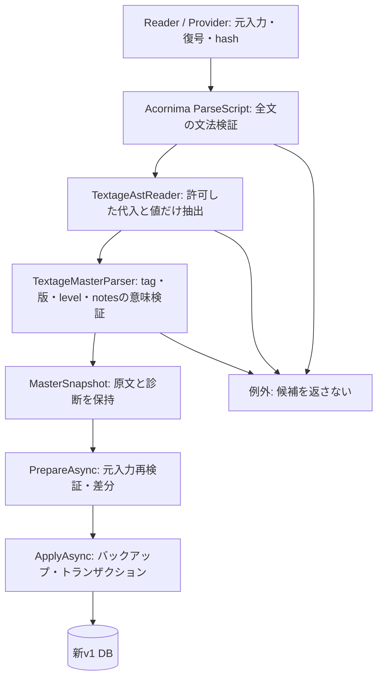

# Phase 2フォローアップ：JavaScript解析のAcornima移行

対象：Issue #13の項目3。実装・検証時点：2026-09-21。

## 採用と責務

[Acornima 1.8.0](https://www.nuget.org/packages/Acornima/1.8.0)を固定採用した。候補だったEsprima .NETは2026-08-24にアーカイブされ、[公式README](https://github.com/sebastienros/esprima-dotnet)がAcornimaを案内している。2026-09-21にユーザーが採用先の変更を承認した。

AcornimaはEsprima.NET由来のASTとAcorn由来の構文解析を持つ.NETライブラリ。採用時の公式公開版は1.8.0、NuGetの対応ソースcommitは `b4508e06c520493d798064dc172ad472e44968ce`。.NET 8用アセンブリには追加パッケージ依存がなく、Python、Node.js、ブラウザーの実行環境を要求しない。既存のSQLite・グラフライブラリと機能は重複しない。Esprimaのパッケージ参照は残さない。

- [TextageAstReader](../Master/Textage/TextageAstReader.cs)：全文のAST作成、データ領域の許可リスト、表示領域の直接書換え検出。
- [TextageMasterParser](../Master/Textage/TextageMasterParser.cs)：既存の曲・譜面・例外tagの意味検証。HTML装飾除去は変更しない。
- [MasterSnapshot](../Master/Models/MasterSnapshot.cs)、[MasterUpdateService](../Master/MasterUpdateService.cs)：解析規則版と既存所有範囲の互換性。
- [AST入力契約テスト](../tests/IIDXProgressDashboard.Tests/Master/Textage/TextageAstContractTests.cs)：内部字句状態への依存を除き、公開Parse APIの受理・拒否・原文保持を検証。

## 入力契約と意図した差

`ParseScript`、`Tolerant=false`、ECMAScript 2022固定、`PreserveParens=true`を使用する。正規表現はAcornimaの既定動作で文法検証のみを行い、実行用.NET Regexへ変換しない。JSを実行するAPIは使わない。

| 対象 | 方針 |
| --- | --- |
| データ領域 | ファイルごとの従来の代入先、非負添字、A〜F/SS/列定数のみ。変数宣言・未知の代入先・重複代入を拒否 |
| 値 | 配列、object、文字列、10進int、許可済み定数。穴あき配列、spread、getter、computed key、未知式を拒否 |
| 文字列 | 復号はライブラリへ委譲。元リテラルに許可escapeの制約を適用し、従来拒否した `\\q`、`\\0`、`\\u{...}` 等を新規受理しない |
| 数値 | 16進・指数・小数・BigInt・区切り文字を拒否。複数桁の先頭ゼロも拒否する（旧実装の10進解釈とJSの旧8進解釈の相違を避ける） |
| 識別子 | データ領域ではASCII文字・数字・`_`・`$`。Unicode識別子や識別子escapeへの拡張はしない |
| 装飾 | 文字列リテラルの `.fontcolor(文字列リテラル)` だけを読み、引数も検証。呼出しは実行しない |
| new | CS初期化の `new Array()` だけ。引数あり、括弧省略、任意のコンストラクターは拒否 |
| 括弧・終端 | データ式の余分な括弧をASTに残して拒否。データ代入の明示的セミコロンを要求し、ASIによって切断入力を受理しない |
| 表示領域 | datatblの関数宣言、scrlistのreferstr代入を入口にし、残りも全文文法検証。標準JSとして正しい正規表現の位置・構文を扱える |
| 表示領域の不正 | 旧実装が括弧だけで通していた文法不正も拒否。保護対象の直接代入・複合代入・前後置更新・delete・分割代入・for-in/of代入・変数宣言を拒否 |

表示コードのalias経由のデータフローや任意関数の意味は解析しない。たとえば実scrlistの `mt=actbl` の後の `mt[tag].tagid=...` は表示処理として無視する。任意JSの副作用を全検出する仕組みではなく、入力を実行せず保護名への直接書換えを拒否する境界である。

承認済み18タグは元入力・`NON_PLAYABLE_EXCLUDED`診断・候補除外を維持する。例外tagの値でも構文と許可値の検査は省略しない。

## 上限・キャンセル・失敗

- AST作成前に1ファイル8,388,608 UTF-16コード単位を上限とする。Readerの読み込みバッファの上限ではない。
- AST深さは128、データ値の入れ子は従来同様64を上限とする。ライブラリのスタック保護による `InsufficientExecutionStackException` も `InvalidDataException` へ変換する。
- ノード作成・token・commentのコールバックとAST走査でキャンセルを確認する。単一の長い文字列・コメント・正規表現を解析している最中には割り込めず、リアルタイムの応答期限は保証しない。
- 構文エラーをファイル名・行・列付きの `InvalidDataException` に変換。キャンセルは `OperationCanceledException` のまま返す。部分候補を返さない。
- Prepare経由の解析失敗は既存のFAILEDログ経路へ入り、Apply途中の失敗はトランザクションをロールバックする。スキーマは変更しない。

## 保存済み更新状態

`ParserVersion`を1から2へ更新。`Scope=TEXTAGE_ACTBL_CATALOG_V1`、FormatVersion、譜面キー、所有範囲の意味は維持する。既知の版1の所有範囲だけは版2へ引き継ぎ、新入力を版2で再検証してから保存する。未知の版・所有範囲形式は拒否する。既存の欠落確認手順やchart_idを変更しない。版2で保存した後、旧版アプリでは版2の状態を拒否するため、旧バイナリへの切替だけで更新運用を戻せない。

## 検証

合成テストと任意の実入力検証を分けて実施する。CIは個人のdataディレクトリに依存しない。

実入力は[既存の監査](phase2-followup-local-textage-audit.md)と同じUTF-8の7ファイル。HEADの旧パーサーを比較用に別名で読み込み、新旧を同じ入力snapshotに対して実行し、曲・譜面の全フィールドと診断レコードの順序・内容を比較した。結果は2,746曲・16,916譜面、診断も一致。件数だけの判定ではない。前後の元バイトhashも一致した。

実入力・比較用旧コード・検証DB・ローカル検証プログラムはGit対象外。通常DBや個人履歴の移行は行わない。

## 配布

ライセンスはBSD-3-Clause。採用版の公式[LICENSE](../ThirdParty/Acornima/LICENSE)と派生元の[NOTICE](../ThirdParty/Acornima/NOTICE)をそのまま保存し、build/publish出力へ同梱する。single-fileでもライセンスは読める別ファイルとして添付する。

net8.0向けAcornima.dllは366,080バイト。実機のx64に合わせたwin-x64 / self-contained / single-fileのpublishと、同形式の合成入力専用コンソールによるParser実行に成功した。これはアプリ全体の配布完了ではない。既存のNU1701・Nullable等の警告やGAC参照の評価、クリーン環境のUI起動確認は後続の配布フェーズに残る。

## 残る範囲

Issue #13の実HTTP取得、通常プレイ可能なカタログ範囲の確定、Phase 6の運用UI、通常DB置換は今回の対象外。外部ライブラリの採用は上流カタログの完全性や全件収録を保証しない。

### 2026-09-21の実施結果

- `dotnet build IIDXProgressDashboard.sln` 成功。既存のNU1701、Nullable、未使用フィールド等の警告は残る。
- 合成自動テスト334件成功（失敗・スキップ0）。個人入力を使う任意検証を外した状態で実行。文法エラーの位置、深い配列・括弧、未知式・重複・書換え、元入力保持、保存済み版1/2の所有範囲と未知版拒否を検証。
- 実入力7ファイル：旧実装とAcornimaの全曲・全譜面・全診断が一致。7ファイルの前後hash一致。
- 入力とは別ディレクトリの新規v1 DBへ正式候補を反映・再適用。各2,746曲・16,916譜面、欠落差分・非アクティブ化0。
- 全16,916譜面をtag・SP/DP・difficulty・level・notes付きでResolver照合し、期待chart_idと一致。
- songs/chartsはupdated_at以外の全列、合成履歴・alias・難易度表3テーブルは全列を維持。再適用前のバックアップも7ドメインテーブルの全列が一致。
- 構文エラーと更新途中の例外を注入し、7テーブルの全列不変、FAILEDログ2件・登録件数0を確認。`quick_check=ok`、外部キー違反0。
- win-x64 / self-contained / single-file publish成功。実測アプリexeは163,784,182バイト（既存のグラフ・Windowsランタイムを含む。Acornima単体の増加量ではない）。Acornima.dll単体は366,080バイトで、LICENSE/NOTICEの同梱も確認。
- 同じ配布形式の専用コンソールを起動し、合成1曲・1譜面をParserVersion 2で解析できた。アプリのUIをクリーン環境で検証した結果ではない。
