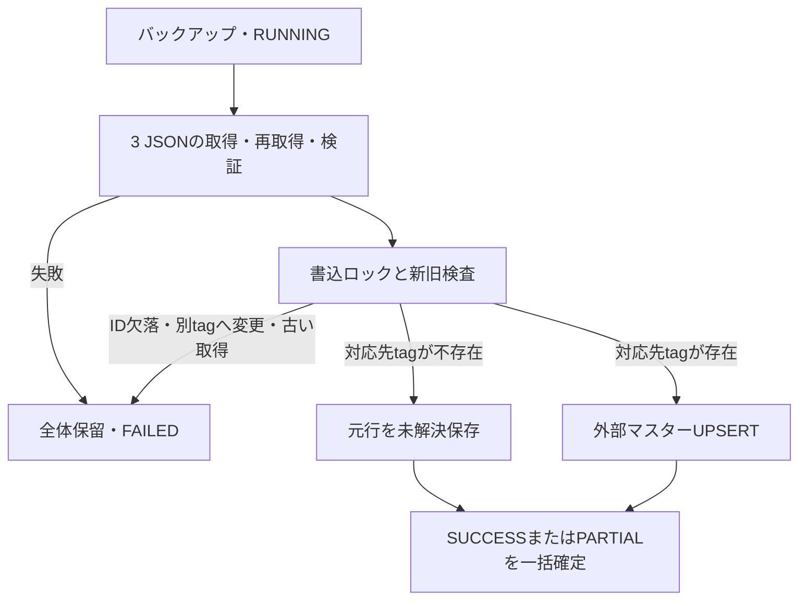

# 外部楽曲IDマスターと補助照合

対象：Issue #26（Phase 2フォローアップ）、2026-09-23実装時点。DBスキーマv2を使う。今回の範囲は取得・登録API、共通Resolver、代表統合テスト。画面への接続はPhase 6で行う。

## 取得元と入力契約

[IIDX Data Table](https://chinimuruhi.github.io/IIDX-Data-Table/)の「楽曲情報」からID集合、「曲名」から原タイトル、「textageタグ」から既存songsへのアンカーを得る。

| ファイル | 内容 |
| --- | --- |
| [song-info.json](https://chinimuruhi.github.io/IIDX-Data-Table/textage/song-info.json) | ID文字列をキーにartist・genre・versionを持つ辞書 |
| [title.json](https://chinimuruhi.github.io/IIDX-Data-Table/textage/title.json) | 同じIDから曲名への辞書 |
| [textage-tag.json](https://chinimuruhi.github.io/IIDX-Data-Table/textage/textage-tag.json) | 同じIDからTexTage tagへの辞書 |

生成コードの調査commitは`45432f6743d3a7d727faee00023f4bae342cf087`。[textage_fetcher.py](https://github.com/chinimuruhi/IIDX-Data-Table/blob/45432f6743d3a7d727faee00023f4bae342cf087/src/fetch/textage_fetcher.py)では既存tagのIDを再利用し、新規ID衝突時は100000ずつ加算する。独自の楽曲IDであり、KONAMIやRefluxの数値IDと同じ名前空間ではない。生成コードcommitと配信データのrevisionは同一と断定しない。公開説明は完全性等を保証しておらず、元データの利用条件への従属を案内している。

外部サイトの処理済み曲名・逆引き辞書は取り込まない。生成側には収録状況・ID大小で同名候補を選ぶ処理があり、その選択を当アプリへ継承しない。原曲名を既存[TitleNormalizer](../Matching/TitleNormalizer.cs)で正規化し、衝突はそのまま候補として保持する。

[IidxDataTableProvider](../Master/IidxDataTableProvider.cs)はUTF-8・各8 MiB上限、トップレベル辞書の非空、重複IDなし、3ファイルのID集合一致、必須値の型を検証する。キーは非負のInt64へ変換し、先頭ゼロ・符号・桁あふれを拒否する。数値は曲単位であり譜面は表さない。tagの複数ID対応は許可する。

HTTPは各要求30秒、429/5xxのみ最大1回再試行（Retry-Afterが10秒を超えると失敗）。5分のインスタンス内成功キャッシュと同時取得の直列化を行う。HttpClient・Providerを呼出側で再利用する。取得後に3ファイルを再取得して元バイトの一致を確認する。これは配信元が一括で原子的に更新した保証ではなく、観測中の不変性と構造整合性の検査である。不整合・空・HTML・403等を正常な空マスターへ変換しない。

## 登録と保全

[ExternalSongUpdateService](../Master/ExternalSongUpdateService.cs)は既存[DatabaseBackup](../Database/DatabaseBackup.cs)を使い、取得前にバックアップとRUNNINGを記録する。ネットワーク処理中は書込トランザクションを保持しない。反映時は書込ロックを取り、対応の検査、UPSERT、未解決保存、完了ログを一括確定する。失敗・キャンセル時は反映全体を戻し、別の処理でFAILEDだけ残す。バックアップ失敗ではRUNNINGも書かない。



- 所有ソースは`IIDX_DATA_TABLE`のみ。他ソース、songs.title、曲・譜面の活動状態、chart_id、登録済み履歴を変更しない。
- 正常行はtitle・normalized_title・is_activeを更新する。変更なしならupdated_atを保持する。created_atは維持する。ID→tagの変更は全体保留とし、自動付替えしない。
- 配信から既存IDが1件でも消失すれば、具体的IDをエラーに残し全体を保留する。欠落を自動削除・非アクティブ化しない。欠落や再割当の承認・修正APIは今後の設計事項。
- songsにtagがない行は、同名曲があっても別tagへ振り替えない。`EXTERNAL_TAG_NOT_FOUND`で元行を保存し、正常行のみPARTIALとして登録する。再取得時に同じID・tagを登録できれば該当PENDINGをRESOLVEDにする。
- 受理済み取得時刻より古いsnapshotを拒否する。並行実行時の開始run番号と完了順が逆でも、新旧判定に取得時刻を使う。
- import_runsはsource_type=`EXTERNAL_SONG_MASTER`。件数は取得行、登録できた行（変更なしも含む）、未解決行。options_jsonには契約・Parser・Normalizer版、取得時刻、URL、SHA-256、受理候補の元JSONを保存する。取得・解析前に失敗した本文の保存は未対応。処理中の強制終了で残るRUNNINGを成功へ変換しない。

利用例（UI側では非同期に呼び出す）：

```csharp
var provider = new IidxDataTableProvider();
var service = new ExternalSongUpdateService(database, backupDirectory);
var result = await service.UpdateAsync(token => provider.FetchAsync(client, token), cancellationToken);
```

## Resolverの判断

[ChartResolver](../Matching/ChartResolver.cs)はまず従来のtag・正式タイトル・対象aliasの照合を行い、同じDBトランザクションから外部候補を取得する。主経路が明示tagを持つ場合は従来どおりタイトルとの整合性を要求する。tag未指定の場合の正式タイトル・alias照合も維持する。

既存Legacy・Reflux・難易度表の要求にはIIDX Data Table独自IDがないため、入力曲名を正規化して外部マスターを引く。得たIDは`TITLE_DERIVED`であり、独立した元入力IDの証拠ではない。将来の直接ID入力用には`ExternalSongId`と`ExternalSourceName`を追加し、両者を指定したときだけ`DIRECT_ID`として検索する。SourceName（aliasの出典）とExternalSourceNameを混同しない。

| 主経路 | 外部経路 | 結果 |
| --- | --- | --- |
| Aに一致 | Aに一意一致 | 従来の譜面条件検査後に自動確定 |
| Aに一致 | 候補なし | 従来処理 |
| Aに一致 | Bに一致 | EXTERNAL_ID_CONFLICT、手動確認 |
| 一意に確定せず | 一意一致 | EXTERNAL_ID_REVIEW_REQUIRED、手動確認 |
| 一意に確定せず | 候補なし | 従来の理由を維持 |
| 任意 | 複数tag | EXTERNAL_ID_AMBIGUOUS、手動確認 |

同じtagへの複数IDは曖昧としない。外部対応自体がis_active=0なら検索から除外するが、songs・chartsの非activeは従来どおり履歴照合の対象。level/notes、SP/DP、B/N/H/A/L、不正必須値の検査は維持し、活動状態・譜面の有無・数値一致で同名候補を間引かない。

`ChartResolution.ExternalEvidence`でID・ソース・tag・外部曲名・証拠種別を返す。手動確認時はreason_detailにも候補根拠と従来理由を含めるため、Phase 3・4の既存保存処理だけで追跡できる。Phase 5は既存の照合snapshotで保存する。成功したPhase 3・4の各履歴へ外部照合根拠を新規永続化する変更は行っていない。

外部側だけ一致した行は自動登録しない。タイトル表記差の妥当性を人が確認し、既存SongAliasRepositoryでaliasを登録して再処理すると、両経路が一致した行のみ登録される。明示tagの矛盾・同名候補・外部ID再割当をaliasで強制解除する機能ではない。手動判断の画面はPhase 6。

## Phase 3・4・5への影響と検証

本体のImporter・Difficulty処理に専用の外部IDロジックは追加していない。共通Resolverを使うことで反映される。Phase 5のPrepare/Apply間で外部対応が変わった場合も、Apply側の既存再照合とsnapshot比較で古い結果の適用を拒否する。

新規単体テストは取得・登録・外部照合・組合せ判断を中心とし、既存tag照合は回帰テストとした。Phase 3・4・5は主経路のみ、外部のみ、双方一致、双方不一致、異なる曲への矛盾の代表ケースを追加。PENDINGと元データ・理由の保存、Legacy/Refluxでは手動alias後の同じ元行の解決と再取込冪等性を確認する。各Importerの全仕様を新しく再検証するものではない。

実HTTP検証（DB書込みなし）：2026-09-22 17:03:58 UTC（JSTでは9月23日）。Providerで6回の取得と解析に成功し2,679件、ID範囲1～104060、tagの複数ID対応0、共通正規化曲名が複数tagになるグループ81を観測した。これは固定の期待値でも、全INFINITAS収録を保証する値でもない。

| 入力 | SHA-256 |
| --- | --- |
| song-info.json | CE599441940B47F3C870E0BA5A86092CB83C865CC171FEE699DADA927578AEC3 |
| title.json | 68B42EF4DDB055604015763E440320474AF44DF616B73003F9444F011C133085 |
| textage-tag.json | 35888A9BD9305DC81A96656804771F86A2A771D1EC27E095F4815ABB786F8A5A |

一式のfingerprint：`B8C4613C45BAA9248E3EF0F94FA2976E9A1D1A628DBC8AF5039AD3CF62398C99`。

```powershell
dotnet build IIDXProgressDashboard.sln --no-restore
dotnet test tests/IIDXProgressDashboard.Tests/IIDXProgressDashboard.Tests.csproj --no-restore
# 任意の実HTTP検証。CI・通常の単体テストでは呼ばない。
dotnet run --project tests/ExternalSongValidation/ExternalSongValidation.csproj -- --fetch
```

合成テスト500件成功（失敗・スキップ0）。直接IDのみの要求を入力不正ではなく照合未解決として扱う最終調整後、ビルドとResolverテスト42件も成功。既存NU1701等の警告あり。個人DB・実履歴の更新は未実施。実履歴の改善件数、複数配信版でのID安定性、UI接続、欠落・再割当の承認操作は残課題。外部IDだけで追加の履歴を自動確定する契約ではないため、件数増加を本実装の成功指標にはしていない。追加パッケージ・Python実行依存はない。
