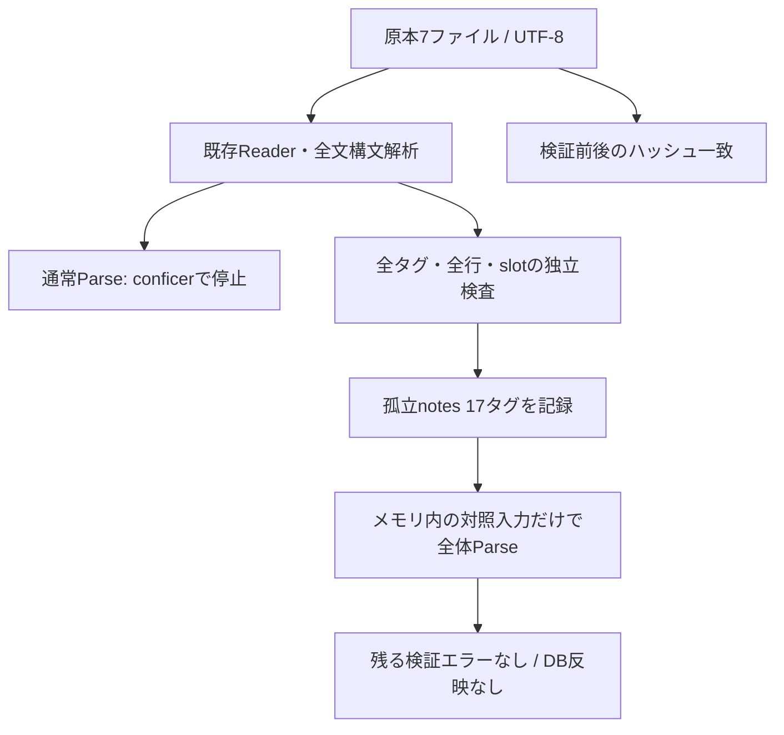
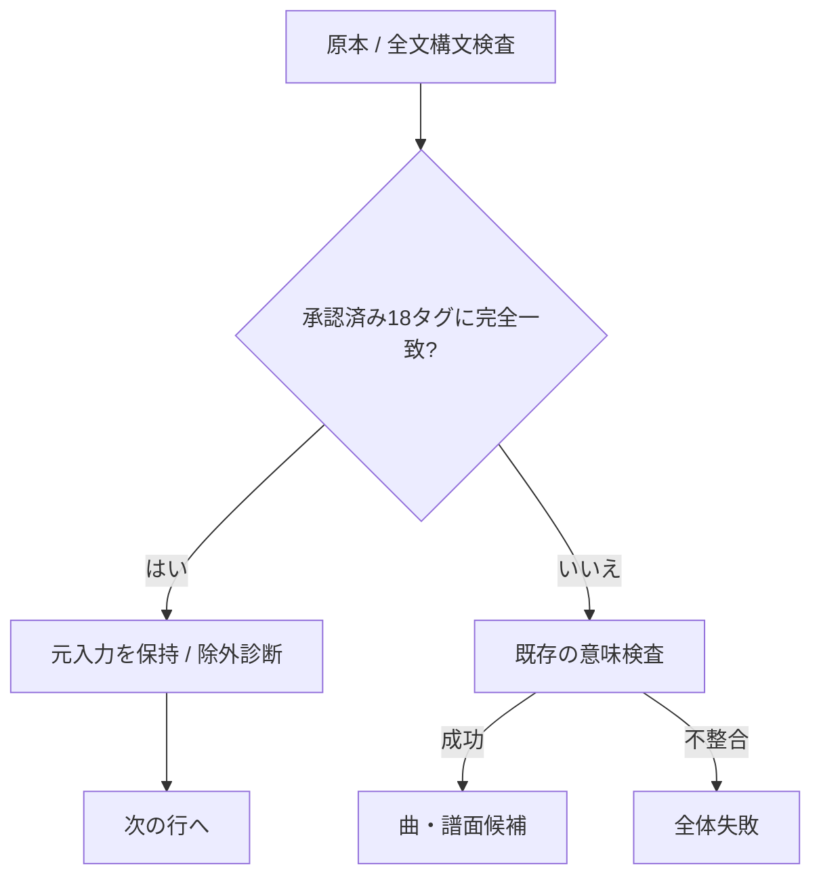

# Phase 2フォローアップ：配置済みTextageの全件調査

2026-09-20実施。[Issue #13 項目1](https://github.com/xidinor/IIDXProgressDashboard/issues/13)のうち、現在配置されている実ローカル入力の不整合調査を対象とする。HTTP再取得・運用接続・個人履歴移行は対象外。

## 2026-09-20調査時点の結論

`conficer` 以外にも16タグが同じ理由で拒否される。計17タグは `datatbl.js` に存在するが、`titletbl.js` と `actbl.js` の双方に存在しない。現在の入力契約・Parserでは全体失敗が正しい動作であり、今回も正式なMasterSnapshotは取得できていない。

原本7ファイルの構文解析は成功。全タグと各行・slotを個別検査した範囲で、承認済み除外 `firstemo` 以外の配列・数値・flagsの追加エラーは検出されなかった。17タグを**メモリ上だけ**で除いた対照実験では、CS比較を含む全体の意味検証が成功した。これは不整合箇所の切り分けであり、除外方針の採用や正式入力の受理ではない。

## 方法とデータ保全

調査専用のローカルC#コンソールから、既存の [TextageSourceReader](../Master/Textage/TextageSourceReader.cs) と [TextageMasterParser](../Master/Textage/TextageMasterParser.cs) を使用した。独立プロジェクト・出力はGit追跡対象外の `bin/phase2-audit/` に配置した。外部JSは実行していない。

1. UTF-8を明示したReaderで必須4ファイルとCS比較3ファイルを読み込み、通常の全体Parseが `datatbl.js:conficer: 曲情報がありません。` で停止することを再現。
2. 調査用Reflectionで既存の `ReadDocument` を呼び、7ファイルの全文構文を検査。CS定数はactblの解析値を引き継ぐ。
3. 解析した辞書の全タグの和集合を取り、各タグの曲情報・level・notesをメモリ上で再シリアライズして既存Parseへ渡す。共通の版情報は元のscrlistを使用する。個別タグの「曲・譜面候補が空」は全体の空カタログと区別する。
4. 前段の参照エラーで隠れる値エラーも調べるため、全notes行へ既存 `NotesRow`、全actbl行とCS行へ既存 `LevelRow` を適用。actblの全10slotのflags-only条件も個別に走査。
5. 孤立notesの17タグだけをメモリ上で除いた対照入力で全体Parseを実行。残りの元ファイルはそのまま使い、全体のCS比較・空候補検査等も確認。
6. 原本7ファイルを再読込し、検証前後のSHA-256一致を確認。

本番Parser・入力契約は変更していない。DBには接続せず、既存DB・原本・通常動作への変更はない。検証用DBも作っていない。

## 検出した17タグ

行番号は今回のローカル `datatbl.js` に対するもの。全件、曲情報とactbl登録の双方がない。

| tag | 行 |
| --- | ---: |
| `conficer` | 303 |
| `dirty_lt` | 379 |
| `elpis` | 450 |
| `era_phat` | 475 |
| `evermess` | 486 |
| `evermesu` | 487 |
| `fujimori` | 556 |
| `gambol_a` | 571 |
| `popteam` | 1086 |
| `_100mnm_g` | 1683 |
| `_begin13` | 1706 |
| `_b_start` | 1713 |
| `_c_demae` | 1726 |
| `_dltamax` | 1733 |
| `_himawri` | 1765 |
| `_hnmrpp` | 1770 |
| `_meumeu` | 1833 |

ローカル入力から確認できた関連情報：

- `conficer` と隣接する `confiser` はnotes全11slotとBPMが完全一致。`confiser` は曲情報に「Confiserie」として存在し、actblにも存在する。旧綴り等の残存の可能性はあるが、上流での意図・経緯は未確認。
- `elpis` と `_elpis` は既存N/H/AのnotesとBPMが一致するが、`_elpis` にはSP/DPのLのnotesもある。文字列置換による一律統合の根拠にはしない。
- `_himawri` と `_hima_cs` はnotesとBPMが完全一致し、後者は曲情報・actblに存在する。版をまたぐ同一性は今回確定していない。
- `gambol_a`、`_begin13`、`_b_start` はnotes全slotが0。他の14タグには正のnotesがある。全0かどうかで曲情報不足を自動解消しない。
- `popteam` と `popteamk` のnotesは異なる。類似したtagを別tagへ自動置換してはいけない。

## 2026-09-21：ユーザー調査の追記

以下はユーザー提供の調査結果と参照先を記録したもの。リンク先の独立した再検証は今回行っていない。上記のローカルデータで直接確認した事実と区別し、楽曲側の版・譜面変更の情報だけでTextageの旧tagの由来まで確定したとは扱わない。

| tag | ユーザー調査内容 | 確認状況・参照先 |
| --- | --- | --- |
| `conficer` | Confiserieのスペルミス表記だった時期のデータか | 推測。詳細確認できず |
| `dirty_lt` | The Dirty of Loudness、AC DistorteDロケテ時点のHYPER（1,265 notes） | ユーザー調査で判明。[BEMANIWiki](https://bemaniwiki.com/index.php?beatmaniaIIDX13+DistorteD/%E9%81%8E%E5%8E%BB%E3%81%AE%E6%83%85%E5%A0%B1) |
| `elpis` | BISTROVERでLEGGENDARIAが追加される前のデータ | ユーザー調査で判明。[RemyWiki](https://remywiki.com/Elpis) |
| `era_phat` | 詳細確認できず | 不明 |
| `evermess` | Everlasting Messageか。BISTROVERでDP HYPERの難易度変更があった | 曲名・tagとの関連は推測。それ以上の詳細確認できず。[RemyWiki](https://remywiki.com/Everlasting_Message) |
| `evermesu` | 詳細確認できず | 不明 |
| `fujimori` | 詳細確認できず | 不明 |
| `gambol_a` | GAMBOL ANOTHERか | 推測。BPMのみで詳細不明 |
| `popteam` | 実際には収録されていない「POP TEAM EPIC (Energize Remix)」か。開発中止タイトル「彩響DJアニクラゲ」のロケテで確認された同名曲との関連が考えられる | 推測。詳細不明。[BEMANIWiki](https://bemaniwiki.com/index.php?beatmania+IIDX+27+HEROIC+VERSE/%E7%A8%BC%E5%83%8D%E5%89%8D%E6%83%85%E5%A0%B1)、[RemyWiki](https://remywiki.com/POP_TEAM_EPIC%28kors_k_Remix%29) |
| `_100mnm_g` | 100% minimoo-G。AC GOLDでCS HAPPY SKY由来のDP ANOTHERが追加される前、AC HAPPY SKY / DistorteDの曲情報 | ユーザー調査で判明。[RemyWiki](https://remywiki.com/100%25_minimoo-G) |
| `_begin13` | 詳細確認できず | 不明 |
| `_b_start` | 詳細確認できず | 不明 |
| `_c_demae` | 詳細確認できず | 不明 |
| `_dltamax` | おそらく「ΔMAX」。過去のエイプリルフール公開譜面で、IIDX未収録とみられる。当時のHYPER譜面は確認できず | 推測を含む。[ニコニコ動画](https://www.nicovideo.jp/watch/sm6610736) |
| `_himawri` | ヒマワリのDP譜面刷新前のデータ | ユーザー調査で判明。[RemyWiki](https://remywiki.com/Himawari) |
| `_hnmrpp` | 「はなまるぴっぴはよいこだけ」が最も近い曲名 | 推測。詳細不明 |
| `_meumeu` | 「めうめうぺったんたん！！(ZAQUVA Remix)」につながるデータか | 推測。詳細不明 |

ユーザー方針：詳細不明なタグは何もせず保留する。元データを保持し、推測による曲情報補完・tag置換・統合・alias登録・削除・除外例外の追加は行わない。用途が判明したタグについても、この調査情報の提供だけを実装変更の承認とは扱わない。

現在のParserは孤立notesで全体停止するため、保留のままでは正式なマスター取得の問題は残る。「曲・譜面への採用を保留すること」と「カタログ外notesが取得全体を停止させるべきか」は別の判断であり、後者の入力契約は今回変更していない。

## 全件検査の観測値

件数は今回のsnapshotの観測値であり、将来の固定期待値やINFINITAS全曲保証には使わない。

| 対象 | 件数・結果 |
| --- | --- |
| titletbl | 2,748タグ（既知ダミー・firstemoを含む） |
| actbl | 2,661タグ（firstemoを含む） |
| datatbl | 2,754タグ |
| 上記のタグ和集合 | 2,765タグ |
| actblにあるが曲情報がない | 0 |
| actblにあるがnotesがない | 0 |
| notesにあるが曲情報がない | 17 |
| 曲情報にあるがactblがない | 87（契約上、曲情報だけの候補を許容） |
| CS比較 | 17版・延べ1,378行の構文・行構造を検査 |
| flags-only | firstemoのSP/Bのみ。承認済み除外を維持 |
| 対照入力の候補 | 2,746曲・16,916譜面。正式入力の成功件数ではない |
| 対照入力の診断 | NON_PLAYABLE_EXCLUDED 5、DUMMY_EXCLUDED 1、LEGACY_LEVEL 1,294、SBO_EXCLUDED 121、CS_DIFFERENCE 1,353、CS_ONLY 21 |

CS_DIFFERENCEは版・曲行単位の先頭23要素の差分であり、1,353譜面の不正を意味しない。CS_ONLYの21タグは以下で、AC側へ自動補完していない。

`20novem5`, `321star5`, `atkmusc5`, `begincr5`, `beginin5`, `caldera5`, `crymson5`, `denim5`, `drkmnky5`, `feelinl5`, `gentle5`, `guilty5`, `implant5`, `lmotion5`, `mnemonq5`, `qmaster5`, `shighwy5`, `shox5`, `t100sec5`, `turning5`, `whatnxt5`。

## 入力同一性

7ファイルとも検証前後で一致。保存された入力の識別であり、上流の同時刻snapshotや元の取得日時を保証しない。

| ファイル | バイト数 | SHA-256 |
| --- | ---: | --- |
| titletbl.js | 217573 | `23E76F4ADA10B2D7E0E38CD50F4D140EEB0B1588D3DF5F2A207ED40CDF8B7CF3` |
| scrlist.js | 47508 | `6227C836981E6B19A42E47C0F29D84DB4F5DA64D6E314763151A0CF65450F7BF` |
| datatbl.js | 211643 | `D877EEA75B738E3DC49A14933901B204545063DBF9AA9E70D4392F70BD810CFA` |
| actbl.js | 197983 | `F4C2AE932B6660CB0F76057194918F841C37453EC693B5CE75DC7EFDDD9D143C` |
| cstbl.js | 30123 | `1C887E4164F9DB637F13C1625C1DC8FF20A5B9E8ED10A34E6B54549135DCEF63` |
| cstbl1.js | 40630 | `D362E743C8CC01AAAC64653FB76927CB62ED710CD37CC888E8F746C7C05B4947` |
| cstbl2.js | 57023 | `0B7E1DD1F8BE1F9014D8EA5CBB79E6274328319E62B21E7858FEA3862F57E5EA` |

## 例外承認前の残課題と完了範囲

今回で、最初のエラーより後の行を含むローカル入力のエラー棚卸しを行った。Issue #13全体の完了ではない。

- 2026-09-21のユーザー調査を上記に記録した。詳細不明なタグは保留し、推測で補完しない。カタログ外notesを全体拒否する現行契約を維持するか、診断として分離するかは未決定。削除・alias登録・tag統合は未実施。
- 実HTTPのFetchAsync、最新入力との比較、旧マスターDBとの比較は未実施。
- 正式入力が全体検証を通っていないため、新v1 DBへの反映・再適用・Resolver照合も未実施。対照入力を代用して運用成功扱いにしない。
- 今回は調査と文書のみ。本番コード変更・新しい受理規則・合成回帰テスト追加はない。調査プログラムの実行は成功したが、アプリのビルド・自動テスト一式は実行していない。

## 2026-09-21：承認済み例外の実装・検証

この節は上記の「保留」「全体停止」の現状記述に優先する。ユーザーは、17タグを過去・未収録・用途未確定のカタログ外データとして保持し、今後のAC/INFINITASスコア管理では `firstemo` と同じ例外処理を行うことを承認した。各タグの詳しい由来まで確定したという意味ではない。

[TextageMasterParser.ExcludeNonPlayable](../Master/Textage/TextageMasterParser.cs) に17タグの完全一致判定を追加した。既存の呼出し経路を共用し、titletbl・actbl・datatbl・CS比較それぞれで候補化前に除外し、理由付きの `NON_PLAYABLE_EXCLUDED` を記録する。コード名はfirstemoとの互換を維持し、診断文では用途未確定も含む承認済み例外であることを明示する。

保持とは、ローカル原本を変更せず、返す `MasterSnapshot.Sources` に元JSを残すことを指す。除外タグの曲・譜面を新DBに登録することや、新しい保管テーブルを作ることではない。DBスキーマ・既存DB・更新時の非アクティブ化条件は変更していない。将来これらのタグを採用する場合は例外規則の再検討が必要になる。

検証結果：

- `dotnet build IIDXProgressDashboard.sln --no-restore` 成功。既存のNU1701・Nullable等の警告は残る。
- `dotnet test tests/IIDXProgressDashboard.Tests/IIDXProgressDashboard.Tests.csproj --no-restore -v quiet`：296件成功、失敗・スキップ0。
- [合成回帰テスト](../tests/IIDXProgressDashboard.Tests/Master/Textage/TextageMasterParserTests.cs)を17タグ分追加。孤立notes、全入力経路での除外、元入力保持、未知・類似・大文字tagの拒否、例外内の構文破損、例外しかない空カタログの拒否を確認。
- 配置済み実入力7ファイルを既存Parserへそのまま渡す全体解析が成功：2,746曲・16,916譜面。以前のメモリ上の17タグ削除を適用する前の通常Parseで確認した。
- 実入力7ファイルの検証前後SHA-256一致。DB反映・個人履歴移行は未実施。

例外処理実装時点では、Issue #13のローカル入力を妨げていた17タグの対応まで完了。その後2026-09-21に、[正式候補の新DBへの反映・再適用・Resolver検証](phase2-followup-real-master-db-validation.md)も実施した。実HTTP取得とPhase 6の運用接続は残る。

関連：[入力契約](phase2-1-textage-source-contract.md)、[Phase 2全体](phase2-master-matching-explained.md)、[Phase 4実データ検証](phase4-reflux-session-importer-explained.md)。
