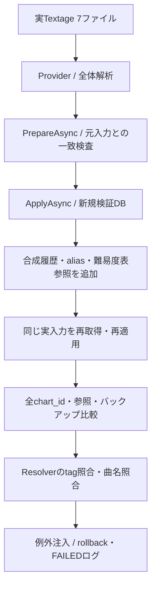

# Phase 2フォローアップ：正式マスターのDB反映・再適用・照合

2026-09-21実施。[Issue #13 項目1](https://github.com/xidinor/IIDXProgressDashboard/issues/13)のDB反映・再適用・Resolver照合を対象とする。[ローカル入力の全件調査と承認済み例外](phase2-followup-local-textage-audit.md)に続く検証である。実Session TSVの再取込は今回の対象ではない。

## 検証構成

配置済みTextageの7ファイルをUTF-8・CS比較有効で読み、[MasterDataProvider](../Master/MasterDataProvider.cs)が返す正式候補をそのまま使用する。手作業で元行を削除した対照入力や旧マスターDBによる代替は使わない。入力同一性は前回報告のハッシュ表を参照する。

検証専用コンソールはGit追跡対象外の `bin/phase2-dbcheck/` に置いた。実行ごとにGUIDの出力ディレクトリを作り、入力の `data/` 配下ではない絶対パスを確認してから新規DBを初期化する。個人履歴・旧DB・TSVは読み書きしない。

主要APIは [DatabaseInitializer](../Database/DatabaseInitializer.cs)、[MasterUpdateService](../Master/MasterUpdateService.cs)、[ChartResolver](../Matching/ChartResolver.cs)。DBの直接SQLは検証用の合成参照の準備と検証結果の読取りに限定し、マスター登録・再適用は公開APIを通す。

## 検証方法

- 初回反映件数を正式候補と比較する。
- ConfiserieのSP ANOTHERへ、ランプ0・score=100・BP NULLの合成履歴1件、手動alias1件、合成難易度表の参照1件を準備する。履歴の出典は `synthetic` とし、個人の実プレイとして扱わない。
- 同じ入力を再取得して変更案を作り、欠落差分0を確認して再適用する。全譜面のchart_id・識別キー・level・notes・活動状態・作成日時を比較し、合成履歴・alias・難易度表参照も全列比較する。更新日時は再適用で変わるため、ID保全比較から除く。
- 再適用前の7ドメインテーブルと、APIが作成したバックアップの同じ7テーブルを全列比較する。バックアップはReadOnly接続で開く。
- 正式候補の全譜面にtag・譜面種別・level・notesを指定し、ResolverがDBの対応chart_idを返すことを検証する。
- 譜面を持つ各tagから代表1譜面を選び、曲名のみでも照合する。正規化曲名が複数tagに一致する場合は `AMBIGUOUS_SONG`、一意なら対応chart_idを期待する。
- 合成aliasの照合、level不一致・notes不一致・除外tag・不正difficultyの理由コードを確認する。
- 実マスターの更新開始後、10曲処理時点のprogressから合成例外を送出する。別に取得段階でも合成例外を送出する。各回で7ドメインテーブルが失敗前と完全一致し、`import_runs` の最新行がFAILEDになることを確認する。
- `quick_check`、`foreign_key_check`、接続の外部キー有効化、入力7ファイルの前後ハッシュを確認する。

合成fixtureの自動テストとは別の、実入力を使った任意検証である。個人データや実ネットワークをCI依存に追加していない。

## 結果

| 検証 | 結果 |
| --- | --- |
| 初回反映 | 2,746曲・16,916譜面、SUCCESS |
| 同一入力の再適用 | 同件数、欠落差分・非アクティブ化とも0、SUCCESS |
| 譜面ID・情報の維持 | 全16,916譜面で一致（更新日時を除く） |
| 合成参照の維持 | 履歴・alias・難易度表参照の全列一致 |
| バックアップ | 再適用前の7ドメインテーブルと全列一致 |
| tag付き照合 | 全16,916譜面で期待するchart_idと一致 |
| 曲名のみの代表照合 | 譜面を持つ2,660タグ中、2,432件解決、228件は期待どおりAMBIGUOUS_SONG |
| 合成alias | Confiserie SP ANOTHERの同一chart_idへ解決 |
| 不一致等の診断 | LEVEL_MISMATCH、NOTES_MISMATCH、TAG_NOT_FOUND、INVALID_DIFFICULTYを確認 |
| 更新途中の例外 | 全ドメイン状態維持、FAILED、登録件数0 |
| 取得段階の例外 | 全ドメイン状態維持、FAILED、登録件数0 |
| 整合性 | quick_check=ok、foreign_key_check違反0、接続のforeign_keys=1 |
| 原本 | 7ファイルの検証前後ハッシュ一致 |

譜面種別ごとの全件照合対象：

| 種別 | B | N | H | A | L |
| --- | ---: | ---: | ---: | ---: | ---: |
| SP | 855 | 2,632 | 2,660 | 2,570 | 265 |
| DP | 13 | 2,632 | 2,659 | 2,378 | 252 |

`records_read` / `records_imported` はマスター更新では曲と譜面の合計なので、成功2回はそれぞれ19,662件である。プレイ件数ではない。失敗注入2回は期待したFAILEDであり、運用上の自然発生エラーではない。

曲名のみの228件は228プレイや228種類の曲名を意味しない。各tagの代表譜面に対する照合要求の件数である。例えば「5.1.1.」の `511` / `511_hs`、「ヒマワリ」の `_hima_cs` / `_hima_gd` など、同じ正規化曲名に複数tagが存在する。候補に譜面を持たない曲情報のみのtagが含まれる場合もある。現行契約どおり曖昧な候補は自動決定しないため、この結果自体は検証失敗ではない。ただし、曲名だけの実履歴入力がすべて自動解決することも保証しない。

## 実行記録と制約

検証用プログラムはプロジェクト参照経由で本体をビルドして実行した。既存のNU1701警告がある。本番コードには今回の検証による追加変更を加えていない。全件照合には数分を要し、同期Resolverの大量呼出しをUIスレッドで行うべきでないという既存方針は維持する。厳密な性能測定ではない。

機能上の検証assertionはすべて通過したが、最後のレポートSQLに検証プログラム側の列名誤記（`records_total`）があり、最初のプロセスはレポート生成で失敗した。正しい `records_read` へ修正し、回収用分岐の変数名のコンパイルエラーも修正後、同じDBをReadOnlyで開いて件数・診断対象・実行ログ・整合性結果を回収した。機能検証を省略して成功に置き換えたものではない。レポート回収時にDB更新・全件再取込は行っていない。

元の実行ログ、検証DB、バックアップ、JSONレポートは `bin/phase2-dbcheck/` 内に保持し、Git追跡対象外を確認した。文書差分の空白検査も実施した。今回の変更は検証と記録なので、前回296件成功済みの合成自動テスト一式は再実行していない。

今回依頼された、配置済み実入力の正式候補によるDB反映・再適用・照合・参照保全・バックアップ・失敗ログ検証は完了した。Issue #13全体やv1全体の完了ではない。実HTTP取得、旧マスターとの比較、Phase 6の運用接続は未実施。Phase 4の実Session TSVと未解決6行の再検証も今回には含まない。
