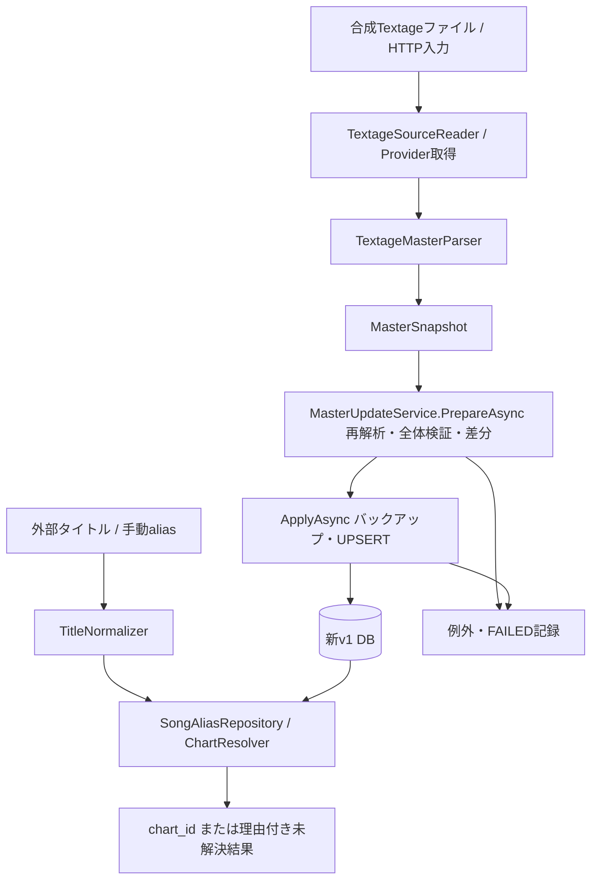

# Phase 2 マスター取得・更新・譜面照合の統合解説

実装・検証時点：2026-09-11。項目7の完了判定対象は統合テストをマージした `2609023`（PR #10）。
対象：[Issue #4](https://github.com/xidinor/IIDXProgressDashboard/issues/4) の6.6「Phase 2 統合テスト」と7「解説・完了判定」。
基準：[SPECS.md](../SPECS.md) 第4.1・6・9〜12・27・29章、[AGENTS.md](../AGENTS.md)。

## 構成と責務



| 主要ファイル | 役割 |
| --- | --- |
| [TextageSourceReader](../Master/Textage/TextageSourceReader.cs) | 必須ファイルと明示文字コードの検証、元バイトの同一性情報 |
| [TextageMasterParser](../Master/Textage/TextageMasterParser.cs) | JSを実行せず対象データ構造を解析し、曲・譜面を検証 |
| [MasterDataProvider](../Master/MasterDataProvider.cs) | ローカルまたはHTTPから非同期取得し、解析済み候補を返す |
| [MasterUpdateService](../Master/MasterUpdateService.cs) | 元入力との整合性再検証、差分作成、バックアップ付き原子的反映 |
| [TitleNormalizer](../Matching/TitleNormalizer.cs) | マスター・alias・外部入力共通の正規化 |
| [SongAliasRepository](../Database/SongAliasRepository.cs) | alias登録と衝突を保持したタイトル候補検索 |
| [ChartResolver](../Matching/ChartResolver.cs) | 譜面種別と任意値の整合性を検証し、一意の場合だけIDを返す |
| [Phase2IntegrationTests](../tests/IIDXProgressDashboard.Tests/Phase2IntegrationTests.cs) | 合成実ファイルから上記APIを接続した統合検証 |

## 取得範囲と完全性

通常候補はtitletbl.js / scrlist.js / actbl.js / datatbl.jsの4ファイルによるactblカタログ。
CS比較は任意で、CSだけの譜面をACへ補完しない。INFINITAS収録全体の保証とは区別する。
SP/DP × B/N/H/A/Lを扱い、旧BeginnerのSBoをSBへ統合しない。

ローカル入力は文字コードを明示し、不正バイトを置換しない。HTTP取得はCP932を使用し、一式を再取得して元バイトのSHA-256を比較する。
解析失敗・欠落・入力途中変更は候補全体の失敗となる。HTTP成功や固定件数だけでは完全としない。
さらにPrepareAsyncが元入力を再解析し、公開snapshotのモデル改変も拒否する。

取得成功だけでは欠落の非アクティブ化を許可しない。前回成功時に記録した所有範囲から欠落差分を作り、呼出し側がその差分を確認した場合だけconfirmMissingを指定する。
由来不明の既存行や管理範囲外の譜面を欠落として削除しない。
詳細は[入力契約](phase2-1-textage-source-contract.md)、[Provider解説](phase2-2-master-provider-explained.md)を参照。

## API利用例

この例はtagがsongの合成マスターを反映済み、または入力に含むことを前提とする。実際には登録済みtag・譜面条件を指定する。
以下のパス変数は呼出し側で決定する。出力には既存の旧DBやdata/原本を指定せず、別の新規パスを使う。

```csharp
var database = new DatabaseInitializer(outputPath);
database.Initialize();
var provider = new MasterDataProvider();
var service = new MasterUpdateService(database, backupDirectory);
var plan = await service.PrepareAsync(
    token => provider.ReadLocalAsync(inputDirectory,
        new(TextageEncoding.Utf8), token), cancellationToken);

// 欠落差分を未確認のまま非アクティブ化しない。
var update = await service.ApplyAsync(plan, cancellationToken: cancellationToken);
var aliases = new SongAliasRepository(database, backupDirectory);
aliases.Register("song", "別名", "manual");
var resolution = new ChartResolver(database).Resolve(
    new("別名", "SPA", Level: 11, SourceName: "REFLUX_SESSION_TSV"));
if (resolution.IsResolved)
{
    var chartId = resolution.ChartId; // 後続Importerへ渡す。
}
else
{
    var reasons = resolution.Issues; // 元データとの保存は後続Importerの責務。
}
```

## 正規化と照合

NFKC → invariant大文字化 → NFKC、空白の圧縮と前後除去を共通適用する。
記号の推測除去やfuzzy一致は行わない。Providerで取り出したタイトル原表記は正規化キーと別に保存する。
正式タイトルとaliasの候補を合併し、検索順・登録順だけで一意決定しない。
出典指定時はその出典とmanual、未指定時は全出典を候補にする。
手動aliasはマスター更新で保持し、改名時の旧タイトルは自動alias化しない。

Resolverは同名・正規化衝突を曖昧結果として返す。明示tagもタイトルや譜面条件との矛盾を検証する。
level/notesは識別子や曖昧候補の絞込みにせず、決定候補との矛盾検査に使う。
任意値不明を理由に有効な照合を捨てず、非アクティブ譜面も過去履歴の照合対象にする。
未解決にはChartIdを返さず理由・候補を返す。Resolver自体は履歴もunresolved_importsも登録しない。

詳細：[正規化・alias](phase2-4-title-normalizer-alias-explained.md)、[Resolver契約](phase2-5-chart-resolver-explained.md)。

## トランザクションと復旧

取得・全体検証とマスター書込みを分離し、バックアップ成功後にRUNNINGを記録する。
songsはtag、chartsは(tag, play_style, difficulty)のUPSERTでIDを維持する。
本体反映とSUCCESSは同じトランザクションで確定する。
反映中の例外・キャンセルは全変更をrollbackした後、独立したFAILEDログを保存する。
PrepareAsync経由の取得・解析失敗もバックアップ後にFAILEDを残す。
ログ保存自体が失敗した場合は複合例外を返すため、必ずFAILEDが残るとは限らない。

records_readは検証済み曲数＋譜面数、records_importedは確定したUPSERT件数。
失敗時はrecords_imported=0、キャンセル理由はCANCELLED。PARTIALは使用しない。
欠落未確認のSUCCESSは全候補のUPSERT成功を意味する。

バックアップはSQLite BackupDatabaseと整合性確認を使う。通常の反映失敗はまずrollbackとログを確認する。
復旧時は全接続を閉じ、現DBと付随ファイルを保全し、バックアップを別の新しいパスへ復元・検証して切り替える。
具体的手順とWAL・バックアップ失敗の扱いは[安全な更新の解説](phase2-3-safe-master-update-explained.md)に記載。

## 統合テストと検証結果

合成fixtureを一時ディレクトリへUTF-8で書き出し、Provider内部のReader・Parserを通して新規v1 DBへ反映する。
SQLによる履歴・難易度表の準備は参照保全を確認するための合成データで、Importer実装を意味しない。

| ケース | 確認内容 |
| --- | --- |
| 正常・改名 | 全10譜面種別の期待ID、外部タイトルとaliasの正規化、再更新後のID・履歴・alias・難易度表参照 |
| Reader失敗 | 不正UTF-8で反映段階へ進まず、既存データを保全 |
| Parser失敗 | 途中で切れた配列を全体失敗として扱う |
| 全体検証失敗 | 元入力と不一致のsnapshotを拒否 |
| 反映途中例外・キャンセル | 書込み開始後の全rollback、FAILED・理由・登録0件、後続照合へ進まない |
| 照合未解決 | 候補なし・不正difficulty・level矛盾の理由、確定済みDBへの副作用なし |

失敗時はsongs/charts/history/alias/難易度表の全列・全行を比較する。import_runsへの失敗記録は意図した変更として別に確認する。
照合失敗は、既に成功したマスター更新を巻き戻す契約ではない。
テスト側が公開APIを順番に呼んで例外時に停止する構成であり、運用UIの統合を検証するものではない。
個別の曖昧一致・notes矛盾・alias衝突・再登場・取得失敗・バックアップ復旧等は既存の個別テストで補完する。

2026-09-11の項目6.6で実行した結果（項目7での再実行結果ではない）：

- 統合テスト限定実行：9件成功、失敗・スキップ0。
- dotnet build IIDXProgressDashboard.sln -v quiet：成功、エラー0、警告12件。
- dotnet test tests/IIDXProgressDashboard.Tests/IIDXProgressDashboard.Tests.csproj --no-restore -v quiet：188件成功、失敗・スキップ0。
- 警告は既存OpenTK / OpenTK.GLControl / SkiaSharp.Views.WindowsFormsのNU1701。互換性解消や配布保証は今回の範囲外。
- SDK探索が制限されたため許可された権限で検証した。依存パッケージの変更はない。

## 項目7の完了判定

**判定：Issue #4で定義したPhase 2の実装・合成自動検証・解説は完了。実取得データによる運用確認は未完了。**
Issueでは外部取得元や旧マスターとの照合を独立した任意検証としているため、実データ検証を合成テスト成功に含めず、以下の根拠と制約を分けて判定した。

| 完了条件 | 判定と根拠 |
| --- | --- |
| C#だけでマスターを取得・解析できる | 実装済み。[Providerテスト](../tests/IIDXProgressDashboard.Tests/Master/MasterDataProviderTests.cs)で明示文字コードのローカル入力と合成HTTP応答を検証。新APIにPython・旧マスターDB依存はない。実HTTP取得成功の保証ではない |
| 全体検証後に安全に更新できる | 検証済み。[更新テスト](../tests/IIDXProgressDashboard.Tests/Master/MasterUpdateServiceTests.cs)のAcquisitionAndValidationFailuresOnlyRecordFailure、MidWriteFailureOrCancellationRollsBackAllMasterChangesで全体失敗・rollback・ログを確認 |
| chart_idと既存参照を保全する | 検証済み。同テストのUpsertPreservesIdentityHistoryAliasesAndDifficultyReferences、MissingItemsRequireConfirmationAndReappearWithSameIdentityで更新・消失・再登場と復旧を確認 |
| 正規化・aliasの曖昧さを安全に扱う | 検証済み。[正規化テスト](../tests/IIDXProgressDashboard.Tests/Matching/TitleNormalizerTests.cs)で冪等性、[aliasテスト](../tests/IIDXProgressDashboard.Tests/Matching/SongAliasRepositoryTests.cs)で衝突・出典・保全を確認 |
| 共通ResolverからIDまたは未解決理由を取得できる | 検証済み。[Resolverテスト](../tests/IIDXProgressDashboard.Tests/Matching/ChartResolverTests.cs)で全譜面種別、候補0/1/複数、tag・level・notes矛盾、不明値、非アクティブ、副作用なしを確認 |
| 取得から照合まで統合検証されている | 検証済み。[統合テスト](../tests/IIDXProgressDashboard.Tests/Phase2IntegrationTests.cs)9件を含む全188件成功、ビルド成功。実運用UIの接続は対象外 |
| 解説とレビュー可能な変更単位が揃う | 本書に構成図、API例、設計判断、検証結果、残課題、関連リンクを掲載。統合テストは6ac7fc7、先行解説はa015e0b、項目7は専用ブランチで文書変更として分離 |

本判定では、前回検証後のコード・テスト・プロジェクト定義に差分がないことを確認した。
今回の変更は文書のみのため、AGENTS.mdに従いビルド・テストは再実行していない。Markdownのローカルリンクと差分の空白エラーを確認した。
各小項目の解説にある「次の工程」「未実装」はその文書の実装時点の記録であり、現在のPhase 2全体の状態は本書を参照する。

## 後続Importerへ渡す契約

Importerは元行を保持したうえでChartResolutionRequestを作り、Resolveを呼ぶ。
DifficultyはSPA等、またはPlayStyleとB/N/H/A/L（旧長名も対応）を明示し、取得できない任意のlevel/notesはnullにする。
同期Resolverを大量に呼ぶ場合のUI外実行・キャッシュは呼出し側で検討する。

IsResolvedがtrueの場合だけChartIdを履歴登録へ使う。
falseの場合は入力1行につき未解決1行とし、主理由はIssues[0].Code、詳細には全Issues・Candidates・TitleEvidence・Requestを保存する契約である。
完全な元行はImporterが別に保持し、Requestから復元しない。
DBアクセスやスキーマの例外をSONG_NOT_FOUND等に変換せず、実行失敗として扱う。
保存処理・source_record_key・再処理・件数・トランザクションはPhase 3/4で実装する。
詳細な列対応は[Resolver解説](phase2-5-chart-resolver-explained.md)を参照。

## 未確定事項と運用上の残課題

| 事項 | 現在の状態・次に確認すること | 担当範囲 |
| --- | --- | --- |
| firstemo | 2026-09-12のユーザー確認によりCS DistorteDのTUTORIAL専用曲として明示除外。除外診断を返し、通常曲の不正値検証は維持する | 方針確定・Parserへ反映 |
| 実HTTP・実カタログ | 今回未実施。取得中変更検知は上流の原子的snapshotや全INFINITAS収録を保証しない | 実運用導入時 |
| 保存先・起動接続 | 呼出し側指定の新v1 DBを使用。通常保存先・起動時初期化は未接続 | Issue #3 / Phase 6 |
| 旧履歴 | 移行元の選択、タイムゾーン、分精度、DB識別と重複キーは未確定 | Phase 3 |
| Reflux | Session識別、途中編集、時刻設定訂正、未解決再処理は未確定 | Phase 4 |
| UI・配布 | chart単位の表示・集計、旧依存除去、GAC参照やNU1701を含む配布互換性は未検証 | Phase 6/7・配布 |

## DB互換性とv1全体との境界

Phase 2の公開APIを合成入力で接続し、安全な更新と共通照合・未解決理由の取得を確認した。
今回、本体コード・DBスキーマ・Migrationは変更していない。data/の原本は使用・変更していない。
実ネットワーク、実データ全件反映、WinForms起動、配布は今回未検証。
firstemoの扱いは下記の追記で確定した。実取得入力全体の受理・運用可否は別途確認が必要。
Issueのチェック欄やクローズは更新していない。

後続事項は、Phase 3/4の履歴Importer・日時と重複キー・未解決保存再処理、Phase 5の難易度Provider、Phase 6のUI接続、
Issue #3の通常DB保存先と起動時初期化、Phase 7の旧依存除去と配布検証。
Phase 2の合成統合検証成功を、実データでの運用確認やv1全体の完了とはしない。

## 2026-09-12追記：通常プレイ対象外のfirstemo

ユーザー確認により、tagが `firstemo` の楽曲はCS版IIDX 13 DistorteDのTUTORIAL専用曲 `first emotion` であり、通常プレイ不能と判明した。
tagの完全一致に限り、タイトル・actbl・notes・任意のCS比較から除外する。曲名やflags条件による一般化は行わず、songs/charts候補を生成しない。
除外した入力ごとに `NON_PLAYABLE_EXCLUDED` とファイル名・tag・理由を診断へ返す。

ファイル全体の構文解析・重複検出は引き続き行う。除外曲の構文破損や通常曲のflagsだけ存在する矛盾は成功扱いしない。
除外後の候補が空なら従来どおり失敗とする。未知の不正行をスキップする許可ではない。

DBスキーマ・ParserVersion・所有範囲形式は変更しない。既存行の削除や実DB更新は実行しない。
仮に既存DBにfirstemoがある場合、この除外だけでは自動削除・非アクティブ化せず、従来の所有範囲と欠落確認の契約に従う。
実データ全件の受理成功を確認した変更ではない。

追記時の検証：dotnet test（--no-restore）は190件成功、失敗・スキップ0。
dotnet build IIDXProgressDashboard.sln --no-restoreは成功、エラー0、既存NU1701警告6件。
追加の合成テストではカタログ・CS比較での限定除外、類似tag非除外、構文破損、空候補、通常曲のflags矛盾の拒否を確認した。
実入力全件の再検証・DB反映は未実施。
