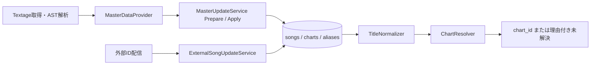

# Phase 2：マスター取得と譜面照合

対象：[Issue #4](https://github.com/xidinor/IIDXProgressDashboard/issues/4)、[Issue #13](https://github.com/xidinor/IIDXProgressDashboard/issues/13)、外部IDの[Issue #26](https://github.com/xidinor/IIDXProgressDashboard/issues/26)。整理時点：2026-09-30。各項目の当時の証拠と検証件数は末尾の原記録を残す。

## 構成

[TextageSourceReader](../Master/Textage/TextageSourceReader.cs)は入力の取得と完全性、[TextageAstReader](../Master/Textage/TextageAstReader.cs)はJavaScriptを実行せずASTから必要な値を取り出す。[MasterDataProvider](../Master/MasterDataProvider.cs)は曲・譜面候補を組み立て、[MasterUpdateService](../Master/MasterUpdateService.cs)は差分準備と安全な反映を分ける。完全取得と所有範囲を確認してから消失曲・譜面を非アクティブ化し、削除・再作成による`chart_id`の変更を避ける。取得失敗や不完全入力は既存マスターを保全する。

[TitleNormalizer](../Matching/TitleNormalizer.cs)、[SongAliasRepository](../Database/SongAliasRepository.cs)、[ChartResolver](../Matching/ChartResolver.cs)を全Importerで共用する。`songs.tag`を曲、`charts.chart_id`を譜面の内部識別子とし、外部表記は`(tag, play_style, difficulty)`で照合する。同名曲・alias衝突・不正difficulty・level/Notes矛盾を推測で確定しない。非アクティブ譜面も過去履歴の候補に含める。

外部IDは`IIDX_DATA_TABLE`を補助証拠として[外部ID Provider](../Master/IidxDataTableProvider.cs)から取得する。現行のtag・曲名・alias経路が主で、異なる曲を指す矛盾や外部側だけの一致は未解決へ送る。元入力に直接あるIDと曲名由来の候補を区別する。外部IDの変化で登録済み履歴を自動付替えしない。カタログ外の確定済み17タグと`firstemo`は完全一致で除外し、入力と診断を保持する。

## 検証と残課題

合成fixtureで解析、完全性、更新の再適用、ID・履歴参照の保持、aliasと曖昧照合を検証した。実ローカルTextageの全件調査と、原本から別に作成したDBへの反映・再適用も記録済み。これらは実HTTPからの完全な収録証明ではない。

[Issue #13](https://github.com/xidinor/IIDXProgressDashboard/issues/13)には実HTTP取得の証跡、通常プレイ可能範囲、マスター更新・alias整備のUI接続、復旧導線が残る。[Issue #26](https://github.com/xidinor/IIDXProgressDashboard/issues/26)には複数配信版でのID安定性と実データでの補助照合価値の検証、運用監査が残る。譜面修正によるNotes差と誤照合の区別は[Issue #16](https://github.com/xidinor/IIDXProgressDashboard/issues/16)とも共有する。

## 原記録

| 領域 | 記録 |
| --- | --- |
| 全体 | [統合解説](phase2-master-matching-explained.md) |
| 取得元・入力 | [Textage調査](phase2-1-textage-input-explained.md)、[入力契約](phase2-1-textage-source-contract.md)、[Provider](phase2-2-master-provider-explained.md)、[AST移行](phase2-followup-acornima-parser.md) |
| DB反映・照合 | [安全な更新](phase2-3-safe-master-update-explained.md)、[正規化・alias](phase2-4-title-normalizer-alias-explained.md)、[Resolver](phase2-5-chart-resolver-explained.md) |
| 追加調査 | [ローカル全件・17タグ](phase2-followup-local-textage-audit.md)、[実マスターDB検証](phase2-followup-real-master-db-validation.md)、[外部ID照合](phase2-followup-external-song-id-matching.md) |

原記録中の「次の工程」「未確定」は記録当時の状態を示す。現在の未完了判断には上記の後続記録とIssueを併せて使う。
