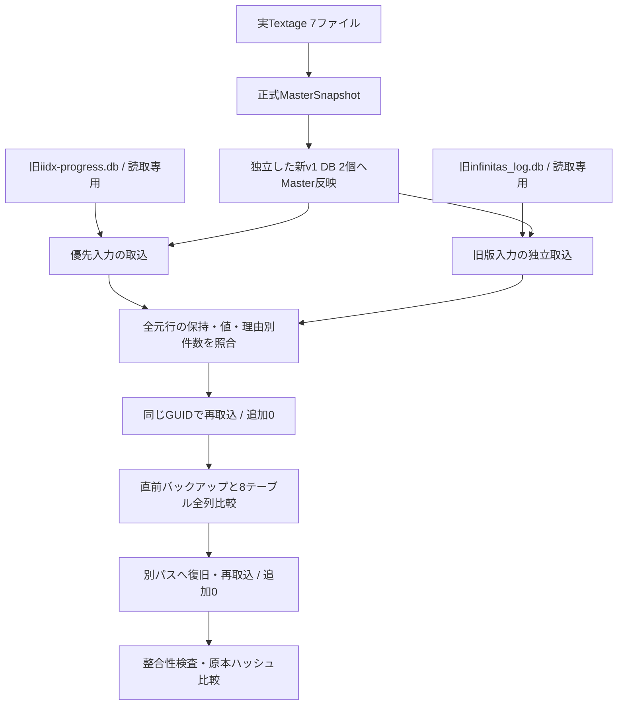

# Phase 3フォローアップ：実Textageマスターによる旧履歴移行検証

2026-09-21実施。[Issue #16 項目1](https://github.com/xidinor/IIDXProgressDashboard/issues/16)の実入力検証を対象とする。Textageの承認済みカタログ外タグ除外（PR #22、検証開始時HEAD 5e3371b）により、正式マスターで旧履歴を照合できるようになった。通常動作のDB置換・自動移行UI・元行訂正は実施していない。

## 構成と方法

[Phase 2の実マスター検証](phase2-followup-real-master-db-validation.md)と同じ配置済み7ファイルをUTF-8・CS比較有効で[MasterDataProvider](../Master/MasterDataProvider.cs)へ渡し、正式候補2,746曲・16,916譜面を取得した。ScopeはTEXTAGE_ACTBL_CATALOG_V1、ParserVersionは1。コード版と各入力ファイルのSHA-256も検証記録で識別する。HTTP再取得は行っていない。

検証専用コンソールをGit追跡対象外の `bin/phase3-validation/` に置いた。実行ごとにGUIDのディレクトリを作り、その下で旧iidx-progress.db用とinfinitas_log.db用の出力DB・移行元GUID・バックアップを分けた。実行設定をsource.json、結果と元行の詳細をローカルreport.jsonへ保存した。個人の元行・パス・移行元GUIDは本書に掲載しない。

- 原本と出力の絶対パスを分離し、data配下には出力しない。[DatabaseInitializer](../Database/DatabaseInitializer.cs)で新規DBを作り、[MasterUpdateService](../Master/MasterUpdateService.cs)の公開APIでマスターを登録した。旧マスターによる代替や候補の手動書き換えは行っていない。
- [LegacyInfinitasLogImporter](../Import/LegacyInfinitasLogImporter.cs)を各原本へ1回、同じ移行元GUIDで再度実行した。両DBを連結しない。
- 元DBをReadOnlyで読み、全idが履歴または初回未解決記録のどちらかに1回だけ存在することを検証した。raw_data内の全元列・値を原本と比較し、original_data、NULL、空文字も一致した。
- 登録済み全行のscore、BP、当時Notesを原本と比較し、日時がJST→UTC変換と一致すること、分精度metadataを保持することを確認した。
- 再取込で履歴全列が変化せず、未解決理由の件数も同じであることを確認した。
- 再取込直前のsongs、charts、song_aliases、play_history、unresolved_imports、difficulty_tables、difficulty_ranks、difficulty_table_entriesをバックアップと全列比較した。import_runsは試行ログが増えるため比較対象から分離した。
- バックアップを別パスへコピーしてInitializeで検証し、8テーブルの一致、復旧DBへの同じ入力・GUIDの再取込でも追加0件であることを確認した。
- 検証DBのquick_check=ok、foreign_key_check違反0を確認した。入力Textageを含むローカルJS群と旧DB2個のSHA-256は実行前後で一致した。

## 取込結果

| 入力 | 読取 | 履歴登録 | 未解決 | 不正 | 競合 | 再取込の追加 | 再取込の重複 |
| --- | ---: | ---: | ---: | ---: | ---: | ---: | ---: |
| 旧iidx-progress.db | 3,413 | 3,176 | 237 | 0 | 0 | 0 | 3,176 |
| infinitas_log.db | 2,382 | 2,155 | 227 | 0 | 0 | 0 | 2,155 |

両入力とも初回・再取込・復旧後の再取込はPARTIALである。未解決を含む全元行の保存と検証assertionは成功したが、全件が譜面照合に成功したわけではない。これらの件数は今回のsnapshotの観測値であり固定期待値ではない。2つの入力間の重複・欠落比較や併用判断はしていない。

復旧後の再取込も、追加0・重複3,176／2,155で一致した。再試行した未解決行は実行ごとの試行記録として増えるが、play_historyは増えない。

## 未解決理由

以下はunresolved_imports.reason_code（最初の理由）による排他的な集計。

| 理由 | 旧iidx-progress.db | infinitas_log.db |
| --- | ---: | ---: |
| TAG_TITLE_MISMATCH | 174 | 0 |
| SONG_NOT_FOUND | 17 | 128 |
| AMBIGUOUS_SONG | 1 | 99 |
| CHART_NOT_FOUND | 17 | 0 |
| LEVEL_MISMATCH | 10 | 0 |
| NOTES_MISMATCH | 18 | 0 |
| 合計 | 237 | 227 |

旧統合DBではsong_tagと現在の曲名候補が一致しない行が多い。表記差（空白・アクセント・記号等）と、旧Pythonによるtag割当や版違いの問題は区別する必要がある。TAG_TITLE_MISMATCHだけから誤tagと断定しない。一方、指定tagには譜面がなく別tagの同名曲には存在するケース、同名の複数tag間でlevel/notesが異なるケースも観測した。候補のlevel/notesが一致することだけで別tagへ差し替えない。

reason_detailには複数理由を保持する。旧統合DBのLEVEL_MISMATCH 10行のうち9行はNOTES_MISMATCHも持つため、notes不一致を含む行は合計27行である。これは27譜面の修正が確認できたという意味ではない。

旧ログはsong_tagがなく、曲名候補なし・同名の複数候補が未解決理由となった。候補なし・曖昧な時点で停止するので、旧ログのlevel/notes不一致件数0を「全入力がマスターと一致する」と解釈しない。

本実行では実履歴のaliasを新規登録せず、元行・tag・Notesを修正していない。対応の根拠が未確定なまま照合成功数だけを増やさない。alias整備後の実入力再処理と、譜面修正・誤照合の切り分けは引き続き未完了。

## 値の保持

| 項目 | 旧統合DB 原本 / 登録分 | 旧ログ 原本 / 登録分 |
| --- | --- | --- |
| BP NULL | 0 / 0 | 121 / 109 |
| BP 0 | 242 / 217 | 50 / 43 |
| NO PLAYかつscore > 0 | 5 / 5 | 5 / 5 |

登録分に含まれないBP NULL/0は未解決元行のJSONに保持され、削除・0補完はしていない。旧統合DBのsong_tagがNULLまたは空の37行も元行単位で保持した。原本の全値比較を通したため、未解決を含めて欠落がないことを確認している。

## 検証範囲と残課題

調査コンソールはプロジェクト参照で本体をビルドして実行し、終了コード0・全assertion成功。既存のNU1701・Nullable等の警告は残る。本番コード・DDLに変更はない。既存合成テストで扱う理由・境界が実入力にも現れたが、今回新たな実装不具合は確認していない。既存296件成功の合成テスト一式は今回再実行していない。

元行・詳細レポート・検証DB・バックアップは追跡対象外のローカル出力に保持した。本書には集計・方法・制約のみを記録した。

Issue #16項目1について、検証先・マスター・IDの分離、全元行と理由別件数、同一入力再実行、復旧、旧ログの独立検証、結果文書化を実施した。alias整備後の実入力再処理は未完了のため、これを含むチェックは完了にしない。

残る作業：

- 根拠を確認した表記差へのalias整備と実入力の再処理。推測での対応付けはしない。
- 旧tag割当の訂正・同名曲の版選択、当時level/notes差の調査と安全な再照合（#16項目3）。
- 移行元IDの設定管理・自動移行UI・通常起動への接続（#16項目2）。
- 複数旧DBの併用判断（#16項目4）。今回の独立検証は併用承認ではない。
- 実HTTP取得（#13）、実Session TSVの再検証は今回対象外。
