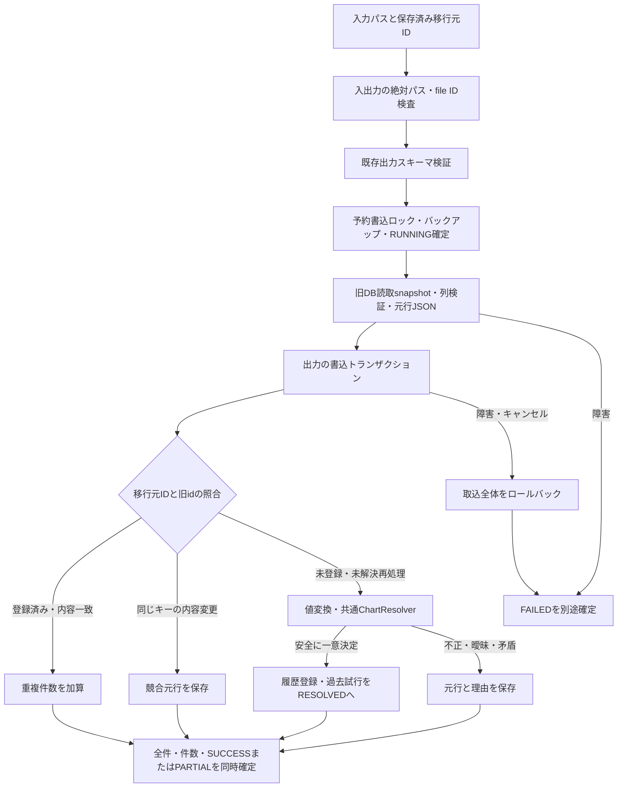

# Phase 3 旧履歴Importerと再取込の契約

2026-09-19時点。[Issue #12](https://github.com/xidinor/IIDXProgressDashboard/issues/12)の旧履歴取込APIを実装した。通常起動・自動移行UIはPhase 6の範囲。本実装は実データの全件移行やv1全体の完了を意味しない。

## 構成と処理の流れ



| ファイル | 役割 |
| --- | --- |
| [LegacyInfinitasLogImporter](../Import/LegacyInfinitasLogImporter.cs) | API、候補優先順位、バックアップ、キー照合、履歴・未解決・実行ログ保存 |
| [LegacySourceReader](../Import/LegacySourceReader.cs) | 読取専用接続、列検証、snapshot取得とfingerprint |
| [LegacyRowConverter](../Import/LegacyRowConverter.cs) | 値検証、旧ランプ、JST変換、元行JSON |
| [LegacyFileIdentity](../Import/LegacyFileIdentity.cs) | Windows file IDで同一実体への入出力を拒否 |
| [LegacyImportResult](../Import/LegacyImportResult.cs) | 実行ID、バックアップ先、排他的な件数分類 |
| [ChartResolver](../Matching/ChartResolver.cs) | 共通照合。Importerと同じ書込トランザクションを使う内部入口を追加 |

## 入力範囲と優先順位

ユーザーの2026-09-19の指示により、最終的な自動移行では旧形式の **iidx-progress.dbを最優先**にする。infinitas_log.dbは旧版Python出力として引き続き対応する。SelectPreferredSource(directory)は優先順で存在する1ファイルを返し、両方を連結しない。優先候補が不正・新形式なら取込時に拒否し、黙って別DBへ切り替えない。

これは[仕様第20章](../SPECS.md#20-legacyinfinitaslogimporter)の11列入力からsong_tag付き12列入力への明示的な拡張である。両DBの混在・重複調停は対象外。既存統合DBが旧ログの完全な上位集合とは仮定しない。

| 列 | 宣言型・扱い |
| --- | --- |
| id | INTEGER PRIMARY KEY。元行の識別子 |
| level | TEXT。NULL可、値があれば整数1〜12 |
| song_name / difficulty_type / clear_type / played_at | TEXT。値が必須 |
| total_notes / miss_count | INTEGER。NULL可、値があれば0〜Int32.MaxValue |
| score | INTEGER。必須、0〜Int32.MaxValue |
| played_option / original_data | TEXT。NULLと空文字を区別して保存 |
| song_tag | 12列形式だけのTEXT。NULL・空白は未指定、値があればResolverで整合性検証 |

列順は自由。未知列・欠落列・未知の宣言型・生成列・複合主キーを拒否する。play_historyは実テーブルであることを確認し、schema_migrationsを持つDBを旧入力にしない。他の旧マスターテーブルは利用しない。SQLiteの実際の値型も検証し、scoreの小数やBLOBを整数へ丸めない。不正行は理由と元データを保持する。旧履歴にない判定情報・play_side等はNULL。played_optionは意味を分解せずraw_dataに保持する。

元DBはMode=ReadOnly、外部キー有効、プールなしで開く。スキーマと全行を同じ読取トランザクションから取得し、途中の書込で入力が混在することを防ぐ。snapshotをメモリーへ読み切ってから出力の取込トランザクションへ進む。v1では全走査し、大容量DB向けのストリーミング最適化はしていない。

## 識別・再取込・変更検出

ユーザー承認済みの契約は source_system=LEGACY_INFINITAS_LOG、source_record_key={移行元GUIDのN形式}:{旧id}。

- 呼出し側は初回だけGUIDを発行して設定へ保存し、以後再利用する。Importerは空GUIDを拒否し、自動発行しない。
- 同じDBのコピー・改名・追記は同じGUID、別DBは別GUID。原本に識別子を書き込まない。
- 実行ログのsource_nameとoptions_jsonにもGUIDを保存する。設定を失ったらログを確認し、安易に別GUIDを発行しない。設定保存先・自動再利用UIはPhase 6で接続する。
- snapshotのSHA-256は調査用。列名順の元行JSONをid順に連結したfingerprintであり、DB全バイトのハッシュではない。キーには使わない。

| 入力の変化 | 結果 |
| --- | --- |
| 同じ元行・同じ内容を再取込 | 追加0、Duplicates加算 |
| 新idの追記（過去日時も含む） | 有効な行を追加 |
| 同じ内容・同じ時刻でも別id | すべて別プレイとして保持 |
| 登録済みの同一キーで元列の値・型が変化 | SOURCE_ROW_CHANGED。既存履歴は不変 |
| 未解決の同一キーが初回保存内容から変化 | 同じく競合。初回元行を基準とする |
| 元行が消える | 新履歴は削除しない |
| 削除idが違う内容で再利用される | 競合。同内容での再利用は観測上区別できず重複扱い |
| alias等の整備で元内容を変えず解決できる | 1回だけ登録。同じ内容の過去PENDING試行をRESOLVEDへ |

内容比較は固定列順のraw_data全体を使う。同一キーの変更検出だけに用い、別idの排除には使わない。sourceIdの誤再利用・誤発行をファイル内容から自動判定することはできない。

競合の契約は「保持して保留」。既存履歴への訂正APIは用意しない。バックアップと元行を比較して修正の意図を確認する。元の内容に戻した再取込は重複になるが、真の訂正を適用する機能は別途設計する。競合回避のためにID変更や履歴削除を行わない。

## 日時・元データ・照合

旧日時はJST固定。yyyy-MM-dd-HH-mmをUTCのyyyy-MM-ddTHH:mm:ssZへ変換する。秒00は保存形式の埋め値であり測定精度ではない。例えば2026-01-01-00-01は2025-12-31T15:01:00Zになる。タイムゾーン切替APIはなく、元日時を変更して再取込すると競合となる。

raw_dataはformatVersion=1、playedAtPrecision=minute、sourceTimeZone=+09:00、storageTypes、rowからなるJSON。rowは元列全体を保持し、original_dataの文字列を解析・整形しない。storageTypesはSQLiteの型（null/integer/real/text/blob）を保持する。不正なBLOBもbase64で保存し、非有限REALはsqliteReal文字列オブジェクトへ退避する。再解析時はformatVersionとstorageTypesを参照して復元する。通常の集計は変換済み列を用いる。

SP/DP×B/N/H/A/L、曲名正規化・aliasはPhase 2のResolverを利用する。非アクティブ譜面も過去履歴の候補に含む。song_tagがあってもタイトル候補との整合性を確認する。曖昧な曲、level/notes不一致は未解決。「現行Notes優先」は将来の表示・計算の規則であり、照合の矛盾を無効化する規則ではない。

## 件数と試行履歴

Readは取得完了snapshotの行数。Imported、Duplicates、Unresolved（照合不能）、Invalid（値・difficulty等不正）、Conflicts（元行変更）は排他的で、正常終了時の合計はReadと等しい。

- import_runs.records_unresolvedはUnresolved＋Invalid＋Conflicts。詳細分類とDuplicatesはoptions_jsonへ保存する。
- 未登録の問題が0件ならSUCCESS、1件以上ならPARTIAL。全件未解決でも元行と理由を保存できた実行はPARTIAL。
- 同じ不正・未解決・競合の再試行は、実行ごとにunresolved_importsへ1件追加する。試行履歴の蓄積とプレイの二重登録を区別する。
- 解決時は同じキー・同じraw_dataのPENDING試行をRESOLVEDへ更新する。異なる内容の競合記録は自動解決しない。
- 例外・キャンセルはFAILED。キャンセルはmessageのCANCELLEDで識別し、OperationCanceledExceptionを呼出し元へ返す。snapshot読み取り完了前の失敗はrecords_read=0、完了後はsnapshot行数を残す。今回のImported/Unresolvedはロールバック後の0となる。

## トランザクションと復旧

[DatabaseInitializer](../Database/DatabaseInitializer.cs)と[MigrationRunner](../Database/MigrationRunner.cs)で出力v1を検証する。空DBを暗黙に初期化しない。スキーマ追加・001変更は不要。

1. 出力接続より先に絶対パスとWindows file IDを比較し、hard link・symlink・junction経由も含め同一実体を拒否する。
2. 予約書込ロック中に[DatabaseBackup](../Database/DatabaseBackup.cs)で確定済みDBを保存し、RUNNINGを確定する。バックアップ失敗ではログも書かない。
3. 別の書込トランザクションでキー確認・照合・履歴・未解決状態・完了件数を一括確定する。照合も同じ接続なのでマスター更新と競合しない。同時Importerは書込ロックで直列化する。
4. 障害・キャンセルなら取込全体を破棄し、FAILEDログを独立して保存する。ログ書込も失敗した場合はAggregateExceptionで両方の障害を返す。

引数不備、同一入出力、入力/出力を開けない場合、未知の出力スキーマ、バックアップ失敗は、安全なログ保存の前提がないため例外のみ。入力スキーマ検査以降の失敗はRUNNING→FAILEDを残す。

異常終了で残ったRUNNINGは完了不明として扱い、別プロセスが実行中かもしれないため自動的にFAILEDへ変更しない。関連プロセスの終了を確認して同じ移行元IDで再実行できる。履歴とSUCCESS/PARTIALは同時確定するため、未完了トランザクションはSQLiteで戻され、再実行も既存キーを確認する。古いRUNNINGは調査記録として保持する。

復旧時は全接続・アプリを閉じ、現DBとSQLite付随ファイルを退避する。BackupPathのDBを別ディレクトリへコピーしてInitializeで検証し、そのパスを出力先に指定する。原本や稼働中DBへ上書きしない。共有バックアップ機能のファイル名は現在master-接頭辞だが、内容は取込直前の出力DB全体。

## 呼び出し例

```csharp
// databaseは入力原本とは別パス。初期化・マスター登録済みとする。
var importer = new LegacyInfinitasLogImporter(database, backupDirectory);
// savedSourceIdは初回だけ発行して設定へ保存したGUID。毎回Guid.NewGuid()しない。
var result = await importer.ImportAsync(selectedSourcePath, savedSourceId, cancellationToken);
// 新idの追記と、元内容不変の未解決再処理を行う。
var rerun = await importer.ImportAsync(selectedSourcePath, savedSourceId, cancellationToken);
```

## 検証と残課題

[変換テスト](../tests/IIDXProgressDashboard.Tests/Import/LegacyRowConverterTests.cs)と[Importer統合テスト](../tests/IIDXProgressDashboard.Tests/Import/LegacyImporterTests.cs)は個人データ・ネットワークに依存しない。旧ランプ、全譜面種別、JST年跨ぎ、BP NULL/0、同内容の別行、悪化プレイ、再取込・追記・コピー・別DB・競合・削除・id再利用、alias再解決、tag矛盾、不正型、未知スキーマ、同一実体、バックアップ失敗、途中例外・キャンセル・再試行・同時実行を検証する。復旧用コピーを開いてcharts参照先を確認するテストも含む。

実データは両旧DBのスキーマと値型を読取専用で調査した。実データ全件の照合・移行、両DBの履歴調停は実施していない。

検証結果（2026-09-19）：

- dotnet build IIDXProgressDashboard.sln --no-restore -v:q：成功。既存依存のNU1701および既存コードの警告あり。
- dotnet test tests/IIDXProgressDashboard.Tests/IIDXProgressDashboard.Tests.csproj --no-restore -v:q：226件成功、失敗・スキップ0（Phase 3追加36件）。
- SDKフォルダーへのアクセス制限を避けるため、許可された通常権限で検証した。

- Phase 6：移行元IDの設定管理、起動時自動移行、実行結果・競合の表示。
- 別途設計：競合訂正API、譜面修正と誤照合を区別したnotes不一致の再解決、複数DB併用時の調停。
- Phase 4 Refluxの採用判断・実装は今回の対象外。
