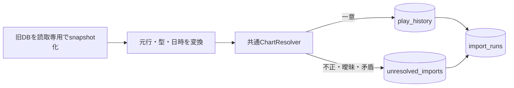

# Phase 3：旧履歴の移行

対象：[Issue #12](https://github.com/xidinor/IIDXProgressDashboard/issues/12)、後続の[Issue #16](https://github.com/xidinor/IIDXProgressDashboard/issues/16)。整理時点：2026-09-30。実装時の詳細と実入力の数値は原記録に残す。

## 入力と保存

[LegacySourceReader](../Import/LegacySourceReader.cs)は旧`play_history`の11列形式と`song_tag`付き12列形式を検査し、原本を読取専用で扱う。[LegacyRowConverter](../Import/LegacyRowConverter.cs)は旧ランプ8表記、SP/DPとB/N/H/A/L、TEXTのlevel、JST日時を明示変換する。旧日時の分精度は元文字列とともに`raw_data`に記録し、UTC保存値の秒00を実測秒数とは扱わない。BPのNULLと0、NO PLAYランプでスコアのある行、悪化したプレイも区別して保持する。

[LegacyInfinitasLogImporter](../Import/LegacyInfinitasLogImporter.cs)のキーは`LEGACY_INFINITAS_LOG`と保存済み移行元GUID＋旧行id。同じ元行の再取込だけを重複とし、別idで内容が同じプレイは統合しない。同じキーの元行内容が変わった場合は競合として原行と理由を保存し、既存履歴を変更しない。未解決行は元行が不変なら再照合できる。元の全列を`raw_data`のJSONに保存し、旧`original_data`文字列は解析・整形しない。

移行元の自動候補は旧形式の`iidx-progress.db`を優先する。`infinitas_log.db`も正式入力だが2DBを自動連結せず、優先候補が不正でも黙って切り替えない。新旧はファイル名でなくスキーマで判断する。入力と出力が同一実体なら拒否し、非空DBの更新前にはバックアップを取る。履歴・未解決・件数と成功ログは同一トランザクション、障害時の失敗ログは別に保持する。

## 検証と残課題

合成テストはコピー・改名、追記、別DB同一id、同一内容の別プレイ、元行変更、未解決再処理、値・日時の境界、原本保全、ロールバックを扱う。2026-09-21には正式Textageマスターを用い、原本と別の検証用DBで旧統合DBの3,413行中3,176行、旧ログの2,382行中2,155行を登録し、残りを理由付きで保持した。この件数はその時点の実入力検証であり、通常DBの移行完了件数ではない。

[Issue #16](https://github.com/xidinor/IIDXProgressDashboard/issues/16)には通常起動での移行元GUID管理、再取込と復旧の運用検証、元行変更の明示的訂正、譜面修正と誤照合の区別、複数DB併用の要否判断が残る。Beta1は準備済みDBを表示し、Beta3は未解決の個別元行を手動確定できるが、登録済み履歴の訂正や2DB調停を実装したことにはならない。

## 原記録

- [Importerと再取込契約](phase3-legacy-importer-explained.md)：列・型・JSON、件数、例外と復旧の詳細。
- [実Textageマスターによる移行検証](phase3-followup-real-legacy-validation.md)：実入力の件数・未解決理由と原本保全。
- [Issue #12](https://github.com/xidinor/IIDXProgressDashboard/issues/12)、[Issue #16](https://github.com/xidinor/IIDXProgressDashboard/issues/16)。
