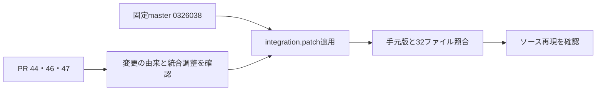

# Phase 4フォローアップ：手元Refluxのビルド元確認

対象：[Issue #20](https://github.com/xidinor/IIDXProgressDashboard/issues/20)「1. 実ビルド・時刻設定の確認」の第1項目。確認日：2026-09-21。

## 確認結果と根拠

ユーザー申告：masterの最新コミットを取得してPR内容を取り込み、ビルド後はソースを変更していない。提示ディレクトリはGit管理外であり、統合commitは存在しない。個人の絶対パスは本記録に掲載しない。

保存されていた上流コピーの32ファイルは、GitHubから今回取得した固定commitのアーカイブと全件バイト一致した。保存済みPR #46・#47のdiffも、今回取得した公開diffと改行正規化後に一致した。

| 参照 | 固定commit | 手元版との対応 |
| --- | --- | --- |
| [基点master](https://github.com/olji/Reflux/commit/0326038fed0cf243a47e95fdbdf81b4092b1f329) | `0326038fed0cf243a47e95fdbdf81b4092b1f329` | 保存済み上流コピーと一致。基点として再現検証済み |
| [PR #46](https://github.com/olji/Reflux/pull/46) | `9644979cf5a94e7833f9940fb90e59f8a78e325b` | Offsets.cs、Utils.cs、Reflux.csproj、offsets.txtが単独適用結果と一致 |
| [PR #47](https://github.com/olji/Reflux/pull/47) | `9d13aefb54cb40502470299b3dcc4764f0406c4b` | Extensions.cs、customtypes.txt、encodingfixes.txt、offsets.txtが単独適用結果と一致 |
| [PR #44](https://github.com/olji/Reflux/pull/44) | `89422ab89585ef5307ddca2aee275605153f6cb2` | Program.csが単独適用結果と一致。リザルト取得前の待機を1000msから2000msへ変更 |

3つのPRのAPI応答のbase SHAはいずれも上記基点だった。PR #44は今回の内容照合で追加確認したもので、取り込んだ経緯をGit履歴で証明したものではない。

OffsetSearcher.csはPR #47そのままではなく、PR #46の`Offsets.Song.IsWide`に応じて検索文字列をUTF-16LE／Shift-JISに切り替える統合調整がある。Utils.csはPR #46側の可変レイアウト方式を採用している。従って、PR #46と#47の単純な順次適用を再現手順としない。

## 再現可能な差分

- [integration.patch](evidence/phase4-reflux-local-build/integration.patch)：固定masterから手元版への全9変更ファイル、195行追加・75行削除。
- [source-sha256.json](evidence/phase4-reflux-local-build/source-sha256.json)：手元ソース・同梱入力32ファイルの元バイトSHA-256。生成物と調査用ディレクトリは対象外。
- [Reflux-LICENSE.txt](evidence/phase4-reflux-local-build/Reflux-LICENSE.txt)：差分に含む上流コードのMITライセンス。

patchのSHA-256：`0476826426b864be786479c70b5414ed6a4025722bcd61663f0d245fdd1eb31b`。



再現時は、上記masterの新しい作業コピーへ次を実行する。パッチはPR差分を別途適用していない基点へ適用する。

```powershell
git apply --check <integration.patchのパス>
git apply <integration.patchのパス>
```

今回、GitHubの固定アーカイブを新たに展開した一時コピーで上記を実行し、32ファイル全件を照合した。テキストはCRLF／LF差のみ許容、バイナリはバイト一致。ビルド後の生成物、.pr-review、個人の設定内容は差分に含めていない。config.iniは上流と同一で変更なしだが、これを別マシンのSession出力時設定の証拠にはしない。

## 対象offsetと生成物

手元offsets.txtの対象表記は`P2D:J:B:A:2026080500`。値はPR #46・#47と一致する。

| 項目 | 値 |
| --- | --- |
| songList | `0x1431D4870` |
| unlockdata | `0x1429089E0` |
| playSettings | `0x1425D9154` |
| playData | `0x1425D9404` |
| currentsong | `0x142886370` |
| judgeData | `0x14288618C` |
| datamap | `0x1435BAB88` |

SongLayout既定値はBufferSize=`0x730`、TitleSize／ArtistSize=`0x100`、TickerSize=`0x40`、GenreSize=`0x80`、IdOffset=`0x5B0`、文字列UTF-16LE（tickerはShift-JIS）。offsetファイルにレイアウト上書きはない。

プロジェクト定義はVersion=`1.17.0`、TargetFramework=`netcoreapp3.1`、PublishSingleFile=`true`。残存生成物はRelease／win-x64。これらはReflux側の定義であり、Dashboardの.NET 8方針を変更しない。

| 残存生成物 | SHA-256 |
| --- | --- |
| 出力側Reflux.exe（177,664 bytes） | `26e97da307b0623bb60181c76745820425bbca42152afad8d1db0fb7c3a4a3da` |
| 出力側Reflux.dll（106,496 bytes） | `459148f8b300d4178910a733247c64bdf72c1a8dafdd285a108bd2ae565262b2` |

obj側Reflux.dllも出力側と同一ハッシュ。これらは提示ディレクトリの残存生成物の識別情報であり、実機へ配置したファイルとの一致、ソースとバイナリの再ビルド一致、単一ファイルpublishの実行を証明するものではない。

## 実機画面による追加確認（2026-09-21）

ユーザー提供の2枚の画像を目視確認した。画像自体は個人情報を含むためリポジトリへ複写せず、対象の表示値のみ記録する。

| 証拠 | 確認した表示 | 判断 |
| --- | --- | --- |
| 画像2：ゲーム本体タイトル画面左上 | `P2D:J:B:A:2026080500` | 手元offsets.txtおよび採用PRの対象ビルドと一致 |
| 画像1：ランチャー左下 | `P2D:J:A:A:2026012800`、`RESOURCE: 2026080600` | ゲーム本体のビルド識別子と区別する |
| 画像1：config.iniの[LocalRecord] | `uselocaltime = false` | 確認した設定ではUTC出力を選択 |

手元Config.csは`localrecord:uselocaltime`を読み、PlayData.csは`DateTime.UtcNow`で取得した日時をUseLocaltimeがtrueの場合にのみLocalへ変換する。従って、画面のfalse設定を用いた出力ではUTCとして解釈でき、出力PCのタイムゾーン指定は不要。

2026-09-22ユーザー確認：提供済み3ファイル・72行の出力当時も同じゲームビルド・uselocaltime=falseであり、設定を変更していない。現在の状態は画像、出力当時の状態はユーザー申告を根拠とする。これにより対象Sessionの時刻解釈はUTCと確定し、第3項目の当時設定を確認できた。第4項目の別検証DBでの元日時→UTC照合は今回未実施であり、完了扱いにしない。

## 2026-09-22 第4項目の追加検証

別の新規検証DBで、対象72行のUTC変換結果と登録68行の保存日時の一致を確認した。未解決4行も元日時を保持し、再取込追加0・原本保全・DB整合性を確認済み。以下の「未実施」は先行調査時点の記録。詳細は[UTC照合報告](phase4-followup-session-utc-validation.md)を参照。

## 検証範囲と残課題

- 第1項目のソース記録は、統合commitの代わりに固定基点＋再現検証済み差分として用意できた。歴史的な取得操作そのものはGit管理外のため追跡不能。
- Config.cs、PlayData.cs、Settings.csは固定masterとバイト一致。Program.csは上記待機変更があるため、従来の上流間比較と手元版を区別する。
- 第2項目の実機IIDXビルドは画像で確認済み。提供Session出力当時も同じビルドだったことは2026-09-22のユーザー回答で確認済み。
- 提供Session出力当時もuselocaltime=falseだったことを確認済み。UTCとして扱い、当時のPCタイムゾーン確定は不要。実機へ配置したRefluxバイナリのハッシュ照合は未実施。
- 調査は読み取りのみ。元Refluxの編集・ビルド・実行、Dashboardコード／DDL／DB／履歴の変更はしていない。文書と証拠資料のみのためDashboardのビルド・テストは未実施。
- Issueへの投稿・チェック更新は未実施。本記録はPhase 4フォローアップ全体の完了を意味しない。

関連：[Phase 4解説](phase4-reflux-session-importer-explained.md)。
