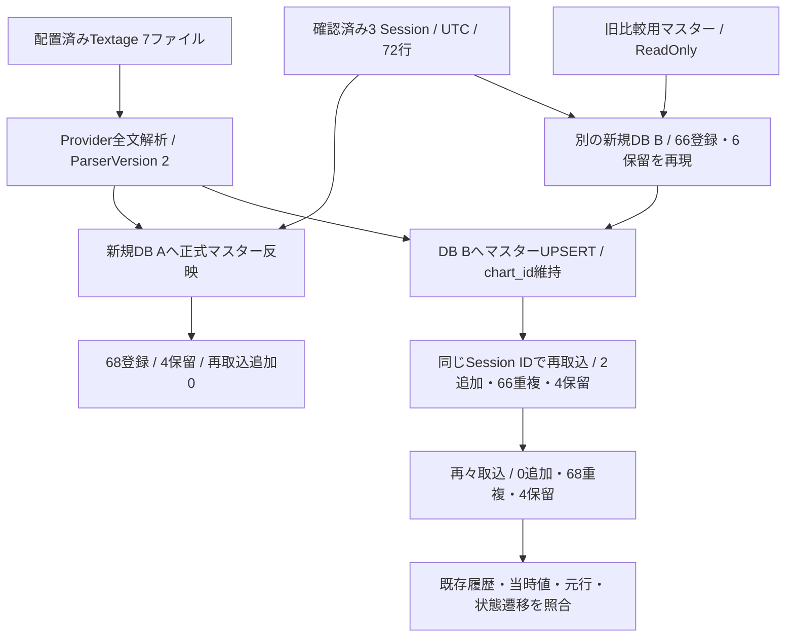

# Phase 4フォローアップ：実マスター再検証と未解決6行の調査

実施日：2026-09-22。対象：[Issue #20](https://github.com/xidinor/IIDXProgressDashboard/issues/20) 第2節。実行した本番コードの基点は `640e702dab844882b51ff1e7470002b4a7c9cb93`、作業ブランチは `codex/phase4-real-master-revalidation`。

## 結果と範囲

提供済み3 Session・72行を現行Providerのマスターで再検証し、68行登録・4行保留を確認した。従来の6行のうちlevel不一致2行はマスター更新で解決し、正式曲名が複数tagに一致する4行は理由付きで保留する。全件登録を完了条件としないIssue第2節の調査・保全検証は完了。本番Importer・Resolver・DDL・通常UIの変更はない。

追加配置された4番目のSession、best TSV、公式CSV、旧プレイ履歴の移行は対象外。旧マスターDBは比較実験の読み取り専用入力に限り使用し、正式マスターの代用にはしない。今回の結果は通常DBへの正式移行やPhase 4全体の完了を意味しない。



## マスターの根拠

- [Issue #13](https://github.com/xidinor/IIDXProgressDashboard/issues/13)で確認済みの配置済みTextageを、UTF-8・CS比較有効で読み取った。2,746曲・16,916譜面、ParserVersion=2（Acornima 1.8.0）。7ファイルのSHA-256は[カタログ調査報告](phase2-followup-local-textage-audit.md#入力同一性)の組と同じ。詳細reportにも保存した。
- `conficer`を含む17タグは、2026-09-21承認済みの完全一致例外として元入力保持・`NON_PLAYABLE_EXCLUDED`診断・候補除外を行う既存実装を使用した。未知tagや不正構文の検査は緩和していない。[合成回帰テスト](../tests/IIDXProgressDashboard.Tests/Master/Textage/TextageMasterParserTests.cs)と[Acornima移行検証](phase2-followup-acornima-parser.md)を参照。
- この例外対応で以前の全体停止は解消済み。入力の取得時刻混在が原因だったと証明したものではなく、上流の原子的snapshotやINFINITAS全収録を保証するものでもない。今回はHTTP再取得を行っていない。
- 正式候補は[MasterDataProvider](../Master/MasterDataProvider.cs) → [MasterUpdateService](../Master/MasterUpdateService.cs)の公開APIで反映。CS表は比較診断に使用し、AC側のlevelを上書きしない。

## 6行の原因と扱い

個人の曲名・tag・日時・スコア・入力行番号をGitへ掲載しないため、下表は調査用の匿名分類で示す。各行の候補tag、正規化キー、旧譜面値、現行`ChartResolution`と`TitleEvidence`はGit対象外のローカルreportに保存した。A〜FはSession内の行番号ではない。

| 行 | 旧理由 | 確認できた原因・根拠 | 今回の扱い |
| --- | --- | --- | --- |
| A | AMBIGUOUS_SONG | 同じ正式曲名の2tag。現行では片方が曲情報のみで、要求譜面の候補は1つ。もう片方はCS比較入力に存在 | 曲の候補は2つなので保留 |
| B | AMBIGUOUS_SONG | 同じ正式曲名の2tag。片方はactblに譜面行がなく、datatblのNotesは全0。要求譜面の候補は1つ | 曲情報のみのtagを勝手に削除せず保留 |
| C | AMBIGUOUS_SONG | 同じ正式曲名で両tagに要求譜面あり。Notesが異なり、一方のactblにはCS版注記と旧尺度flagsがある。旧尺度側の現行levelはNULL | NotesやNULLを使った候補選別をせず保留 |
| D | AMBIGUOUS_SONG | 同じ正式曲名で両tagに要求譜面あり。level・Notesが異なり、一方にCS版注記がある | 数値の一致だけで版を確定せず保留 |
| E | LEVEL_MISMATCH | 正規化曲名は単一tag。旧・現行でtag／SP・DP／difficulty／Notesは一致し、旧levelだけ入力と不一致。現行actblのlevelは入力と一致 | 正式マスターで通常照合が成功し、1回だけ登録 |
| F | LEVEL_MISMATCH | Eと同じ構造。旧levelは配置済みCS表の値と一致し、現行actblのlevelは入力と一致 | 正式マスターで通常照合が成功し、1回だけ登録 |

Eでも旧levelに一致するCS表の値を確認した。[旧Python](../python/buildsongmaster.py)はAC→CS順に`levels_map.update`で同じtagを上書きするため、2行とも旧DBへのCS側level混入と整合する。旧DBを作成した当時の入力・実行履歴は未保存なので、歴史的な生成原因の断定はしない。今回確認したのは「現行actbl・入力・同一tagの譜面情報が一致し、旧比較用levelが異なる」という事実である。Notes変更の検出解除や元履歴の訂正は必要ない。

A〜Dは大文字小文字・空白等の正規化で別曲名が偶然一致したのではなく、マスターが返す正式曲名自体が等しい。検証DBの初期aliasは0件。[SongAliasRepository](../Database/SongAliasRepository.cs)は正式曲名と対象出典／manualのaliasを合併するため、一方へのalias追加は他方の正式曲名候補を消さない。実データへのalias追加は行わなかった。

[ChartResolver](../Matching/ChartResolver.cs)は曲tagの一意性を先に確定し、level・Notes・活動状態・譜面の有無で曲候補を間引かない。A・Bでも「要求譜面が1つだから採用」への変更は共通照合契約の変更になる。`is_active`もINFINITAS収録フラグではないため、今回の版選択根拠にしない。

今後A〜Dを解決する場合は、取得元の識別情報や版を確定する根拠を用意し、出典別対応付け／明示的なtag選択と監査を[Issue #13](https://github.com/xidinor/IIDXProgressDashboard/issues/13)・[Issue #16](https://github.com/xidinor/IIDXProgressDashboard/issues/16)の共通設計に接続する。今回その方式を選択・実装したことにはしない。

## 実入力の検証

実行ごとに`bin/phase4-master-validation/<GUID>/`を新規作成し、DB・バックアップ・詳細reportを保存。原本とは絶対パスを分離した。Session IDはファイルごとに発行し、各DB内での再取込には同じIDを再利用した。時刻は[確認済みのUTC](phase4-followup-session-utc-validation.md)を使用。

### 新規DB A：正式マスターだけで再検証

| 対象 | Read | Imported | Unresolved | 再取込Imported | 再取込Duplicates |
| --- | ---: | ---: | ---: | ---: | ---: |
| Session 1 | 9 | 8 | 1 | 0 | 8 |
| Session 2 | 51 | 48 | 3 | 0 | 48 |
| Session 3 | 12 | 12 | 0 | 0 | 12 |
| 合計 | 72 | 68 | 4 | 0 | 68 |

- 初回・再取込とも不正0、競合0、Session全体保留0。Session 1・2はPARTIAL、Session 3はSUCCESS。
- 全72行が初回の履歴または未解決へ元行単位で一度だけ保持されること、rawLine・header・元dateの保持を照合。
- 全72行のUTC変換を独立期待値と比較し、登録68行のplayed_atも一致。options_jsonとraw_dataのUtc／TimeZoneId=nullを確認。
- 再取込後は履歴の全列不変。未解決4行は試行ごとの監査だけが追加される。

### 新規DB B：旧6行保留から正式マスターで再照合

旧マスターをReadOnlyで読み、曲・譜面だけを新v1 DBへ複写。旧difficultyの長名をB/N/H/A/Lへ明示変換した。これは旧結果の再現専用DBであり、新規DB Aとは分離している。

| 段階（各72行） | Imported | Duplicates | Unresolved | 理由 |
| --- | ---: | ---: | ---: | --- |
| 旧比較マスターで初回 | 66 | 0 | 6 | AMBIGUOUS_SONG 4、LEVEL_MISMATCH 2 |
| 正式マスターUPSERT後、同じSession IDで再取込 | 2 | 66 | 4 | AMBIGUOUS_SONGのみ |
| 同じ入力をもう一度再取込 | 0 | 68 | 4 | 同上 |

- マスター更新の欠落差分0。元のchart_idを全件維持し、既登録66行は更新後再取込でも全列不変。
- 2行の元PENDINGがRESOLVEDへ遷移し、初回未解決のraw_dataと理由コードを保持。Session IDの再発行、元入力変更、履歴削除による競合回避はしていない。
- 最終68行すべてのscore、BP、level_at_play、total_notes_at_playをraw_dataの入力値と照合。BP不明はNULLを維持。再々取込後も履歴全列不変。
- 最終監査記録はLEVEL_MISMATCH／RESOLVEDが2件、AMBIGUOUS_SONG／PENDINGが12件。後者は**同じ4元行×3試行**であり、未解決プレイが12行あるという意味ではない。
- 各段階とも不正・競合・Session全体保留0。Session 1・2はPARTIAL、Session 3はSUCCESS。

両DBのquick_check=ok、foreign_key_check違反0。対象外入力も含めdata配下の全ファイルの実行前後SHA-256一致。詳細reportと入力・DBがGit追跡対象外であることを確認した。

## 合成回帰と検証コマンド

[RefluxImporterTests](../tests/IIDXProgressDashboard.Tests/Import/RefluxImporterTests.cs)へ個人入力に依存しない3ケースを追加した。

- マスターlevel更新後、同じ元行を一度だけ登録してPENDING→RESOLVEDへ遷移し、既存履歴・当時値・元データを保持する。
- 同名のもう一方が曲情報だけの場合、および要求譜面を持つが数値が異なる場合に、出典別aliasを加えても曖昧さを強制解消しない。試行数と未解決元行数を区別する。

実検証コンソールの全assertion成功（最終出力PASS）。ローカル詳細は`report.json`と`transition-report.json`に保存した。コンソールと個人入力はGitへ追加していない。

```powershell
dotnet run --project bin/phase4-master-validation/Check.csproj --verbosity quiet
dotnet build IIDXProgressDashboard.sln --no-restore -v quiet
dotnet test tests/IIDXProgressDashboard.Tests/IIDXProgressDashboard.Tests.csproj --no-restore -v quiet
```

ビルド成功（エラー0、既存NU1701警告6件）。合成自動テストは追加3ケースを含め436件成功、失敗・スキップ0。`git diff --check`も成功。既存警告の修正は今回の範囲外。HTTP取得、UI経由のSession管理、訂正機能、実機バイナリ同一性、配布検証は未実施。
