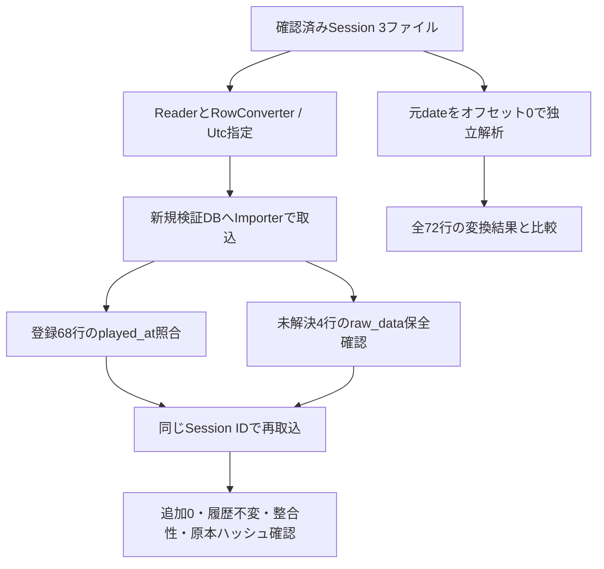

# Phase 4フォローアップ：実SessionのUTC日時照合

実施日：2026-09-22。対象：[Issue #20](https://github.com/xidinor/IIDXProgressDashboard/issues/20)「1. 実ビルド・時刻設定の確認」第4項目。実行コードはHEAD `ed7c1ab9cceedd9a3ffed0a850d43eb63fbe665b`。本番コードの変更はない。

## 根拠と方法

[実機・設定確認](phase4-followup-local-reflux-build.md)で、提供済みSession 3ファイル・72行の出力当時も`uselocaltime=false`だったことをユーザーが確認済み。この3ファイルのみを対象とし、追加配置された4番目のSessionとbest形式reflux.tsvは対象に含めていない。

Git追跡対象外の`bin/phase4-utc-validation/`に専用コンソールを置き、実行ごとにGUIDのサブディレクトリを新規作成。その配下に検証DB、バックアップ、元日時と期待値・保存値を含むreport.jsonを保存した。入力と出力の絶対パスが異なることをassertし、data配下への出力は行っていない。個人の元行・日時・Session GUID・絶対パスは本文やGitへ掲載しない。

- [MasterDataProvider](../Master/MasterDataProvider.cs)で配置済みTextageをUTF-8・CS比較有効として読み、[MasterUpdateService](../Master/MasterUpdateService.cs)で新DBへ反映した。ParserVersion=2（Acornima）、2,746曲・16,916譜面。HTTP再取得や旧マスターDBの複写は行っていない。使用マスターファイルのSHA-256はローカルreport.jsonに記録。
- [RefluxSessionTsvImporter](../Import/RefluxSessionTsvImporter.cs)に明示的に`RefluxImportOptions(RefluxTimeMode.Utc)`を渡した。Session IDは入力ファイルごとに発行し、同じIDで再取込した。
- 期待値はImporterの変換関数を使わず、元dateを`yyyy/MM/dd HH:mm:ss`で解析し、`DateTimeOffset`にオフセット0を明示して`yyyy-MM-ddTHH:mm:ssZ`へ整形した。JSTとしての9時間減算は行わない。
- 全72行について[RefluxRowConverter](../Import/RefluxRowConverter.cs)のUTC変換結果を独立期待値と比較した。登録された全68行はDBのplayed_atも比較。未解決4行にplayed_at保存列はないため、raw_dataの元date・rawLine・header保持と変換結果一致を確認し、「72行が履歴DBへ登録された」とは扱わない。
- 元行ごとに履歴または初回未解決記録へ一度だけ保持されることを確認。raw_dataのtimeMode=Utc、timeZoneId=null、playedAtPrecision=second、および初回・再取込の全6実行のimport_runs.options_jsonのUtc／nullを検証した。

## 結果

| 対象（従来の入力順） | 読取／UTC変換一致 | 登録／DB日時一致 | 未解決 | 再取込追加 | 再取込重複 |
| --- | ---: | ---: | ---: | ---: | ---: |
| Session 1 | 9 | 8 | 1 | 0 | 8 |
| Session 2 | 51 | 48 | 3 | 0 | 48 |
| Session 3 | 12 | 12 | 0 | 0 | 12 |
| 合計 | 72 | 68 | 4 | 0 | 68 |

不正・競合・Session全体保留は初回・再取込とも0。未解決はすべてAMBIGUOUS_SONG。初回・再取込ともSession 1・2はPARTIAL、Session 3はSUCCESS。再取込ではplay_historyの全列が不変、未解決件数も同じで、試行ごとの監査記録のみ追加された。

従来の旧比較用マスターでの66行登録・6行未解決に対し、今回は現行Providerで得た配置済みTextageにより68行登録・4行未解決となった。今回LEVEL_MISMATCHは0だが、旧結果との差の原因調査・alias整備・未解決解消はIssue第2節の別作業であり、ここでは完了扱いにしない。

- 検証DBのquick_check=ok、foreign_key_check違反0。
- data配下の全入力ファイル（対象外TSV、旧DB、Textageを含む）の実行前後SHA-256一致。
- 専用コンソールの全assertion成功。`dotnet run --project bin/phase4-utc-validation/Check.csproj`は終了コード0。参照プロジェクトのビルドも成功し、既存NU1701・Nullable等の警告は残った。
- 本番コード変更なし。ソリューション全体の独立ビルド・自動テスト一式の再実行は今回未実施。個人入力をCIへ追加していない。

第4項目の実入力UTC照合は完了。通常DB・元TSV・旧DBの変更、履歴訂正、UI接続、実機バイナリのハッシュ同一性確認は行っていない。Phase 4フォローアップ全体の完了ではない。
