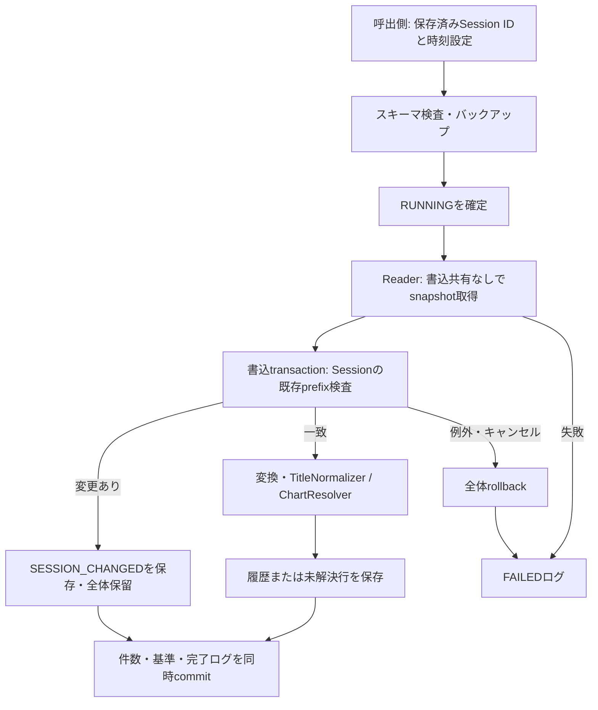

# Phase 4: Reflux Session TSV Importer

対象: [Issue #17](https://github.com/xidinor/IIDXProgressDashboard/issues/17) のPhase 4-1〜7。実装時点: 2026-09-20。
API・合成検証と、対象バイナリの取得環境・実際のタイムゾーンの確認は区別する。UI接続はPhase 6。

## 入力の根拠と対象版（Phase 4-1）

2026-09-22追加検証完了：[別検証DBでのUTC照合](phase4-followup-session-utc-validation.md)で72行の変換結果と登録68行の保存日時が一致した。未解決4行は元日時を保持。再取込追加0、原本ハッシュ不変、DB整合性も確認済み。以下の未実施・未確認記述はそれぞれ先行調査時点の記録。

2026-09-22確定：ユーザーが提供済みSession出力当時も同じゲームビルド・uselocaltime=falseで変更なしと確認。対象3ファイル・72行はUTCとして解釈する。以下の未確認という記述は各調査時点の記録であり、現在の残課題は別検証DBでの元日時→UTC照合。

ユーザー確認: 暫定1.17.0は、入手可能なmasterへ公開PR #46・#47を反映した手元ビルド。一般公開バイナリではない。ローカルの統合commit、ビルド時の差分、実機のIIDXビルド番号は未取得。

2026-09-21追記：[手元ビルド調査](phase4-followup-local-reflux-build.md)で、Git管理外の手元ソースを固定master＋再現可能な差分として記録した。PR #44相当の待機変更とoffset検索の統合調整も確認。上記「差分未取得」は実装時点の記録であり、現在は取得・再適用照合済み。実機のIIDXビルド番号とSession出力時設定は引き続き未確認。

同日追加：ユーザー提供のゲーム本体画面から`P2D:J:B:A:2026080500`を確認し、採用offsetの対象と一致した。config.ini画面の`[LocalRecord] uselocaltime=false`も確認済み（UTC出力の設定）。提供済みSession出力当時も同じビルド・設定だったかと、元日時→UTCの追加照合は未確認。詳細は上記調査記録の「実機画面による追加確認」を参照。

今回固定して比較した上流:

| 対象 | commit | 内容 |
| --- | --- | --- |
| master / tag 1.16.6 | `0326038fed0cf243a47e95fdbdf81b4092b1f329` | 形式比較用 |
| [PR #46](https://github.com/olji/Reflux/pull/46) | `9644979cf5a94e7833f9940fb90e59f8a78e325b` | 楽曲メモリー配置変更対応 |
| [PR #47](https://github.com/olji/Reflux/pull/47) | `9d13aefb54cb40502470299b3dcc4764f0406c4b` | UTF-16LEのゲーム内文字列・offset対応 |

両PRで説明されるIIDX対象ビルドは `P2D:J:B:A:2026080500`。これはユーザー実機の確認結果ではない。UTF-16LEはゲーム内文字列の話であり、TSVの文字コードではない。

次の4ファイルは上記3参照間で内容が一致した:

- [Config.cs](https://github.com/olji/Reflux/blob/9d13aefb54cb40502470299b3dcc4764f0406c4b/Reflux/Config.cs): ヘッダーと設定。
- [PlayData.cs](https://github.com/olji/Reflux/blob/9d13aefb54cb40502470299b3dcc4764f0406c4b/Reflux/PlayData.cs): TSV値・日時。
- [Program.cs](https://github.com/olji/Reflux/blob/9d13aefb54cb40502470299b3dcc4764f0406c4b/Reflux/Program.cs): ファイル作成・追記条件。
- [Settings.cs](https://github.com/olji/Reflux/blob/9d13aefb54cb40502470299b3dcc4764f0406c4b/Reflux/Settings.cs): style/style2等の意味。

起動時のローカル日時から `Session_yyyy_MM_dd_HH_mm_ss.tsv` を命名し、接続処理内でファイルを作成、各プレイをAppendAllLinesで追記する。TSV内に永続Session IDはない。ファイル名の時刻から行のタイムゾーンを推測しない。再接続時の同一ファイル再作成もあり得るため、削除・短縮を検出する。

出力はタブの直接連結で、引用・エスケープ処理はない。引用符は文字そのものとして読む。タブ・改行を含む曲名を安全に復元する契約はなく、列数不一致行は推測しない。UTF-8、BOM有無、LF/CRLFを受理。UTF-16、壊れたUTF-8、単独CR、NUL、末尾改行なしは拒否する。空ファイルは拒否、ヘッダーのみは0件成功。空データ行も不正行として保持する。

必須列は `title/difficulty/lamp/exscore/date`（大小文字を含め完全一致）。空・重複・前後空白ヘッダーは拒否。任意列の省略・追加・並び替えは初回入力で受理し、未知列もraw_dataに残す。上流のresultdetails=falseではexscoreがないため、この設定のSessionは履歴入力として拒否する。best/trackerも必須ヘッダー検査で拒否。

NP/F/AC/EC/NC/HC/EX/FC/PFCを0/1/2/3/4/5/6/7/7へ変換。SP/DP×B/N/H/A/Lを受理。未観測の表記も合成テストで検証する。BPの空・欠落・`-`はNULL、0は0。その他の任意数値の空・欠落はNULL、値があれば非負整数（levelは1〜12、gaugepercentは0〜100）を検証する。必須scoreの空欄は拒否し、当時notesがあるときscoreが2倍を超える行も不正とする。

DPのstyleは1P側、style2は2P側。SPのstyleは使用側。gaugeは使用ゲージでありlampとは独立。playtypeはP1/P2/DPを区別しdifficultyとの矛盾を保留する。FLIP/BATTLEはTSVに出ない。QuickRetryはスキップ、DataAvailable=falseではSession追記のブロックに入らない。BATTLEの全組合せで必ずfalseになるとまでは断定しない。出力されないプレイを補完しない。

## Sessionと再取込（Phase 4-2、ユーザー承認済み）

`source_system=REFLUX_SESSION_TSV`、キーは `Session GUIDのN形式:データ行番号（1始まり）`。ヘッダーは番号に含めず、不正・空のデータ行も番号に含む。呼出側がIDを保存し、同じSessionで再利用する。毎回GUIDを発行すると二重登録になる。パス・内容から自動同定しない。

| 入力変化 | 動作 |
| --- | --- |
| 同一ファイル・同時刻・同一内容の連続行 | 元行を全件保持、再取込では登録済み行は重複 |
| 末尾追記 | 過去prefixが一致するとき、追記分のみ追加 |
| コピー・改名 | 同じIDを指定すれば同じSession |
| 別Sessionの同一先頭行 | 別IDを指定して別プレイとして保持 |
| UTF-8 BOM・LF/CRLFだけの違い | 同一性を維持。元バイトfingerprintは別 |
| 列順・列追加削除、途中挿入編集削除、短縮 | 既存prefixとの差を検出した場合、ファイル全体を保留 |
| 時刻設定変更 | ファイル全体を保留。既存日時は訂正しない |
| 未解決→alias整備→元入力を再取込 | 再照合して一度だけ追加、同じrawの過去PENDINGをRESOLVEDへ |
| 不正行をTSV上で修正 | 元入力変更として全体保留。訂正機能は別工程 |

rolling hashは行キーではなく、既存部分の変更検出に使う。`h0=SHA256(UTF8(header))`、`hN=SHA256(UTF8(hN-1の大文字hex + LF + raw行))`。受理した完了ログにheader、rowCount、最終hashを保存し、次回は同じ長さのprefixを比較する。既存のimport_runsを利用するためMigrationは不要。SUCCESS/PARTIALかつaccepted=trueの最新ログを基準とし、保留・失敗は基準を更新しない。正常な基準ログを手作業で削除しない。

同じ文字列の行の途中挿入が末尾追記と完全に同じ結果になる場合など、観測したファイル内容が同一なら位置の変化は識別できない。上流に行IDがないための限界であり、任意の編集を完全検出する保証ではない。

## 時刻・元データ（Phase 4-3）

初期値UTC。Localは明示的なTimeZoneIdを必須とし、取込PCのローカル設定を暗黙利用しない。秒精度の `yyyy/MM/dd HH:mm:ss` をUTC `yyyy-MM-ddTHH:mm:ssZ` に変換。夏時間の曖昧時刻・存在しない時刻は不正行。元日時はrow.dateに保持する。

raw_data version=1はSession ID、物理行番号、元ヘッダー、元行、全列辞書、時刻モード・zone ID・second精度を保存。gradeも元値として残すが、集計値としての専用列は作らない。列数不一致の辞書は空とし、元行からの推測をしない。

## 構成と処理（Phase 4-3〜5）



| ファイル | 責務 |
| --- | --- |
| [RefluxSessionReader.cs](../Import/RefluxSessionReader.cs) | ヘッダー・構造・厳密UTF-8・元行保持 |
| [RefluxRowConverter.cs](../Import/RefluxRowConverter.cs) | 値・時刻変換、照合リクエスト |
| [RefluxSessionTsvImporter.cs](../Import/RefluxSessionTsvImporter.cs) | Session検査・照合・DB登録・実行ログ |
| [ChartResolver.cs](../Matching/ChartResolver.cs) | 非activeを含む安全な共通照合 |
| [DatabaseBackup.cs](../Database/DatabaseBackup.cs) | SQLite snapshotのバックアップ |

ReaderはWindowsのFileShare.Readで読み取り中の書込み・削除を防ぐ。末尾改行なしはファイル全体を失敗として再試行を促す。取得後の追記は次回取込対象。readはメモリーsnapshotの行数であり、大規模ファイルのストリーミングは未実装。

取込はTask.RunでUI外から実行可能。既存スキーマ検査後、書込ロック内でバックアップとRUNNINGを確定。その後、別の書込transactionでprefix検査から完了までを直列化する。履歴・未解決・基準・件数が部分確定しない。入力原本と出力は絶対パス・Windows file IDで同一実体も拒否する。

- Read = Imported + Duplicates + Unresolved + Invalid + Conflicts。すべて今回の元行数。未解決の再試行も毎回記録する。
- SUCCESS: 不正・未解決・保留なし（重複だけでも成功）。PARTIAL: 行保留、またはSession全体保留。
- Session全体保留はConflicts=Read、SessionHeld=true。削除で0行になった場合もPARTIALで、SESSION単位の証拠を1件残す。これは元行件数に加算しない。
- FAILED: ファイル不正、例外、キャンセル等。取込行は全体rollback、独立して失敗ログを保存する。
- バックアップ前の検査失敗、ロック獲得失敗、バックアップ失敗では開始ログを書けない場合がある。例外を呼出側へ返す。
- FAILED保存も失敗した場合はAggregateException。run IDとbackup pathを例外Dataから確認する。
- 異常終了で残ったRUNNINGは成功とみなさず残す。新しい再試行は別run。自動的に既存RUNNINGをFAILEDへ変更しない（別プロセスで実行中の可能性がある）。

復旧はアプリ・接続を停止し、現DBと付随ファイルを別名で保全後、バックアップを別の復旧先へコピーしてInitializeによるスキーマ検査・quick_check・foreign_key_checkを行う。開いたDBや入力原本へ上書きしない。

## API例・Phase 6への受け渡し

```csharp
// sessionIdは初回選択時に発行し、設定へ保存する。コピー・改名時も再利用。
var importer = new RefluxSessionTsvImporter(database, backupDirectory);
var result = await importer.ImportAsync(sessionPath, savedSessionId,
    new RefluxImportOptions(RefluxTimeMode.Local, "Tokyo Standard Time"),
    cancellationToken, progress);
```

Phase 6はSession IDの設定保存・コピー/別Sessionの選択、UTC/Local設定、結果・SessionHeld・未解決表示を担当。訂正時にIDを変えて二重登録を回避したつもりにしない。元行訂正・時刻再解釈の適用機能は別途設計する。

## 検証と残課題（Phase 4-6〜7）

合成テストは[Importテスト](../tests/IIDXProgressDashboard.Tests/Import/)にあり、個人データ・ネットワークに依存しない。ヘッダー・構造、全difficulty/lamp、BP NULL/0、日時、再取込・追記・改名・別Session・編集保留、alias再照合、照合矛盾、同時取込、バックアップ、キャンセル・例外rollbackを確認する。

実行結果: `dotnet build IIDXProgressDashboard.sln --no-restore` 成功、`dotnet test tests/IIDXProgressDashboard.Tests/IIDXProgressDashboard.Tests.csproj --no-restore -v quiet` は279件成功。既存のNU1701・Nullable等の警告は残る。`git diff --check`も確認。

実Sessionは個人データのためコミットせず、ローカル専用の検証プログラムで原本と異なる新DBへ取り込んだ。最初は配置済みTextage snapshotを使用しようとしたが、`datatbl.js:conficer: 曲情報がありません`で安全に停止した。Providerの検査は変更していない。この不整合はマスター入力検証の残課題である。

続いて旧infinitas_master.dbをReadOnlyで比較資料として読み、新しい検証DBに曲と譜面を複写した。difficulty長名をB/N/H/A/Lへ、旧マスターのlevel=0を検証用にNULLへ変換した。これはImporterのマスター恒久依存や正式マスター更新処理ではない。各Sessionは別ID・UTC指定で検証した。

| サンプル | 元行数 | 登録 | 未解決 | 不正 | 再取込の追加 |
| --- | ---: | ---: | ---: | ---: | ---: |
| 1 | 9 | 7 | 2 | 0 | 0 |
| 2 | 51 | 47 | 4 | 0 | 0 |
| 3 | 12 | 12 | 0 | 0 | 0 |
| 合計 | 72 | 66 | 6 | 0 | 0 |

未解決は元行単位でAMBIGUOUS_SONG 4行、LEVEL_MISMATCH 2行。再試行も監査するため、2回分の未解決レコードは計12件。誤照合を避けて元行を保存した結果であり、72行の全件登録成功とはしない。入力TSVの前後SHA-256一致、出力quick_check=ok、foreign_key_check違反0を確認。実入力・旧DB・検証DB・個人パスはGit追跡対象外。

実装時点では実サンプルのuselocaltime設定は未確認だった。2026-09-22にユーザーが出力当時もuselocaltime=falseだったことを確認したため、対象3ファイル・72行の時刻解釈はUTCと確定した。確認後の別検証DBでの元日時→UTC照合は未実施であり、従来の検証を再実行済みとは扱わない。1.16.6の現環境での取得成功や、ローカル統合バイナリの再ビルドは検証していない。DBロック長時間timeout・ディスク障害によるFAILEDログ保存失敗・プロセス強制終了の実機注入は未実施。

既存DDLと通常UI・旧DBは変更しない。Phase 4のImporter実装をもってPhase 6やv1全体の完了とはしない。関連仕様: [SPECS.md 第15〜19章](../SPECS.md)、[作業ルール](../AGENTS.md)。
