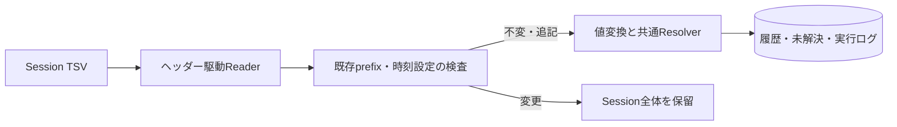

# Phase 4：Reflux Session TSVの取込

対象：[Issue #17](https://github.com/xidinor/IIDXProgressDashboard/issues/17)、後続の[Issue #20](https://github.com/xidinor/IIDXProgressDashboard/issues/20)。整理時点：2026-09-30。対象サンプルは暫定1.17.0のSession TSVで、best一覧形式は履歴入力ではない。

## Session契約と処理

[RefluxSessionReader](../Import/RefluxSessionReader.cs)はヘッダー名で列を読み、`title`、`difficulty`、`lamp`、`exscore`、`date`を必須とする。`lamp`は結果、`gauge`は使用オプションとして別に扱い、ゲージからランプを推測しない。`miss_count`の`-`はNULLであり0とは異なる。元行と列を`raw_data`に保存する。[RefluxRowConverter](../Import/RefluxRowConverter.cs)はSP/DP、難易度、時刻を変換し、[RefluxSessionTsvImporter](../Import/RefluxSessionTsvImporter.cs)が照合・登録・監査を行う。

キーは保存済みSession GUID＋データ行番号。コピー・改名は同じID、別Sessionは別IDである。rolling hashは行キーでなく既存prefixの変更検出に使う。末尾追記は受理し、途中編集・削除、列構成や既存時刻設定の変更はSession全体を保留して、既存履歴と基準を保全する。BOM有無とLF/CRLF差は同一性を変えない。異なるSessionで同じ内容のプレイを内容一致だけで消さない。

時刻はUTCが初期値で、Localには明示TimeZoneIdが必要。夏時間の曖昧・存在しない時刻は不正行。提供された3ファイル・72行は2026-09-22に`uselocaltime=false`と確認され、別DBで元日時とUTC保存値を照合した。取込結果は履歴・未解決・Session基準・件数を一括確定し、障害時にはロールバックしてFAILEDを別途残す。バックアップ前の失敗ではログを書けない場合もある。

## 検証と残課題

合成テストはヘッダー変更、再取込、追記、コピー・改名、別Session、同一内容の別元行、未解決再処理、全体保留、ロールバックを扱う。実72行の初回検証は旧マスター比較資料で66行登録・6行保留。正式Textageマスターでの再検証は68行登録・4行保留で、以前の保留2行を同じSession IDから追加し、再々取込の追加0件を確認した。4行は同じ正式曲名の複数tagによりPENDINGを維持する。実データ検証は通常DBへの取込完了を意味しない。

Beta2ではSession IDと設定の保存、選択、取込画面、表示更新を接続した。[Issue #20](https://github.com/xidinor/IIDXProgressDashboard/issues/20)には実環境での再起動・コピー・追記・失敗復旧、変更されたSessionの訂正契約、長時間ロック・ログ保存失敗・強制終了の隔離検証が残る。Issueの未チェックは後続実装の反映漏れを含み得るため、実装記録と照合する。

## 原記録

- [Session Importer](phase4-reflux-session-importer-explained.md)：入力列、キー、結果件数、バックアップの詳細。
- [ローカルRefluxビルド調査](phase4-followup-local-reflux-build.md)：暫定版の出典・offset・実機確認。[関連証跡](evidence/phase4-reflux-local-build/)を保持する。
- [正式マスター再検証](phase4-followup-real-master-revalidation.md)：66→68行と残る4行の根拠。
- [UTC照合](phase4-followup-session-utc-validation.md)：実サンプルの時刻設定と保存値。
- [Beta2 UI接続](phase6-beta2-reflux.md)、[Issue #17](https://github.com/xidinor/IIDXProgressDashboard/issues/17)、[Issue #20](https://github.com/xidinor/IIDXProgressDashboard/issues/20)。
