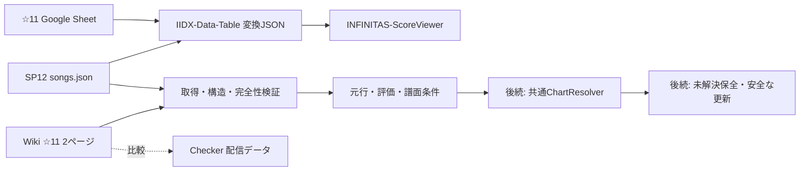

# Phase 5-1: 非公式難易度4表の取得元・入力契約

2026-09-21調査。[Issue #21](https://github.com/xidinor/IIDXProgressDashboard/issues/21)の第1項を対象とする。取得・構造調査と契約の記録までで、C# Provider、譜面照合、DB反映は未実装。本書の受理条件は後続実装への要求であり、実装済みの保証ではない。

## 採用元と範囲

ユーザー回答により、☆11はWiki、☆12はScoreViewerが参照する元JSONを採用する。比較先の自動代替・単純結合はしない。

|論理表|直接取得元|使用箇所|観測件数|
|---|---|---|---:|
|SP☆11 NORMAL|[Wiki page 22](https://w.atwiki.jp/bemani2sp11/pages/22.html)|ランク節と曲表|608|
|SP☆11 HARD|[Wiki page 21](https://w.atwiki.jp/bemani2sp11/pages/21.html)|ランク節と曲表|608|
|SP☆12 NORMAL|[songs.json](https://iidx-sp12.github.io/songs.json)|各行のnormal|671|
|SP☆12 HARD|同上|各行のhard|671|

件数はスナップショットであり固定の受理条件にしない。NORMAL/HARDは評価ゲージ、H/A/Lは譜面種別。☆12の2表は同じ取得バイト列から生成する。

Wikiは「beatmania IIDX SP☆11 難易度表保管所(仮)」の共同編集ページ、Checkerはnomadblacky.dev上の連動ツール、変換データはchinimuruhi、☆12元JSONはGitHubのiidx-sp12アカウントが公開している。個人の実名・運営継続・更新保証までは確認していない。

## 出典と固定版

|公開リポジトリ|調査したref / commit|確認点|
|---|---|---|
|[ScoreViewer](https://github.com/chinimuruhi/INFINITAS-ScoreViewer/tree/f86c35746b3f976c71dd54249f5d335488dcfb57)|main / f86c35746b3f976c71dd54249f5d335488dcfb57|Sp11TablePage.tsx / Sp12TablePage.tsxから変換JSONを取得|
|[IIDX-Data-Table生成コード](https://github.com/chinimuruhi/IIDX-Data-Table/tree/45432f6743d3a7d727faee00023f4bae342cf087)|main / 45432f6743d3a7d727faee00023f4bae342cf087|src/fetch/difficulty_sp11_fetcher.py、difficulty_sp12_fetcher.py、workflow|
|[変換済みデータ](https://github.com/chinimuruhi/IIDX-Data-Table/tree/d7758884eb38799009607f7ed0db792cce20eb7d)|gh-pages / d7758884eb38799009607f7ed0db792cce20eb7d|difficulty/sp11・sp12のsongs_list.json / difficulty.json|
|[☆12元データ](https://github.com/iidx-sp12/iidx-sp12.github.io/tree/24b51995f118ddbb9eb5f30c5708f1623a862ac7)|master / 24b51995f118ddbb9eb5f30c5708f1623a862ac7|songs.json、表示コード12table.js|

☆11生成器は公開Google Sheet `1e7gdUmBk3zUGSxVGC--8p6w2TIWMLBcLzOcmWoeOx6Y`のノーマルゲージ／ハードゲージを読む。セル色も地力／個人差の識別に使うため、CSVだけを同等入力とみなせない。Wikiも同Sheetを案内するが、Wiki側の独自変更がある。☆12生成器は上記songs.jsonを取得する。

変換済みJSONは独自IDとdifficulty・n_value・h_valueを持つ。IDは☆11では文字列、☆12では数値であり、songs.tagやchart_idではない。同commitのtextage/title.json、textage/textage-tag.json等との対応が必要。生成器の不明ID・不明評価のフォールバックや辞書上書きを新Providerへ継承しない。

生成workflowには週次更新があるが、配信commitの時刻は個別表の更新時刻を保証しない。last_modified.txtも生成処理時刻であり、HTTP Last-Modifiedではない（12時間表記でAM/PMもない）。☆12配信原本のGit blob SHA-1 `46d498f8de2db7e6da904f22f71d5e818b405f42`は固定commit内のsongs.jsonと一致した。

## ☆11 Wikiの解析契約

- UTF-8。`#pagetitle`と`#wikibody`で対象ページを識別し、本文のランクh4と対応する表だけを読む。広告・メニュー・コメント・全tdの一括抽出はしない。
- 見出しはランク名＋`(N曲)`。各表の先頭行はtdによるヘッダーで、TexTageにcolspan=2がある。展開後の列はver、曲名、BPM、notes、属性、☆、TexTage 1P、2P、レーダー、CR基準の10列。`☆`列はNOTES等の属性であり数値levelではない。CR基準をランクにしない。
- 曲名末尾の`(H)`／`(L)`を譜面指定として抽出し、記号なしAはこのソースに限定した規則とする。原曲名を必ず残し、曲名内の括弧や記号全般を除去しない。不明な末尾記号をAへフォールバックしない。
- TexTageリンクのファイル名からtag候補、queryから譜面とlevel候補を得る。観測した`?1AB00`等の先頭1/2はSPの1P/2PでありDPではない。譜面記号XはL、levelのBは11、Cは12。1P/2Pのtag・譜面・levelとタイトル指定、対象表が整合することを検査する。不明query形式は推測しない。
- notesは正の整数。リンク欠落や譜面指定の矛盾を黙って補完せず診断する。取得tagはマスター照合を省略する権限ではない。
- ☆11 NORMALの既知ランクは未定、地力S+/S/A/B/C/D/E/F、個人差S+/S/A/B/C/D/E。HARDは個人差Eがなく超個人差がある。NORMAL/HARD別の許容集合を使い、未知見出しを読み飛ばさない。
- 節見出し件数と実行数、ページ対象、必須ヘッダー、行幅、リンク、重複を検査する。行位置とランク節を出典位置として保持する。装飾・注記は元行に残し、色や取り消し線だけで削除・未収録と断定しない。新しい装飾が譜面識別を妨げる場合は未解決とする。

両表608行（H27/A541/L40）、各16節。観測した全行のnotes・2リンク・譜面・levelは整合し、節件数も一致、title+難易度およびtag+難易度の重複はなかった。Wikiの更新表示は2025-02-22 NORMAL 18:25／HARD 18:24で、表示タイムゾーンは未確認。

## ☆12元JSONの解析契約

UTF-8のroot配列。各行のnameは空でない曲名、difficultyはH/A/L、normal・hardは評価文字列。version、d_value、n_value、h_valueは出典情報として保持する。tag・notesはないためNULLとし、SP・level12はこの取得元の定義から与える。

671行（H2/A534/L135）。name+difficulty重複はなく、12行は両評価が空文字、n_value/h_valueが0だった。空文字は「原本で評価未割当」として保持し、未知の非空文字・欠落・nullと区別する。DB上の未定ランクへの対応はPhase 5-2で決める。normalとhardを混ぜず、片方だけ空の場合も個別の状態を保持する。

既知評価は地力／個人差×F,E,D,C,B,B+,A,A+,S,S+。数値は地力が順に1～10、対応する個人差が各値-0.5、空文字が0。文字列を評価の一次値とし数値との矛盾を診断する。d_valueはH=1/A=2/L=3という表示用値で、共通difficulty enumの値へ直接キャストしない。versionは識別子にしない。

全必須キーの型、配列終端、評価集合、数値との整合、重複を検査する。同じ曲名でもH/A/Lは別行。同じname+difficultyが重複すれば、同じ評価でも黙って統合せず競合として扱う。将来の任意キー追加は記録し、必須キーの欠落・型変更を受理しない。

## 比較対象と差異

Checkerの[11_normal](https://iidx-difficulty-table-checker.nomadblacky.dev/table/11_normal)、[11_hard](https://iidx-difficulty-table-checker.nomadblacky.dev/table/11_hard)、[12_normal](https://iidx-difficulty-table-checker.nomadblacky.dev/table/12_normal)、[12_hard](https://iidx-difficulty-table-checker.nomadblacky.dev/table/12_hard)はHTTP 200。SSR HTMLの`__NEXT_DATA__`に全4表と選択表の複製を含む。比較では`props.pageProps.table`だけを使用した。buildIdは配信識別子であり上流のcommitとは断定しない。

|比較（各ゲージ共通の対象集合）|共通|Wikiのみ|比較先のみ|共通行の評価差 NORMAL / HARD|
|---|---:|---:|---:|---:|
|Wiki☆11とChecker（602行）|602|6|0|0 / 0|
|Wiki☆12とChecker（578行）|578|4|0|0 / 0|
|Wiki☆11と変換JSON（541行）|527|81|14|0 / 0|
|Wiki☆12と変換JSON（671行）|578|4|93|17 / 26|

比較キーはTexTage由来tag+譜面。これは資料間の比較であり、当アプリのChartResolverによる登録成功件数ではない。表記だけの比較では大文字小文字・記号・空白差も混ざる。Checkerの共通行はnotesも一致した。

Checkerにない☆11の6曲はDIAMOND JACKAL、Move UR Body、ILAYZA、マツケンサンバII、LIKE A VAMPIRE、ガヴリールドロップキック。☆12の4曲は俺ら東京さ行ぐだ(L)、anthracene、Please Welcome Mr.C、Sweet Clapper(L)。Wiki上の通常の曲リンクであり、欠落だけから削除曲とは判断できない。

比較用Wiki☆12は[page19](https://w.atwiki.jp/bemani2sp11/pages/19.html)／[page18](https://w.atwiki.jp/bemani2sp11/pages/18.html)、各582行（H2/A473/L107）。☆11と異なり11列で、末尾は適正CPI等。これもランクではない。元JSONとの出典の完全な同一性は未確認。評価差と収録範囲を踏まえ、ユーザーが☆12元JSONの採用を選択した。

## 取得条件・再現情報・完全性

今回、通常HTTPによるWiki4ページは403、Cloudflareの`Just a moment...`画面だった。ブラウザーでは4ページの本文と全曲行を取得できた。チャレンジ解決操作は行っていない。この結果は本番.NET環境での自動取得成功を保証しない。JSONはHTTP取得できた。

追加依存の採用は承認済みだが、今回の文書調査で本番ライブラリは追加していない。☆12は.NET標準HTTP／JSON機能で扱える形式。☆11はHTML解析とブラウザー経由取得の必要性をPhase 5-3で実証し、保守・ライセンス・Windows/.NET8・配布サイズ・追加ランタイムを比較して選ぶ。Pythonを本番依存にしない。キャッシュ、間隔、上限付き再試行を設け、403/429を無制限に繰り返さない。

取得ごとに要求URL・最終URL、開始／終了UTC、HTTP status/content-type、ETag/Last-Modified（存在時）、取得方式、原本SHA-256、解析契約版、上流revision（確認できた場合のみ）を記録する。DOM取得ではブラウザー最終URL・採取UTC・DOM/抽出形式とそのSHA-256を記録し、HTTP原本ハッシュとは呼ばない。Wiki更新表示やChecker buildIdは補助情報にする。認証情報・Cookieは記録しない。

[調査証跡](phase5-1-source-evidence.json)にHTTP原本のメタデータとDOM抽出物のハッシュを収録する。公開表全体や個人データは収録しない。ローカルの一時調査ファイルはGit対象外であり、ハッシュだけから入力を復元できるものではない。

|段階|成功条件|失敗時|
|---|---|---|
|取得|期待する対象・形式、応答完了、challengeではない|空表とせず保留。既存DBを変更しない|
|構造|必須列/キー、既知ランク、節と行の整合、全入力を走査|未知形式・途中入力・欠落節・空全体を保留。元入力と診断を残す|
|候補|行の曲名・難易度・評価・取得済み条件が整合、重複なし|不正行・競合を明示し、黙示スキップで完全成功にしない|
|照合（後続）|マスター内で一意、SP/難易度/level/notes等が整合|候補なし・複数・矛盾を未解決として保全|
|反映（後続）|Phase 5-2で定める更新範囲と原子性を満たす|失敗や未解決を既存エントリー削除の根拠にしない|

件数一致だけでは完全性を証明できない。Wikiの既知節が消えた場合は空ランクか欠落か判別できるまで保留する。JSONは配列全体の構文成功だけでは意図的に短縮された配信を検出できないため、前回との差分・急減・対象集合変更を確認する契約がPhase 5-2で必要。取得完全性と照合未解決を別状態にする。

## INFINITASとの境界・利用条件

これらはSPの難易度表で、現在のINFINITAS収録譜面一覧そのものではない。変換データの外部song単位in_inf=falseは☆11で52行、☆12で91行あり、譜面単位の現行収録証明には使えない。表にあってマスターにない曲・譜面は作成せず未解決にする。非アクティブ譜面の反映方針もPhase 5-2/4で決める。

実Textageのカタログ外17タグ対応と検証用DB構築は[Phase 2調査](phase2-followup-local-textage-audit.md)・[DB検証](phase2-followup-real-master-db-validation.md)を参照。本調査ではそのDBへの4表全件照合は行っていない。

ScoreViewerのMITは同リポジトリのコードの条件。IIDX-Data-Tableと☆12元データには調査したtree内にLICENSEが見当たらず、前者は元出典の条件を参照する案内がある。ScoreViewerのMITを表データへ拡張しない。[atwiki利用規約](https://atwiki.jp/tos)の著作権・過負荷に関する規定も参照し、robots.txtは再配布許諾とは扱わない。包括的なデータ再配布条件は未確認のため、ここではリンク・構造・集計値を記録し、原表全体をGitへ転載しない。

## 検証結果と次工程

実施したのは公開HTTP取得、ブラウザーDOMの行抽出、JSON/HTMLのオフライン構造・件数・比較検査、固定commitと出典コードの確認。調査用スクリプトは製品Parserや自動テストではない。文書のみの変更のためdotnet build/testは未実施。data原本・DB・既存履歴に変更なし。

後続の合成fixtureは、4表正常例、H/A/Lと曲名の括弧、ヘッダーcolspan、未知節、列変更、件数不一致、重複、challenge/空/途中HTML、JSON欠落/null/空評価/未知評価/数値矛盾、TexTage矛盾、任意キー追加を含める。実サイトへのアクセスをCIの前提にしない。

次はPhase 5-2。table_code、rank_codeと並び順、空評価の保存先、取得完全性と照合未解決の状態、差分急減と欠落の扱い、1表/4表の原子性、部分反映、監査・再処理キーを決める。Phase 5全体や本番取得・DB反映の完了ではない。
