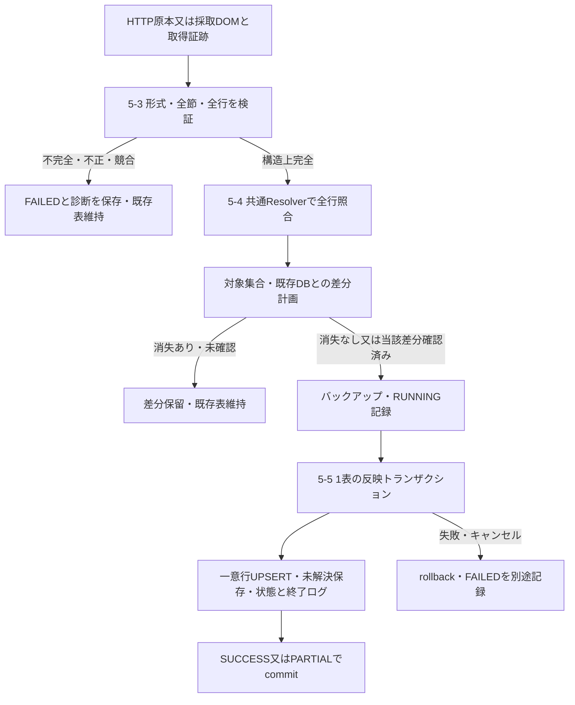

# Phase 5-2: 難易度表の識別・更新・監査契約

2026-09-21確定。[Issue #21 第2項](https://github.com/xidinor/IIDXProgressDashboard/issues/21)の設計契約。ユーザー回答で正常行の部分反映、欠落保持と差分確認、空評価の専用ランク、非アクティブ譜面の登録を承認済み。ブランチは `codex/phase5-2-update-contract`。Provider・DB更新・UIの実装はPhase 5-3以降。

根拠は[Phase 5-1入力契約](phase5-1-difficulty-source-contract.md)、[仕様](../SPECS.md)、[適用済みDDL](../Database/Migrations/001_initial.sql)、[共通照合](phase2-5-chart-resolver-explained.md)、[マスター更新基盤](phase2-3-safe-master-update-explained.md)。元DDLの変更や実DBへの書込みは行っていない。

## 判断の要点

採用方針は「1表単位、完全取得した表の安全に照合できた行を反映、欠落は保留して既存評価を保持」。対象外の曲が原表に含まれるため、照合未解決1行だけで全表の更新が止まらないようにする。一方、不完全取得・不正行・競合は表全体を保留する。取得完全性と、INFINITASマスターに照合できる割合を分ける。

|判断|採用方針|影響・代案|
|---|---|---|
|反映単位|1表単位。照合未解決だけなら正常行を反映|正常行と保留中の旧評価が混在し得るためPARTIALと行の出典を表示。代案は未解決が1件でも表全体を保留|
|欠落|自動削除なし。旧エントリーを保持し欠落一覧に記録|現在の原表との完全一致は保証しない。明示的な除外・非アクティブ化は別設計|
|空評価|☆12の空文字を専用UNRATEDランクに保存|表示「評価未割当」。Wikiの「未定」と区別。欠落・null・未知文字は受理しない|
|非アクティブ譜面|一意に照合でき条件が一致すれば登録|現在のINFINITAS収録対象への絞込みは曲・譜面のis_activeで行う。登録を理由に再有効化しない|
|差分保留|前回の入力対象が1件でも消える場合、具体的な差分の確認まで表全体を保留|曖昧な急減率を採用せず少数の消失も検出。確認しても欠落エントリー自体は削除しない|

この選択はプレイ履歴の統合・削除・補完を一切変更しない。上記方針はユーザー確認済みで、AGENTS.mdの確定事項にも要点を記録した。

## 表の識別と所有範囲

コードは大小区別の固定ASCII。URL・表示名・取得日時から毎回生成しない。同じlevel/gaugeの別出典は別table_codeとし、この4表へ混ぜない。

|table_code|display_name|level|play_style|gauge_type|source_name|source_url|
|---|---|---:|---|---|---|---|
|ATWIKI_BEMANI2SP11_SP11_NORMAL|SP☆11 NORMAL（Wiki）|11|SP|NORMAL|ATWIKI_BEMANI2SP11|https://w.atwiki.jp/bemani2sp11/pages/22.html|
|ATWIKI_BEMANI2SP11_SP11_HARD|SP☆11 HARD（Wiki）|11|SP|HARD|ATWIKI_BEMANI2SP11|https://w.atwiki.jp/bemani2sp11/pages/21.html|
|IIDX_SP12_GITHUB_SP12_NORMAL|SP☆12 NORMAL（iidx-sp12）|12|SP|NORMAL|IIDX_SP12_GITHUB|https://iidx-sp12.github.io/songs.json|
|IIDX_SP12_GITHUB_SP12_HARD|SP☆12 HARD（iidx-sp12）|12|SP|HARD|IIDX_SP12_GITHUB|https://iidx-sp12.github.io/songs.json|

source_revisionは取得内容との一致を検証した上流commit/revisionのみ。分からなければNULL。取得日時・Wiki更新表示・入力ハッシュをcommitに見立てない。入力ハッシュは実行ログに別保存する。PARTIAL時の表メタデータは最後に受理した入力を示し、全エントリーが同じ版という意味を持たない。

所有範囲はtable_code完全一致の1表、そのランク、その表のエントリー。別出典、他表、songs/charts/play_history/song_aliasesは変更しない。テーブル行のidとrankの複合キーを保持し、DROP/REPLACEを使わない。既存table_codeが別出典・level・style・gaugeに割り当てられている、又は所有状態が不明なら拒否する。未所有の既存表を名前一致だけで接収しない。

## ランク辞書

原表記とdisplay_nameは下表の日本語表記。元行・元見出しは別途そのまま残す。文字列の部分一致、未知評価をOTHER/未定へ落とす処理はしない。rank_codeは表示名変更後も維持するが、許容する改名は契約版を上げ明示的対応表を追加する。

次の数値は**アプリ内の表示順**であり、出典の難易度数値そのものではない。sort_order降順で地力→同段階の個人差と並ぶ。別表の数値を横断して難易度比較しない。

|段階|code末尾|地力 sort_order|個人差 sort_order|☆11 NORMAL|☆11 HARD|☆12 NORMAL/HARD|
|---|---|---:|---:|---|---|---|
|S+|S_PLUS|100|95|両方|両方|両方|
|S|S|90|85|両方|両方|両方|
|A+|A_PLUS|80|75|不可|不可|両方|
|A|A|70|65|両方|両方|両方|
|B+|B_PLUS|60|55|不可|不可|両方|
|B|B|50|45|両方|両方|両方|
|C|C|40|35|両方|両方|両方|
|D|D|30|25|両方|両方|両方|
|E|E|20|15|両方|地力のみ|両方|
|F|F|10|5|地力のみ|地力のみ|両方|

地力は `JIRIKI_`＋末尾（rank_kind=JIRIKI、表示例「地力S+」）、個人差は `KOJINSA_`＋末尾（rank_kind=KOJINSA、表示例「個人差S+」）。共通生成規則を使っても、受理集合は表別に固定する。

|対象|原評価|rank_code|display_name|rank_kind|sort_order|
|---|---|---|---|---|---:|
|☆11両表|未定|UNDECIDED|未定|UNDECIDED|-10|
|☆11 HARDのみ|超個人差|EXTREME_KOJINSA|超個人差|SPECIAL|110|
|☆12両表|空文字|UNRATED|評価未割当|UNDECIDED|-20|

☆12の地力/個人差はそれぞれ10段階。n_value/h_valueは原本の値との整合検査に用い、sort_orderへ直接転用しない。空文字だけがUNRATEDであり、空白だけの文字列、キー欠落、null、不明評価は不正。片方だけ空の場合も別々に処理する。表示順の特殊枠は難易度の大小を断定するものではない。

Wikiの既知16節は全て必要（0曲節は見出しと表構造から明示的に確認）。JSONでは行のないランクも辞書として保持する。参照数0になったランクも削除しない。消失・再登場は同じrank_codeを使用する。未知の節・評価は契約更新まで表全体を保留し、既知ランクへの推測変換をしない。

## 取得・照合・差分の分離

取得状態は `COMPLETE / INCOMPLETE / FAILED`、解析は `VALID / INVALID / NOT_RUN`、適用は `APPLIED / HELD / FAILED` としてoptions_jsonに分ける。COMPLETEは入力契約上の検査を通った意味で、上流が意図した全データという絶対保証ではない。

- challenge、403/429、空全体、切れたJSON、欠落節、未知ヘッダー等は更新不可。HTML5 Parserが破損HTMLを補修できたことを完全性の証明にしない。
- 解析不正や同一ソース識別子の重複は表全体を保留する。重複は同じ評価でも競合。同一chart_idへ別元行が解決した場合も全関係行を競合とし、表全体を保留する。
- 構造が完全で行が有効なら、曲/譜面なし、曖昧候補、tag・level・notes不一致は照合未解決。一意に解決した他行を反映できる。取得したtagだけで照合を省略せず、INFINITASにない譜面を作らない。
- 共通Resolverは非アクティブ曲・譜面を除外せず照合し、成功後の活動状態を診断へ残す。活動状態で曖昧候補を絞らない。notes未知だけは失敗にせず、既知値の矛盾は維持する。
- 全行未解決なら、完全入力の受理と診断保存だけをPARTIALとして確定できる。エントリー追加0件を全件登録成功とは表示しない。

差分比較用のソース識別はWikiでは `(tag, SP, difficulty)`、☆12では `(nameの原文字列, SP, difficulty)`。曲名正規化をキーにせず、大文字小文字・記号変更も新旧差分として確認する。ランク・notes・行順はこの識別に含めず、評価移動は更新として検出する。識別候補が不正な行は差分の欠落判定に利用しない。

前回受理入力の集合と今回の集合を比べ、消失が1件以上なら適用全体を `HELD / PARTIAL` とする。確認は入力ハッシュ、表コード、前回状態、差分一覧に束縛する。単なる永続的「確認済み」フラグにしない。初回は比較元なしと明示し、構造検査を満たせば受理する。追加のみやランク移動のみは通常反映する。全件入替も消失として検出される。

確認後も欠落したDB行を削除しない。未解決行に対応する旧DB行を推測で特定・変更しない。保持行は「今回確認できた現行評価」と区別して表示できるよう、最後の反映runと状態の `missingSourceKeys / retainedChartIds` を記録する。保持行を現行表の分母へ含めるかはPhase 6のUI契約で明示する必要がある。

## 原子性・所有状態・同時更新

1表につき1 import_run。4表バッチは共通batchIdを持ち個別結果を返す。☆12の2表は同一取得バイト列を共有し同じハッシュを持つが、評価欄の検査結果・照合・適用結果は別。root構造など共通入力の障害は両表失敗、片ゲージの不正評価は当該表失敗とする。

適用前に不変のplanを用意する。planには契約/Parser/Normalizer版、入力・解析済み候補、全元行、旧状態、既存表、マスターと対象aliasの照合状態、差分と診断を含める。Applyで同じ読取前提が有効か再検査し、途中のマスター・alias・表・所有状態の変更なら古いplanを拒否して再準備する。照合と書込みは同じSQLiteトランザクションのsnapshotで整合させる。

既存DBの構造検証→書込予約下の整合したバックアップ→RUNNINGを別commit→反映トランザクションを基本とする。表・ランク・エントリーのUPSERT、診断保存、PENDINGの解決、所有状態、終了ログを同じcommitにする。処理中の通知は確定件数ではない。

所有状態は `options_json.difficultyState` の版1として、table_code、受理世代ID、親世代ID、入力ハッシュ、前回受理ソース集合、元行識別と反映chart_idの対応、所有chart_id集合、保持行、rank辞書版を保存する。所有chart_idは欠落しても失わない。最新状態の選択は「SUCCESSだけ」ではなく、`APPLIED` のSUCCESS/PARTIALで `stateCommitted=true` の実行に限る。HELD/FAILED/RUNNINGは基準を進めない。未知版、壊れたJSON、親世代不整合は拒否する。

DB由来の世代ID（その入力を受理した最初のrun ID）は取得ハッシュと別。同じ入力の連続再適用・再照合では世代IDを維持し、状態の最新run IDだけを進める。A→B→Aのように別入力を挟んで同じ原本が再登場した場合は新しい世代になる。Apply開始時の基準run IDが違えば同時更新として拒否する。受理済み表へ監査状態なしの行が追加されている場合も無断で引き継がない。

途中失敗・キャンセルでは表変更と状態をrollback。取得済み入力・診断は保持し、別トランザクションでFAILEDと試行情報を記録する。失敗ログ保存も失敗した場合は両方の例外を返し、成功扱いしない。バックアップ失敗ならDBへRUNNINGも書かず呼出し側へ失敗を返す。プロセス強制終了のRUNNINGは自動成功化せず、ロック/実行中プロセス確認後に復旧する。復旧手順は既存[バックアップ解説](phase2-3-safe-master-update-explained.md#バックアップ復旧)を基準とし、元DBへ復元コピーを上書きしない。

## 監査と件数

`source_type=DIFFICULTY_TABLE`、`source_name=table_code`。履歴ImporterのLEGACY_INFINITAS_LOG/REFLUX_SESSION_TSVを流用しない。alias照合用SourceNameは表メタデータのsource_name（ATWIKI_BEMANI2SP11又はIIDX_SP12_GITHUB）を明示する。manual aliasと同じ候補規則を使う。

`source_fingerprint` は取得原本又は採取DOMのSHA-256。`source_path` は必要ならローカル保管先、共有文書・Gitへ個人の絶対パスを載せない。要求/最終URL、取得開始/終了UTC、方式、status/content-type、ETag/Last-Modified、上流revision、DOMかHTTP原本か、契約版はoptions_jsonの取得証跡へ保存する。認証情報・Cookieは保存しない。

|件数|定義|
|---|---|
|read / records_read|当該論理表で列挙した曲行。節・ヘッダーを含まない。途中失敗なら観測済み件数とreadComplete=falseを併記|
|resolved|有効かつ一意照合できた行。競合関係の行は除外|
|unresolved|有効だが照合できない行|
|invalid|値・行構造の不正行|
|conflict|重複・同一chart競合に関係する行すべて（組数ではない）|
|notProcessed|入力不完全等で分類できなかった観測行|
|added / updated / unchanged|正常適用したresolved行の新規・値変更・同値件数|
|records_imported|commit済みadded+updated。unchangedを加えない|
|records_unresolved|unresolved+invalid+conflictの行数。ページ単位の診断を含めない|
|missing / retained|前回入力からの消失ソース識別数／今回更新されず保全した既存chart行数。readへ加算しない|

最終行分類は conflict → invalid → unresolved → resolved の優先順位で排他的にし、判定しなかった行はnotProcessed。必ず `read = resolved + unresolved + invalid + conflict + notProcessed`。APPLIEDなら `resolved = added + updated + unchanged`。HELD/FAILEDなら反映3件数とrecords_importedは0、差分予定は `plannedCounts` に分離する。rollback前のSQL実行数を反映数にしない。表・ランクメタデータの変更は別件数。

エントリー値が同じならupdated_atとimport_run_idも書き換えず、unchanged。最新入力での再確認は所有状態へ記録する。これにより同一入力再適用は増殖せず、最後に評価を変更した出典も失わない。

|status|意味|
|---|---|
|SUCCESS|完全・有効入力をAPPLIED、照合未解決0、欠落保持0。変更0件の正常再適用も含む|
|PARTIAL|完全・有効入力をAPPLIEDしたが未解決又は欠落保持あり。または差分確認待ちHELD（反映0）。applyStatusで区別|
|FAILED|取得/解析失敗、不正、競合、SQL/バックアップ/同時更新/キャンセルなど。既存評価不変|
|RUNNING|未確定。終了時刻なし。完了/成功として参照しない|

未解決数の増加だけでは既存行を削除せず、差分・診断として報告する。SUCCESSを「上流・マスターの全仕様が正しい」という意味へ拡大しない。

## 元入力・未解決・再照合

`entity_type=DIFFICULTY_TABLE_ENTRY`、`source_system=DIFFICULTY_TABLE`。1元行につき試行ごとに1 unresolved_imports行。ページ単位の障害は `entity_type=DIFFICULTY_TABLE_SOURCE` の診断とし、曲行の件数へ混ぜない。

`source_record_key` は `dt:v1:`＋SHA-256。ハッシュ入力はUTF-8の固定順JSON配列 `[table_code, inputKind, inputSha256, rowOrdinal]`（空白なし、rowOrdinalは1始まり整数）。行順変更・原本変更は別の元行版。同一版の再試行は同じキー。世代はraw_dataのacceptedGenerationIdで別管理し、履歴SessionのGUIDやrolling hashを流用しない。

raw_dataは版付きJSONで、完全な元行（WikiはtrのHTMLとランク節・見出し・位置、JSONは行オブジェクトの元文字列と配列位置）、元評価、取得情報、table_code、入力ハッシュ、候補、契約版、世代IDを保持する。DOM採取物は原HTTPとは呼ばない。reason_codeは主理由、reason_detailには全理由・候補・照合条件を保存する。正常行も監査runの版付きsnapshotに同じ元行情報を保存し、後の評価変更を追えるようにする。

既存DDLだけで再処理可能にするため、options_jsonのsnapshotに当該入力（HTML/DOMテキスト又はJSONテキスト）と解析済み全行・取得証跡を保存する。ハッシュだけや消える一時パスだけを原本保全としない。受理前に入力サイズ上限を検証し、巨大入力で原本保存だけ失敗した場合も表反映を行わない。上限値と容量試算は5-3で実入力を使って決める。ローカルDBの保存量は増えるため将来の履歴整理は別設計とし、勝手に監査runを削除しない。

再処理は「PENDINGを1行ずつ直接適用」ではなく、現在の受理世代のsnapshot全体を用いて新しいplanを作る。alias/マスター更新後も重複・競合・差分を再検査する。元入力が現在世代に属することと、基準run IDが不変であることをApply時に確認する。古い世代のPENDINGは保存したまま「旧版」として提示し、自動適用しない。元表B受理後にAの未解決を解いて評価をAへ戻さない。

正常行がcommitされた場合だけ、同一表・元行キー・現在世代に属する過去PENDINGをRESOLVED、resolved_chart_id、resolved_atで更新する。HELD/rollbackでは解決済みにしない。A→B→Aの再登場でも、最初のA世代のPENDINGを一括解決しない。旧版はIGNOREDへ自動変更しない。

## 期待動作と後続テスト

|場面|既存表への結果|実行/再処理|
|---|---|---|
|初回・全行照合|表/辞書/エントリー新規作成|SUCCESS|
|同一入力・同一マスター再適用|行数・rank・entry時刻不変|SUCCESS、unchanged=resolved|
|ランク移動|同じtable_id/chart_idのrankだけ更新|SUCCESS、updatedへ計上|
|既知評価から空評価|☆12ならUNRATEDへ明示更新|未定や欠落に置換しない|
|未知評価・未知ランク改名|表全体不変|FAILED、元行保持|
|入力から1曲消失|確認前は全表不変、確認後も消失行保持|HELD後PARTIAL|
|消失行が再登場|同じchart_id行を更新/再確認|重複なし、保持理由解除|
|未解決と正常行の混在|正常行のみUPSERT、旧行は保持|PARTIAL、PENDING記録|
|同一chartへ2行|先勝ち/後勝ちしない、全表不変|FAILED、両行conflict|
|全行未解決|エントリー変更なし、入力と診断受理|PARTIAL|
|非アクティブに一意照合|表には登録、曲/譜面の状態不変|活動状態を診断保存|
|途中入力・challenge|全表不変、基準不変|FAILED|
|alias修正後の現在版再処理|新規解決分を適用|commitと同時に該当PENDINGをRESOLVED|
|改訂後の旧版再処理|拒否、最新評価不変|旧版PENDINGは保存|
|SQL失敗・キャンセル|当該表rollback、先に完了した別表は維持|FAILED又は残存RUNNINGを検出|
|plan作成後に別更新|古いplan拒否|再準備、確認の使い回し不可|

## DDL評価と実装境界

この契約では追加Migration不要。表/ランク/エントリーの既存一意制約と複合外部キー、import_runs.options_json、unresolved_importsで保持できる。エントリーにis_activeがないため「欠落を非アクティブ化した」とは扱わない。欠落行を通常エントリーから除外する仕組みを選ぶ場合は追加Migrationが必要になり得る。その際はIssue #3と調整してバックアップ・追加DDL・既存状態移行・復旧を先に設計し、001は変更しない。

既存コードの役割：DatabaseInitializer/MigrationRunnerで既存v1 DBを検証、DatabaseBackupで保全、TitleNormalizer/ChartResolverで安全照合。MasterUpdateServiceの所有状態は参考にするが、難易度表のPARTIALや元行監査の契約をそのまま同じ状態クラスへ押し込まない。

## HTML解析ライブラリ

ユーザー提案を踏まえAngleSharpを採用する方針。公式[README](https://github.com/AngleSharp/AngleSharp)はHTML5 DOM・CSS selectorと.NET 8対応を案内し、[LICENSE](https://github.com/AngleSharp/AngleSharp/blob/devel/LICENSE)はMIT。公式公開リポジトリで開発・保守情報を確認できる。対象は取得済みHTMLの解析で、#wikibody配下の見出しと表をDOMとして追跡する用途に合う。

比較候補[Html Agility Pack](https://html-agility-pack.net/documentation)もHTML解析が可能で、[標準の選択API](https://html-agility-pack.net/selectors)はXPath中心。今回の入力契約のCSSセレクターとブラウザーDOMに合わせやすいためAngleSharpを選ぶ。既存AcornimaはJavaScript AST解析なので役割の重複はない。HTML本文をJavaScriptとして実行する用途には使わない。

5-3で安定版を固定してPackageReference・ライセンス同梱を追加し、.NET 8 Windowsでのrestore/buildと合成HTMLを検証する。本節の公式開発ブランチの情報を、未選定NuGet版の実測結果とは扱わない。追加管理DLLとその依存分の配布増加はあるが、HTML解析自体にPythonやブラウザー実行環境は不要。具体的な容量・依存一覧・single-fileへの影響は採用版で測る。ブラウザー取得が必要ならそのランタイム・容量は別評価。

HtmlParserで与えられた文字列を解析し、外部リソース取得やスクリプト実行は有効にしない。AngleSharpは取得障害・Cloudflare challengeの解決手段ではない。HTML5の補修動作に加え、節件数・ヘッダー・全行の意味検査を必須とする。☆12 JSONはSystem.Text.Jsonで扱う。今回NuGet追加やParser実装はしていない。

## 確認状況

Issue #21の範囲、DDLの制約、既存更新状態、Resolverの非アクティブ対応を読み合わせた。後続テストの期待動作を上表で定義したが、自動テスト実行・実入力のDB反映・取得ライブラリの実証は未実施。文書のみのためbuild/testは対象外。

ユーザー回答を反映し、Phase 5-2の契約を確定した。文書内ローカルリンクとgit diff --check（新規文書はno-index指定）を検証し、問題なし。次は5-3の取得/解析モデル、AngleSharp導入、合成fixture検証。5-4照合・5-5反映・5-6統合検証の完了とは区別する。
