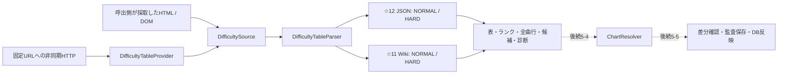
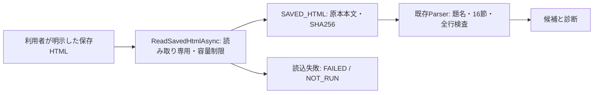

# Phase 5-3: 難易度表の取得・解析Provider

2026-09-22、[Issue #21 第3項](https://github.com/xidinor/IIDXProgressDashboard/issues/21)の実装。ブランチは `codex/phase5-3-difficulty-provider`。
[入力契約](phase5-1-difficulty-source-contract.md)・[更新契約](phase5-2-difficulty-update-contract.md)に沿う4表のParserとHTTP取得を追加した。Wikiの本番ブラウザー取得は残課題であり、Phase 5-3全体の完了とはしない。照合・DB反映・通常UIは未実装。

## 構成と境界



|ファイル|役割|
|---|---|
|[DifficultyModels.cs](../Difficulty/DifficultyModels.cs)|4表の固定識別、表別ランク辞書、取得証跡、元行、候補、診断、結果|
|[DifficultyTableParser.cs](../Difficulty/DifficultyTableParser.cs)|取得済み入力の構造・値・重複検査。ネットワーク・DB・Formに非依存|
|[DifficultyTableProvider.cs](../Difficulty/DifficultyTableProvider.cs)|HttpClientを注入できる非同期取得、上限・キャッシュ・間隔・再試行、非同期解析|
|[DifficultyProviderTests.cs](../tests/IIDXProgressDashboard.Tests/Difficulty/DifficultyProviderTests.cs)|個人データ・ネットワークを使わない合成32ケース|

`DifficultyTableDefinition`のlevelと候補のSP/difficulty/notes/tagを後続Resolverに渡せる。ゲージを譜面難易度として使わない。曲名正規化、alias、chart_idの確定は行わない。`IsValid`も登録可能なchart_idを得た意味ではない。

## API

```csharp
using var client = new HttpClient();
var provider = new DifficultyTableProvider(client);
var tables = await provider.FetchAllAsync(cancellationToken);
foreach (var table in tables)
{
    // SourceとRowsを診断と一緒に保全する。IsValidだけでDB適用しない。
    Console.WriteLine($"{table.Table.Code}: {table.ParseStatus}, {table.Rows.Count}");
}
```

採取済みDOMは `DifficultySource.FromUtf8(url, bytes, "BROWSER_DOM")` で明示し、`ParseAsync(kind, source, token)`へ渡せる。元の採取日時・最終URLはsourceの対応フィールドへ設定する。DOMをHTTP原本として扱わない。このAPIはブラウザーを起動・採取する機能ではない。

☆12の2表はFetchAllAsync内で同じ取得結果を共有する。共通項目の不正は双方へ、片ゲージの不正評価は当該表へ診断を返す。原本にある任意キーも元JSON文字列に残る。`SourceRevision`は確認した上流版がある場合だけ設定でき、HTTP取得ではNULL。

## 検査とデータ保全

- Wikiはpagetitleとwikibodyを確認し、既知16節・各節件数・列ヘッダー（TexTageのcolspan=2）・10列曲行を検査。末尾H/Lと両TexTageリンクのtag/SP/譜面/levelを照合する。CR基準はランクに使わない。取り消し線も削除指定に変換しない。
- 終端htmlとtable/tr/td/h4の明示開始・終了数を確認し、HTML5の補修だけで途中入力を受理しない。省略タグの新形式は保留する保守的な制限。見出し256文字、曲行20,000行が上限。
- JSONはroot配列、型、H/A/L、d_value、表別評価集合と対応数値、同名キー重複を検査。空文字だけをUNRATEDとし、NULL・空白・未知評価を区別する。
- 同じソース譜面の複数行は同評価でも競合とし、全関係行に行番号付き診断を返す。未知ランク節の曲行も元HTMLを保持する。
- `Source.Content`は採取した本文全体。JSON元行はGetRawText、Wiki行はDOMのOuterHtml（HTML表現は再直列化される）を保持し、正確な受信表現は本文全体で追跡する。
- 行キーは更新契約の固定順JSON配列からSHA-256を生成する。HTTP原本のBOMを本文・ハッシュから除去せず、構文解析時だけ許容する。
- 取得失敗はFAILED/NOT_RUN。構造不完全はINCOMPLETE/INVALID。全体を読めた有効構造で行の値が不正・重複ならCOMPLETE/INVALIDとなる。ReadCompleteは全走査できたかであり、有効・反映成功を意味しない。
- 呼出側のキャンセルはOperationCanceledException。HTTPの30秒タイムアウトはFETCH_FAILED。HTML DOM構築・JSON構文解析の内部には即時割り込みできないが、前後・行単位で確認する。ParseAsyncはワーカースレッドで解析する。

本段階では失敗ログをDBへ書かない。import_runs/unresolved_importsへの永続化・所有世代・同時更新検査は5-4/5-5の担当。既存DBを開くコードもない。

## 取得と容量

要求先は固定3 URL。1 Providerインスタンス内で取得を直列化し、最低2秒間隔、5xxのみ1回まで再試行、403/429は再試行しない。正常解析した入力だけ15分のメモリーキャッシュへ保存する。期限切れの取得失敗で古い成功入力へ戻さない。キャッシュの日時・ハッシュは元取得時点を維持する。運用側はProviderを再利用する。

UTF-8を厳密に復号する。1入力8 MiBをHTTP Content-Lengthとストリーム読込中の両方で制限し、本文とハッシュ・バイト数の整合も解析前に検査する。別ホスト等へのリダイレクト、想定外Content-Typeも成功としない。

実☆12原本130,365バイト、671行。NORMAL結果全体をSystem.Text.Jsonの既定設定で直列化した参考サイズは744,828バイト（元本文・全元行・候補・証跡を含む）。Wiki NORMALのブラウザーDOMは724,717 UTF-16コード単位だった。UTF-8の上界でも8 MiB以内で、今後の増加余地を確保した。上限は実サイトの完全性を保証する件数閾値ではない。DB監査の各試行に本文を重複保存すると容量が増えるため、5-5ではoptions_json全体のサイズも評価する。今回DBへの保存量実測はしていない。

## 依存と配布

[AngleSharp 1.8.2](https://www.nuget.org/packages/AngleSharp/1.8.2)を固定した。採用パッケージのrepository commitは `35b26db83557a6a74ce286907833e3b17806d9eb`、MITの[LICENSE](../ThirdParty/AngleSharp/LICENSE)をbuild/publishへ別ファイルとして同梱する。net8.0の追加依存はなく、AngleSharp.dllは1,073,664バイト。AcornimaのJS ASTとは役割が異なる。HtmlParserだけを使用し、外部資源取得やスクリプト実行を有効にしない。

既存の配布検証と同じwin-x64 / self-contained / single-fileのpublishが成功し、ライセンス同梱を確認した。ブラウザーランタイムは追加していない。クリーン環境でのUI・全機能起動、既存GAC参照の移植性は未検証で、配布完了ではない。

ブラウザー取得の候補として[WebView2 Evergreen](https://learn.microsoft.com/microsoft-edge/webview2/concepts/distribution)は既存WinFormsと親和性があるが、別Runtimeの存在確認・配布対応が必要。Playwright等もブラウザーの配布・管理が増える。今回のCodexブラウザーで表示できた事実から、これらの本番取得成功を推定せず、未実証ライブラリは追加していない。

## 検証結果・残課題

- `dotnet build IIDXProgressDashboard.sln`成功。既存のNU1701（OpenTK等）、Nullable・未使用フィールド警告あり。
- 全自動テスト366件成功、失敗・スキップ0。新規32件は4表の正常入力、H/A/L、記号・装飾、未知/欠落節、件数・ヘッダー・notes・リンク矛盾、JSON型・数値、片ゲージ不正、重複、空/途中/challenge、ハッシュ、UTF-8、上限、キャッシュ、キャンセル、403/429・5xx・Content-Typeを検証。
- 実☆12JSONを新ParserでNORMAL/HARD各671行、診断0、UNRATED各12行と確認。SHA-256は `0F1A8E89FCF1BDB5978DFEFE556ADE4991ED3A954C837508CB7E68A910C93402`。元データはGit対象外の調査用領域に保管。
- Wiki NORMALへの通常HTTPはchallengeで拒否。Codexブラウザーでは16節・ヘッダー込み624行と想定TexTage形式を確認。これは新C# Parserで実Wiki全行を通した検証ではない。HARDの今回の実入力検証も未実施。
- 個人DB、旧DB、DDL、通常UI、既存履歴は変更していない。

上記は保存HTML提供前の検証記録。両Wikiの実Parser検証は次の追補で完了した。ブラウザーによる自動取得の実証・実装は引き続き残り、Phase 5-3全体の完了チェックは付けない。5-4のResolver接続、5-5の監査・安全なDB更新、5-6の実4表統合検証も別工程として残る。

## 2026-09-22追補: 利用者が保存したWiki HTML

利用者から提供された `data/atwiki/` のNORMAL/HARD HTMLを読み取り専用で検証した。既存Parserの修正は不要だった。原本はGitへ追加せず、同ディレクトリを `.gitignore` に追加した。個人DB・DDL・通常UIは変更していない。



`DifficultyTableProvider.ReadSavedHtmlAsync(kind, path, token)`を追加した。☆11専用で、選択された表の題名と構造を検証する。ファイル名は表識別に使わない。非同期読込、厳密UTF-8、読込前と読込中の8 MiB上限、キャンセルに対応する。読込失敗の診断にはOS例外中の個人パスを含めない。解析失敗でも読めた元本文を保持する。

取得種別に `SAVED_HTML` を追加する。開始・終了日時はローカルの読込日時であり、Web取得日時ではない。HTTP status/content-type、ETag、Last-Modified、上流revisionは不明のままNULL。URLは利用者が選択した表の契約URLであり、ファイルの採取元をネットワークで証明した意味ではない。mtimeからWeb取得日時を推測しない。HTTP_BODY/BROWSER_DOMとの行キーは分離される。既存入力のキー・ParserVersion・ContractVersionは変更していない。後続5-5ではこの取得種別も監査に保存する。

この経路は利用者が保存ファイルを明示した場合だけ呼び出す。`FetchAsync` / `FetchAllAsync` の失敗から自動でローカルファイルへ切り替えず、HTTPキャッシュも更新しない。ブラウザーランタイムや新たな依存は追加していない。

|実入力|バイト数|曲行|H / A / L|診断|
|---|---:|---:|---|---:|
|NORMAL|718,507|608|27 / 541 / 40|0|
|HARD|717,261|608|27 / 541 / 40|0|

新APIから両表を読み、COMPLETE / VALIDを確認した。実行前後のSHA-256は不変だった。

- NORMAL: `6C758DCD7F84798C66224BEC61D9B0AA0E874A19CFD3DF78588A000FEE041BC9`
- HARD: `81B78DADC2D46CCF51AA91D8106B6280109C22688B08A29019339108DB5A7705`

これは保存スナップショットの解析検証であり、最新サイトの自動取得、chart_id照合、DB適用の成功ではない。

`dotnet build IIDXProgressDashboard.sln --no-restore`成功（既存警告21、エラー0）。`dotnet test tests/IIDXProgressDashboard.Tests/IIDXProgressDashboard.Tests.csproj --no-build --no-restore`は369件成功、失敗・スキップ0。最初のsandbox内実行はSDKディレクトリ参照制限で失敗し、許可された制限外実行で確認した。追加3ケースは両表読込、BOM・原本・キー保持、表取り違え、HTTPキャッシュとの分離、不正UTF-8、容量超過、challenge、キャンセル、対象外表、ファイル不在を合成入力で検証した。実HTMLはCIへ持ち込んでいない。今回publishは再実行していない。
