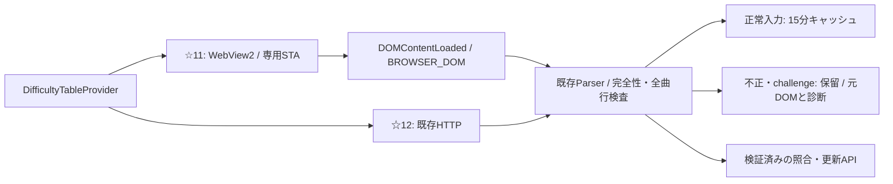

# Phase 5-3追補: WebView2によるWiki取得

2026-09-22、[Issue #21 第3項](https://github.com/xidinor/IIDXProgressDashboard/issues/21)の残項目を実装・実証した。ユーザー指定どおり、取得アダプターを追加して既存Parserへ渡す範囲とした。解析・照合・DB更新の再実装や通常UIの変更は行っていない。

## 構成と使い方



- [WebView2DifficultyFetcher](../Difficulty/WebView2DifficultyFetcher.cs): 固定Wiki URLだけを許可し、専用STAとmessage pump内で非表示WebView2を作成・操作・破棄する。通常UIスレッドは塞がない。
- [DifficultyTableProvider](../Difficulty/DifficultyTableProvider.cs): 任意のブラウザー取得delegateを注入する。☆11だけに適用し、☆12のHTTP共有取得は維持する。成功入力の15分キャッシュと最低2秒間隔も既存処理を利用する。
- [任意実サイト検証](../tests/Phase5BrowserValidation/Program.cs): 製品APIから両Wikiを取得・解析し、原DOMと個人パスを含まない集計証跡を保存する。solution/CI外。DBには接続しない。

```csharp
using var client = new HttpClient();
// 呼出側がアプリ専用の書込可能なprofileディレクトリを指定する。
// 日常利用のEdge profileや、入力原本ディレクトリを指定しない。
var browser = new WebView2DifficultyFetcher(browserProfileDirectory);
var provider = new DifficultyTableProvider(client, browser.FetchAsync);
var tables = await provider.FetchAllAsync(cancellationToken);
```

同じProviderを再利用する。従来の1引数コンストラクターはHTTP経路を維持する。Phase 6では上記の構成とprofile保存場所をUIの起動側へ接続する。

初期化からDOM採取まで45秒上限。呼出側キャンセルはOperationCanceledException、Runtime不在・初期化失敗・タイムアウトはFETCH_FAILED。SDK例外の個人パスは診断へ転記しない。同一Fetcher内の取得は直列化する。別Fetcher間のprofile共用は想定せず、アプリ側で1インスタンスを共有する。

広告等の副資源も待つNavigationCompletedでは初回HARDがタイムアウトしたため、DOMContentLoadedで採取する。HTTP状態は対象URLへの応答から取得し、不明なら失敗にする。200だけでは成功にせず、既存Parserの題名・16節・件数・全行検証を通す。403/429やchallengeは元DOMが取得できれば保持して不正とし、再試行・手動challenge操作・他出典や保存HTMLへの自動切替はしない。Cookie等は専用profileに保存され得るが、監査データへ抽出しない。

採取DOMはBROWSER_DOMとして、本文・UTF-8バイト数・SHA-256・開始終了日時・要求/最終URL・HTTP状態を保持する。HTTP原本ではない。Content-Type/ETag/Last-Modified/revisionは取得していないためnull。固定JavaScriptでDOMを読むだけで、取得内容をevalしない。WebView2自体ではページのJavaScriptが動作する。DOMは転送前と.NET側で8 MiBを検査するが、ブラウザーが読む副資源全体の通信量を8 MiBへ制限するものではない。

## 実サイト結果

2026-09-22 12:12 UTC、新規の専用profile、WebView2 Runtime `153.0.4234.48`で確認した。

|表|HTTP|入力バイト数|曲行|取得 / 解析|診断|
|---|---:|---:|---:|---|---:|
|☆11 NORMAL|200|723,774|608|COMPLETE / VALID|0|
|☆11 HARD|200|718,411|608|COMPLETE / VALID|0|

日時・URL・ハッシュは[機械可読証跡](phase5-3-webview2-evidence.json)。件数だけを成功条件にしていない。初回のNavigationCompleted待機ではNORMALのみ成功、HARDは45秒でFAILEDになった。上表は待機条件修正後に両表を通した結果である。サイトやRuntime更新後の常時取得成功を保証するものではない。

DOMには広告等の変動部分が含まれるため、同じ曲表でも全体ハッシュは変わり得る。元本文を加工せず保存する既存契約を維持し、曲表単位のハッシュへの変更は今回行わない。

再実行は新しい出力先を指定する。

```powershell
dotnet run --project tests/Phase5BrowserValidation/Phase5BrowserValidation.csproj -- artifacts/phase5-webview2-new
```

既存出力先を拒否し、生成した原DOM・profileはGit対象外のartifacts内に保持する。今回、実4表のDB検証を繰り返してはいない。後段は[Phase 5-6の検証](phase5-6-integration-validation.md)を根拠とし、今回確認した本番DOM取得・Parser成功と区別する。DB・DDL・個人履歴への変更はない。

## 依存・配布・合成検証

[Microsoft.Web.WebView2 1.0.3856.49](https://www.nuget.org/packages/Microsoft.Web.WebView2/1.0.3856.49)を固定。Microsoftの公式SDKで、WinForms/.NET 8と既存アプリ構成に適合する。AngleSharpは取得後の解析、AcornimaはTextage構文解析なので役割は重複しない。Playwright等の別ブラウザー管理基盤やPython依存は追加しない。SDKのBSD形式[LICENSE](../ThirdParty/WebView2/LICENSE.txt)・[NOTICE](../ThirdParty/WebView2/NOTICE.txt)をbuild/publishへ同梱した。

[公式のthreading model](https://learn.microsoft.com/en-us/microsoft-edge/webview2/concepts/threading-model)に従う。SDKとは別に[Evergreen Runtimeが必要](https://learn.microsoft.com/en-us/microsoft-edge/webview2/concepts/distribution)で、.NET self-containedだけではRuntimeを内包しない。今回Runtimeの新規インストールは行わず、既存環境で検証した。Runtime未導入環境への配布・導入案内は配布フェーズに残る。

SDKが自動追加する未使用WPF参照は[Directory.Build.targets](../Directory.Build.targets)でWinForms/検証プロジェクトから除外し、WindowsBase競合の追加警告を解消した。既存のNU1701・Nullable等の警告は残る。

追加SDKの実測はCore.dll 649,800バイト、WinForms.dll 39,496バイト、x64 WebView2Loader.dll 161,864バイト。publishした製品exeは165,678,715バイト（アプリ全体のサイズでありSDK単体の増加量ではない）。Runtime本体はこのサイズに含まない。

- `dotnet build IIDXProgressDashboard.sln --verbosity quiet`: 成功、エラー0。復元込み増分buildは既存NU1701警告12。
- `dotnet test tests/IIDXProgressDashboard.Tests/IIDXProgressDashboard.Tests.csproj --no-build --no-restore --verbosity quiet`: **444件成功、失敗・スキップ0**。追加5ケースはブラウザー/HTTP振分け、キャッシュ、200 challenge・403・429、失敗とキャンセルの非fallbackを合成入力で検証。CIではWebView2やネットワークを起動しない。
- `dotnet publish IIDXProgressDashboard.csproj -c Release -r win-x64 --self-contained true -p:PublishSingleFile=true -o artifacts/phase5-webview2-publish --verbosity quiet`: 成功。ライセンスとWebView2Loaderの同梱を確認。native DLLは別配置で、exe単体配布の達成ではない。クリーン環境での全UI起動検証は未実施。

初回のパッケージ追加・検証プロジェクトbuildはsandboxのNuGet設定読取制限で失敗したため、許可された制限外実行で復元・buildした。実サイト試験も許可された制限外実行で行った。

これによりPhase 5-3に残っていた本番ブラウザー取得の実装・実証を完了した。通常UI接続・profile設定はPhase 6、マスター対象範囲や未解決の裁定は既存の別課題として残る。v1全体の完了ではない。
