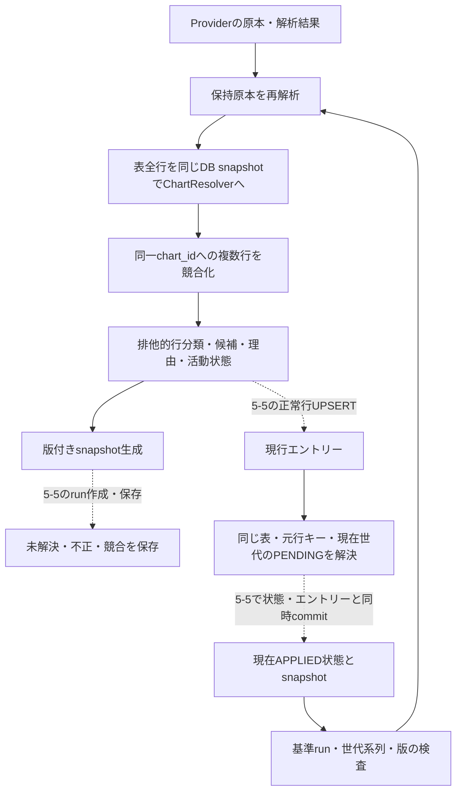

# Phase 5-4: 難易度表の譜面照合・未解決監査・現在世代の再照合

2026-09-22、[Issue #21 第4項](https://github.com/xidinor/IIDXProgressDashboard/issues/21)の実装。
[5-3 Provider](phase5-3-difficulty-provider-explained.md)と[5-2更新契約](phase5-2-difficulty-update-contract.md)の間に、共通Resolverへの接続と監査部品を追加した。
公開APIで照合結果を取得できる。監査保存・再処理・PENDING解決は同一SQLiteトランザクションで利用する内部APIであり、5-5の更新サービスへの接続は残る。
第4項の「表へ登録できる」という最終完了条件は5-5のUPSERTと連動して確認する。今回だけで第4項全体・Phase 5全体を完了とはしない。

## 構成



|ファイル|役割|
|---|---|
|[DifficultyMatchingService.cs](../Difficulty/DifficultyMatchingService.cs)|公開の同期・非同期照合、表全体の分類と競合検査|
|[DifficultyMatchingAudit.cs](../Difficulty/DifficultyMatchingAudit.cs)|snapshot生成、トランザクション内の監査保存、現在世代読出し・再照合、PENDING解決|
|[ChartResolver.cs](../Matching/ChartResolver.cs)|既存の共通曲名・alias・譜面条件照合。今回変更なし|
|[DifficultyMatchingTests.cs](../tests/IIDXProgressDashboard.Tests/Difficulty/DifficultyMatchingTests.cs)|合成Provider入力と一時v1 DBによる27ケース|

## 照合APIと判断

```csharp
// 初期化・検証済みの出力用新DBを呼出側から渡す。
var service = new DifficultyMatchingService(database);
DifficultyMatchingResult result = await service.ResolveAsync(parsedTable, cancellationToken);
foreach (var row in result.Rows)
    Console.WriteLine($"{row.Source.Ordinal}: {row.Status} / {row.ChartId}");
```

`CanPrepareUpdate`は構造上完全・有効で競合がなく、更新計画の準備に進める意味。消失確認・所有状態・同時更新検査・DB反映の成功を意味しない。全行未解決でもtrueになり得る。5-5では未解決件数を確認しPARTIALとして扱う。

公開recordの候補を書き換えて検証を回避できないよう、Source本文から再解析する。取得失敗のSourceなし結果は曲行を持てず、有効結果にもできない。単独照合はDB初期化をせず、既存スキーマを検証して、全行を同じ読取トランザクションで照合する。Asyncはワーカースレッドを使う。キャンセルは開始・Parser・行境界で確認し、同期SQLite呼出しの途中に厳密な割込み期限は保証しない。

Resolverに渡す値は、Parserが装飾・譜面接尾辞を分離したTitle、SP、H/A/L、取得tag、表level、取得notes、表のSourceName。NORMAL/HARDゲージは渡さない。曲名のNFKC等と出典限定alias・manual aliasは既存共通規則を使う。

非アクティブ曲・譜面も照合するのは5-2の承認済み方針による。成功した候補にもSongIsActive/ChartIsActiveを残す。活動状態、level、notesを使って曖昧候補を間引かない。notes未知は許可し、既知の矛盾はNOTES_MISMATCHとして残す。表にない譜面を生成せず、fuzzy match・自動aliasも追加しない。

行分類はConflict → Invalid → Unresolved → Resolved、未走査相当はNotProcessed。入力不完全なら有効そうな行も照合を進めない。ソース重複と、正規化・alias経由の同一chart競合は別の理由を持ち、全関係行をConflictにする。重複2行と第三の別名行が同じchartに至る場合も3行とも競合となる。Conflict行の`ChartId`はnullとし、診断用のResolution内候補と登録用IDを区別する。

## 保存する情報

`CreateSnapshot`のJSONを`import_runs.options_json.snapshot`へ保存する。版1にはParserVersion、ContractVersion、NormalizerVersion、取得証跡と本文全体、解析済み全行、正常行を含む照合結果を持つ。

`SaveDiagnostics`は対象runのsource_type=DIFFICULTY_TABLE、source_name=table_code、保存済みsnapshotとの内容一致を確認してから書く。不正・未解決・競合は元行ごとに1件、ページ診断は別entityに保存する。元行キーはParserの`dt:v1:`をそのまま使い、プレイ履歴のキーへ流用しない。

行raw_data版1にはtableCode、acceptedGenerationId（未受理試行はnull）、入力hash、契約/Parser版、取得証跡、完全な元行、照合条件・候補・タイトル照合根拠を保存する。reason_detailには主理由だけでなく全理由を保存する。原本本文はrun snapshotに保持し、各曲行には複製しない。NotProcessed行もsnapshotから調査可能である。ページ診断には取得本文も保持する。

件数は`Rows.Count`と`Count(DifficultyRowStatus)`から排他的に算出できる。実行status・records_imported等の確定、元入力消失差分・予定件数と確定件数の分離は5-5担当。監査部品だけで成功runを作成するAPIは設けていない。

## 再照合とPENDING

`ReprocessCurrent`はDBにある現在の受理snapshot全体を再解析・再照合する。呼出側が古いPENDINGの元行だけを渡すAPIは設けない。

受理済みrunはSUCCESS/PARTIAL、applyStatus=APPLIED、stateCommitted=true。HELD/FAILED/RUNNINGは受理基準を進めない。壊れたJSON・不整合状態・未知版は例外として拒否する。
`difficultyState`版1の本部品が読むフィールドは次のとおり。所有chart集合・欠落集合等の完全な状態生成・検査は5-5で追加する。

|フィールド|検査|
|---|---|
|version / tableCode|版1・対象表一致|
|acceptedGenerationId|初回受理run由来。新世代はそのrun IDと一致|
|parentGenerationId|新世代では直前世代、同世代再試行では親も維持|
|inputSha256|snapshotの原本hash一致。同世代のInputKind/hash変更も拒否|

連続同一入力は同世代を維持し、A→B→Aでは新世代を要求する。expectedRunIdとexpectedGenerationIdの両方を検証するため、同じ入力の別再照合が先に確定した場合も古い計画を拒否する。

`ResolvePendingAfterApply`は現在APPLIED状態から再照合し、競合・不正なら拒否する。対象table_codeとchart_idに対し、rank・source_title・source_difficultyの一致するエントリーがある行だけを解決する。さらにPENDINGのtableCode・元行キー・acceptedGenerationIdを限定する。古いA世代や未受理試行のPENDINGは、A再登場時にも自動RESOLVED/IGNOREDにしない。

この内部部品はcommitしない。5-5の呼出側が書込トランザクション内で最新前提を検証し、エントリー・受理状態・監査行・PENDINGを一括確定する必要がある。テストでは表エントリーと受理状態を合成して連動を検証した。これは未実装のUPSERTサービスを通した実運用検証とは異なる。

## 関連課題・検証・残課題

[Issue #13](https://github.com/xidinor/IIDXProgressDashboard/issues/13)と[Issue #16](https://github.com/xidinor/IIDXProgressDashboard/issues/16)を確認した。譜面修正と誤照合を区別する根拠・訂正手順は引き続き別設計であり、今回level/notes不一致の解除は行っていない。実マスターのカタログ範囲確認や履歴側の未解決を、難易度表の照合成功で解消したとは扱わない。

- `dotnet build IIDXProgressDashboard.sln --no-restore`成功。既存NU1701・Nullable等の警告21、エラー0。
- `dotnet test tests/IIDXProgressDashboard.Tests/IIDXProgressDashboard.Tests.csproj --no-restore --verbosity quiet`成功。全396件（追加27件）、失敗・スキップ0。
- sandboxではSDK参照先へのアクセスが拒否されたため、許可された制限外実行でビルド・テストを確認した。
- 4表・H/A/L、source限定alias、同名/正規化/alias衝突、tag/譜面不在、tag/title・level/notes矛盾、notes未知、非アクティブ、原本保全、競合全行保存、現在世代再照合、A→B→A、古いrun、破損/未知版、未反映PENDING、rollback、キャンセルを合成検証した。
- snapshotの一致検査ではJSONのescape表現差で失敗する問題を検出し、JSON構造の等価比較へ修正して全件再検証した。
- 依存追加・DDL変更なし。個人DB・原本・通常UI・履歴・aliasは変更していない。実4表と実マスターの全件照合・再適用は未実施。

次の5-5でバックアップ、RUNNING/終了ログ、表・ランク・エントリーUPSERT、消失差分の確認、完全な所有状態、同時更新の検出、失敗ログ保存を接続する。5-6で実4表を独立DBへ反映して検証する。単独照合結果や今回の内部部品を、これらの保全を省略した通常DB書込みに使わない。
