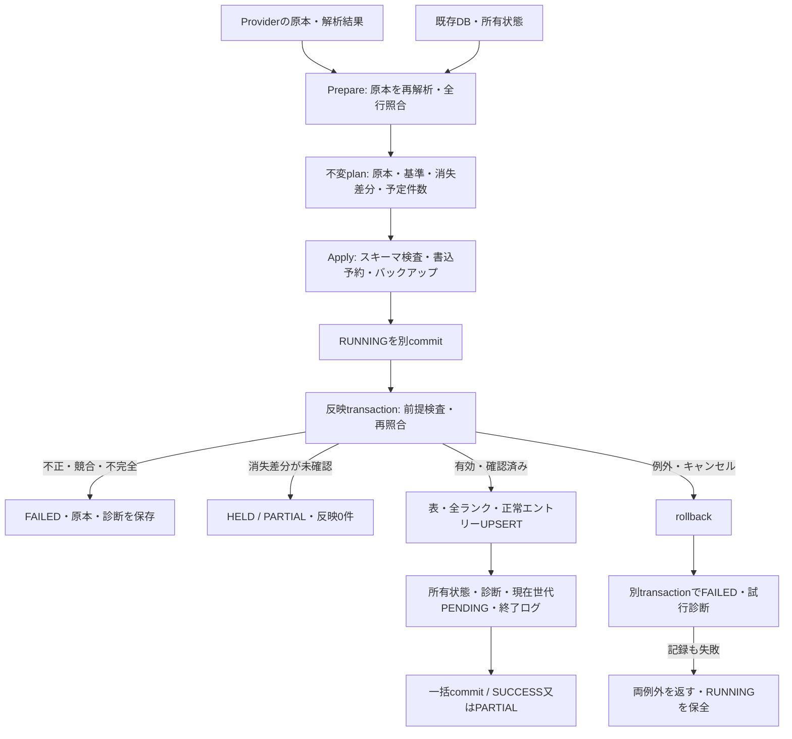

# Phase 5-5: 難易度表の安全なDB反映

2026-09-22。[Issue #21 第5項](https://github.com/xidinor/IIDXProgressDashboard/issues/21)の実装。
[5-2更新契約](phase5-2-difficulty-update-contract.md)に基づき、[5-3 Provider](phase5-3-difficulty-provider-explained.md)と[5-4照合・監査](phase5-4-difficulty-matching-explained.md)を、表単位の更新APIへ接続した。
対象は呼出側が指定する初期化済みv1出力DB。通常UI接続・個人DBの移行・実4表による統合検証・Wiki本番ブラウザー取得は今回の完了範囲に含めない。

## 構成と境界



|ファイル|役割|
|---|---|
|[DifficultyUpdateService.cs](../Difficulty/DifficultyUpdateService.cs)|Prepare/Apply/現在世代再処理、バックアップ、run管理、transaction境界|
|[DifficultyUpdateModels.cs](../Difficulty/DifficultyUpdateModels.cs)|不変plan、消失行、予定・確定件数、版付き所有状態|
|[DifficultyUpdateStorage.cs](../Difficulty/DifficultyUpdateStorage.cs)|スキーマ・所有状態検査、DB前提の指紋、パラメーター化UPSERT|
|[DifficultyMatchingAudit.cs](../Difficulty/DifficultyMatchingAudit.cs)|原本snapshot、未解決保存、現在世代検査、PENDING解決。5-4実装を再利用|
|[DatabaseBackup.cs](../Database/DatabaseBackup.cs)|WALを含む確定済みDBの独立バックアップ。既存のファイル名接頭辞masterを維持|
|[DifficultyUpdateTests.cs](../tests/IIDXProgressDashboard.Tests/Difficulty/DifficultyUpdateTests.cs)|公開APIから合成DBを更新し、保全・再適用・障害経路を検証|

公開APIはワーカースレッドでDB・解析処理を行う。取得はProviderの責務であり、更新サービスはネットワークへ接続しない。未知DB・空DBを暗黙初期化せず、`DatabaseInitializer.OpenConnection`と`MigrationRunner`で検査する。初期化・出力DBの選択は呼出側で行う。入力原本や`data/`を出力先へ指定しない。

## 計画と消失確認

```csharp
// dbは入力原本とは別パスの初期化済みv1 DB。parsedはProviderの結果。
var updates = new DifficultyUpdateService(db, backupDirectory);
var plan = await updates.PrepareAsync(parsed, cancellationToken: token);

// plan.Rowsで照合理由、plan.MissingRowsで消失行と最後の既知chart_idを提示できる。
// 消失があると、確認を渡さないApplyはHELD/PARTIALとなり表は変わらない。
var result = await updates.ApplyAsync(plan, cancellationToken: token);

// MissingRowsの具体的差分を確認した場合に限る。
// 永続的なtrueフラグではなく、提示したplan自身のIDを渡す。
if (result.ApplyStatus == "HELD" && userConfirmedThisPlan)
    result = await updates.ApplyAsync(plan, confirmedPlanId: plan.PlanId, cancellationToken: token);
```

planは内部コンストラクターで作成し、原本・照合結果・基準run・DBの指紋・消失一覧を固定する。`Input`は独立コピー、`Rows`と`MissingRows`は変更不能なリスト。`CanApply`は構造・照合上反映可能という意味で、消失確認とDB前提の再検査は別途必要。

消失比較は前回受理した元入力の全SourceKeyに対して行う。未解決だった行も含む。不完全・不正入力からは消失を判定しない。ランク移動はSourceKeyを変えず通常更新、曲名等の識別変更は消失・追加として確認する。HELDは受理基準を進めないので、他の前提が変わらなければ同じplanを確認して再適用できる。

確認後も欠落エントリーを削除しない。`missingSourceKeys`は過去に確認した消失も再登場まで保持する。`retainedChartIds`は所有エントリーのうち今回正常行で確認できなかった集合で、未解決化した旧行も含む。消失や保持が残れば、続けて同じ入力を適用してもPARTIAL。再登場・再解決した行は同じキーで再確認され、保持集合から外れる。

## 更新と件数

安定キーは表のtable_code、ランクの(table_id, rank_code)、エントリーの(table_id, chart_id)。表ID・chart_id・ランク参照を維持するUPSERTを使用する。全ランク辞書を保持し、参照0のランクも削除しない。NORMAL/HARD、他表、別出典は独立する。songs/charts/play_history/song_aliasesへの更新SQLはない。

エントリーのrank_code/source_title/source_difficultyが同じなら、updated_at/import_run_idを書き換えずunchanged。同じ入力を再適用しても行が増えず、最後に評価を変更したrunを保持する。表メタデータ・ランクの同値更新も抑制する。新しい受理runには再確認の事実を保存する。

|結果|status / applyStatus|DBへの確定件数|
|---|---|---|
|完全・有効で全行照合、欠落保持なし|SUCCESS / APPLIED|added / updated / unchanged|
|正常行と未解決行の混在、又は消失・保持あり|PARTIAL / APPLIED|正常行の分だけ。全行未解決も受理可能|
|消失差分未確認|PARTIAL / HELD|すべて0。元入力と診断だけ保存|
|取得失敗・不完全・不正・競合|FAILED / FAILED|すべて0。元入力と診断だけ保存|
|SQL・前提不一致・キャンセル|FAILED / FAILED、例外を返す|rollback後はすべて0|

`records_imported=added+updated`。`records_unresolved=unresolved+invalid+conflict`で、ページ障害は含めない。`counts`に排他的行分類・消失・保持・表/ランク変更件数、`plannedCounts`に反映前の見込みを分けて保存する。失敗後の予定件数を確定件数へ転記しない。`IProgress<int>`は試行中の処理行数でありcommitの証拠ではない。

## 所有状態と同時更新

`options_json`の外側はversion=1、受理状態は`difficultyState.version=1`。stateCommitted=true、applyStatus=APPLIED、SUCCESS/PARTIALのrunだけが基準になる。

所有状態は受理世代/親世代、入力hash/InputKind、ランク辞書版、現入力のSourceKey集合、元キー→最後に反映したchart_idの対応、所有chart集合、消失・保持集合、表全体のDB指紋を持つ。全受理runのsnapshotと集合遷移を検査し、未知版・壊れたJSON・世代不整合・未所有の既存表・所有外エントリーを拒否する。手動変更を現在の正しい状態として勝手に引き継がない。

planの指紋にはsongs/charts/alias全体、当該表・ランク・エントリー、受理runを含む。aliasは安全側に全出典を対象とし、無関係なaliasの変更でも再準備になる。他表の更新と、自分のHELD/FAILED記録は前提変更に含めない。Applyの書込transaction内で基準runと指紋を照合し、同じsnapshot内で再照合する。原本が同じでも別のAPPLIED runが先に確定すれば古いplanは拒否する。

同じ表にRUNNINGが残っていればPrepare/Applyを拒否する。並行実行のRUNNINGも同様に扱うため、呼出側は同じ表の更新を直列化する。同時に準備した2案を適用する合成検証では、一方だけが確定し、もう一方はFAILEDになった。

## 現在世代の再照合

```csharp
var retry = await updates.PrepareCurrentAsync(
    tableKind, expectedRunId, expectedGenerationId, cancellationToken: token);
var replayed = await updates.ApplyAsync(retry, cancellationToken: token);
```

現在APPLIEDのsnapshot全体から計画を作り、通常更新と同じ競合・所有・前提検査を通す。expectedRunIdは最新受理run、expectedGenerationIdはそのdifficultyState.acceptedGenerationId。連続同一原本は世代を維持するが、A→B→Aは新しい世代。

UPSERT、診断保存、所有状態、終了ログ、現在世代のPENDING解決は同じtransactionに属する。対象表・元行キー・現在世代が一致し、実際に反映したエントリーに対応するPENDINGだけをRESOLVEDへ変更する。HELD/FAILEDの未受理試行や旧世代のPENDINGを一括解決しない。

## 障害と復旧

Applyは、スキーマ検査→書込予約中のバックアップ→RUNNINGのcommit→反映transaction、の順。非空DBの変更前に必ずバックアップする。バックアップ失敗ではRUNNINGも書かず例外を返す。準備は読取専用で、準備段階のキャンセル・不正な所有状態・未知DBへのDBログ書込みは行わない。Providerが返す取得・解析失敗結果はplanにでき、Applyで監査runと診断を記録できる。

反映中の例外は全表変更・診断・PENDING・所有状態・終了ログをrollbackし、別transactionでFAILEDと計画時の原本・診断を保存する。例外のDataには`DifficultyImportRunId`と`DifficultyBackupPath`がある。失敗ログも保存できなければAggregateExceptionに両例外を残す（runとbackupは元例外のData）。成功結果は返さない。

復旧手順は[既存バックアップ解説](phase2-3-safe-master-update-explained.md#バックアップ復旧)も参照する。

1. 同じDBを更新しているプロセス・タスクがないことを確認する。RUNNINGを見ただけで強制終了や成功化をしない。
2. 対象runのsnapshot・時刻・例外・バックアップを確認する。RUNNINGの反映数やoptions_jsonを完了結果と解釈しない。
3. 現在DBを保全し、バックアップを別の新規パスへコピーしてスキーマ・integrity_check・foreign_key_check・履歴を確認する。元DBへ直接上書きしない。
4. 現在DBを継続利用する場合、SQLiteのrollback完了、直前APPLIEDの所有状態と実表の一致を確認してから、終了していない当該runだけをFAILEDへ閉じる。stateCommitted=false/applyStatus=FAILED、反映数0、完了時刻と復旧理由を記録し、snapshotは残す。この判断を自動化する復旧API/UIは今回設けていない。不整合を無理に修正して接収しない。
5. 修復・復元後は原本から新しいplanを準備する。古い確認IDや古いplanは流用しない。

SQLiteの同期呼出しやバックアップの途中に厳密なキャンセル期限は保証しない。開始・照合行・書込み行・commit前のキャンセルは失敗扱いでrollbackする。原本とsnapshotはrunごとに保存するためDB容量は増える。監査runの自動削除は行わない。

## 検証と残課題

- ビルド: `dotnet build IIDXProgressDashboard.sln --no-restore --verbosity quiet`成功、エラー0。初回の全体コンパイルは既存警告21、最終の増分ビルドはNU1701警告6。既存Nullable等を解消したという意味ではない。
- テスト: build付きの全体検証後、最終ビルドに対して`dotnet test tests/IIDXProgressDashboard.Tests/IIDXProgressDashboard.Tests.csproj --no-build --no-restore --verbosity quiet`を実行。全433件成功（追加37件）、失敗・スキップ0。
- sandboxではSDK参照先へのアクセスが拒否されたため、許可された制限外実行でbuild/testを検証した。最初の検証で監査モデルのJSON復元不可を検出し、計画内に変更不能な照合結果を保持する方式へ修正した。障害テストのSQLite NULL期待値と新規Analyzer警告も修正し、全件を再検証した。
- 合成原本と一時v1 DBを使用。4表の再適用、H/A/L、NORMAL/HARD別評価、ランク移動・辞書保持、消失確認・保持・再登場、全行未解決・現在世代再照合・A→B→A、未解決化した既存行、空/破損/不正/競合/取得失敗、古いplan、所有破損、残存RUNNING、SQL途中失敗・終了ログ失敗・キャンセル・失敗記録失敗、バックアップ失敗・WAL復元、並行更新、他表・履歴・alias・活動状態・外部キー保全を検証する。
- SQLite障害は内部テスト境界でTEMP TRIGGERを注入し、実SQLのABORTとrollbackを確認する。製品の公開APIに注入機能はない。テスト結果ファイルはGit除外対象。
- DDL・依存追加・既存通常UI・個人DB・実入力の変更なし。実4表と実マスターを接続する5-6の検証は未実施。
- 5-4の保存・再照合部品を本サービスから実際のUPSERTへ接続した。Issueの全体完了、5-3のWiki本番ブラウザー取得、5-6実入力検証、5-7全体解説、Phase 6 UI接続は別途残る。
