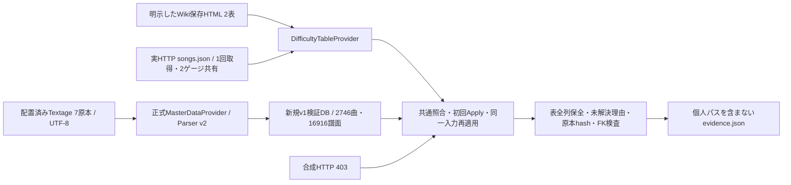

# Phase 5-6: 合成統合検証と実4表の独立DB検証

2026-09-22。[Issue #21](https://github.com/xidinor/IIDXProgressDashboard/issues/21)第6項の残る3項目を検証した。全体構成・API・完了境界は[Phase 5解説](phase5-difficulty-tables-explained.md)。機械可読の取得証跡・理由別件数は[phase5-6-evidence.json](phase5-6-evidence.json)。

## 合成検証

[DifficultyUpdateTests](../tests/IIDXProgressDashboard.Tests/Difficulty/DifficultyUpdateTests.cs)に3ケースを追加した。個人入力とネットワークは使用しない。

- 合成HttpMessageHandler → `FetchAllAsync` → 共通照合 → 表単位Apply → 同一入力再適用を4表で実行。NORMAL/HARD別評価、H/A/L、履歴なしエントリー6件、74ランクの保持、全表のランク順とSPECIAL/UNDECIDED/UNRATEDを確認する。
- 初回登録後のDPリンク混入はFAILED、マスターlevel矛盾は未解決のPARTIALとし、いずれも前回評価を維持する。元データ・診断保存、追加/更新0を確認する。
- songs/charts/alias/play_historyの全列不変、表・ランク・エントリーの再適用前後の全列一致、外部キー違反0を確認する。

既存のParser・照合・更新・障害検証は書き直さず維持した。今回のテスト数は開始時436件から439件へ増加した（5-5記録時の433件に、後続Phase 4で3件追加済み）。

|コマンド|結果|
|---|---|
|`dotnet build IIDXProgressDashboard.sln --no-restore --verbosity quiet`|成功、エラー0。初回全体コンパイルは既存警告21、最終増分はNU1701警告6|
|`dotnet test tests/IIDXProgressDashboard.Tests/IIDXProgressDashboard.Tests.csproj --no-build --no-restore --verbosity quiet`|最終buildに対して439件成功、失敗・スキップ0|
|`git diff --check`|成功|

既存NU1701・Nullable等の警告を解消した意味ではない。新規検証プログラムの復元はsandboxのNuGet設定読取制限で失敗したため、許可された制限外実行でbuild/runを行った。新しいパッケージ依存は追加していない。

## 実入力の検証経路



[任意検証プログラム](../tests/Phase5Validation/Program.cs)はsolution/CIに含めない。元DBは一切読まず、配置済みTextage 7ファイルをUTF-8・CS比較ありで正式Providerへ渡した。ParserVersion=2、2,746曲・16,916譜面を新しいv1 DBへ正式MasterUpdateServiceで反映した。

これは[Issue #13](https://github.com/xidinor/IIDXProgressDashboard/issues/13)で検証したローカルsnapshotと同じ7ハッシュである。実HTTPマスター取得・通常プレイ可能なカタログ対象範囲の確認は未完了。旧マスターで代替したものではないが、最新の全INFINITAS曲・譜面を保証する結果でもない。

Wikiは`ReadSavedHtmlAsync`で読み込んだ。URLは選択した表の契約URL、証跡のStartedAt/CompletedAtはローカル読込日時。Web採取日時・上流revisionは不明で、mtimeから補わない。5-3検証時と原本ハッシュは同じ。☆12は2026-09-22 11:42:42 UTCに製品の`FetchAsync`から実HTTPで取得し、NORMAL/HARDで同一原本を共有した。Last-Modifiedは2026-08-15 15:00:13 UTC、ETagとSHA-256を記録。今回のHTTP結果を特定commitと推測で結び付けず、SourceRevisionはnullのままにした。

## 実4表の結果

|表|入力行|初回追加|未解決|同一入力再適用: 追加/更新/変更なし|結果|
|---|---:|---:|---:|---|---|
|☆11 NORMAL|608|583|25|0 / 0 / 583|PARTIAL / APPLIED|
|☆11 HARD|608|583|25|0 / 0 / 583|PARTIAL / APPLIED|
|☆12 NORMAL|671|624|47|0 / 0 / 624|PARTIAL / APPLIED|
|☆12 HARD|671|624|47|0 / 0 / 624|PARTIAL / APPLIED|

全4表で取得・解析はCOMPLETE / VALID。不正行・競合行0。最終エントリーは2,414件、履歴0件。表間で同じ譜面を持つため、2,414件を一意譜面数とはしない。未プレイでもエントリーとして保持され、架空の履歴は作られなかった。

|未解決理由|☆11各表|☆12各表|扱い|
|---|---:|---:|---|
|TAG_TITLE_MISMATCH|24|0|tagと原曲名の整合性を確認できず保留|
|NOTES_MISMATCH|1|0|取得notesとマスターの矛盾を保留|
|AMBIGUOUS_SONG|0|27|複数曲候補を自動決定しない|
|SONG_NOT_FOUND|0|20|曲候補を推測で作らない|

件数は各論理表の元行単位。NORMAL/HARDで重複する未解決を別の72曲と解釈しない。元行・理由は検証DBの監査へ保存し、タグ書換え・notes検査解除・alias自動登録は行わなかった。詳細原因の裁定と手動修正は今回のチェック条件へ追加していない。

全表で次をassertした。

- 初回と再適用がAPPLIEDで、再適用の追加・更新0、変更なし件数が初回追加件数と一致。表・ランク・エントリーの全列も不変。
- 実表登録後に、合成HTTP 403を製品Providerへ返す。FAILED・反映0となり、既存4表の全列を保全する。実サイトから403を誘発した検証ではない。
- songs/charts/alias/play_historyは難易度更新前後の全列が一致。未終了RUNNINGなし。
- quick_check=ok、foreign_key_check違反0。入力9ファイル（Textage 7・Wiki 2）の実行前後ハッシュ不変。

実入力と合成障害を組み合わせた検証であり、実ネットワーク障害・Wiki自動ブラウザー取得・実データによる全障害パターンを実証した意味ではない。SQL失敗・キャンセル・バックアップ失敗等は既存の合成自動テストで確認する。

## 再実行方法と成果物の保全

リポジトリルートから、実入力を明示して実行する。最後の引数には存在しない新規出力ディレクトリを指定する。

```powershell
dotnet run --project tests/Phase5Validation/Phase5Validation.csproj -- `
  data/textage `
  data/atwiki/ATWIKI_BEMANI2SP11_SP11_NORMAL.html `
  data/atwiki/ATWIKI_BEMANI2SP11_SP11_HARD.html `
  artifacts/phase5-6-validation-new
```

引数不足・既存出力先・入力ディレクトリ内への出力を拒否する。既存検証DBを消して再実行せず、新しい名前を使う。出力にはvalidation.db、バックアップ、取得JSON、evidence.jsonが残る。DBと原本をコミットしない。`data/atwiki/`、`artifacts/`、DB類がGit除外されることを確認済み。公開する証跡はパス・曲行本文を含まない集計JSONのみ。

このプログラムの失敗時は例外終了し、途中DBを調査用に残す。例外本文にはローカルパスが含まれ得るため、そのままIssueへ転記しない。ライブJSONは将来更新されるので今回の件数を固定assertにはしない。今回の原本とDBはローカル出力に保持する。

## 判定と次工程

5-6の未チェック3項目は合成・実入力を区別した証跡により完了。5-7の解説3項目も全体文書に記載した。チェック済み項目の再実装や仕様変更、DDL・通常UI・個人DBの変更はない。

Issue #21の5-3追記「Wiki本番ブラウザー取得アダプター」は未完了。今回の保存HTMLによる検証でこのチェックを付けず、Issueはopenを維持する。Phase 5全体およびv1全体の完了は宣言しない。Phase 6の表示・更新UIと未解決調査は別工程。
