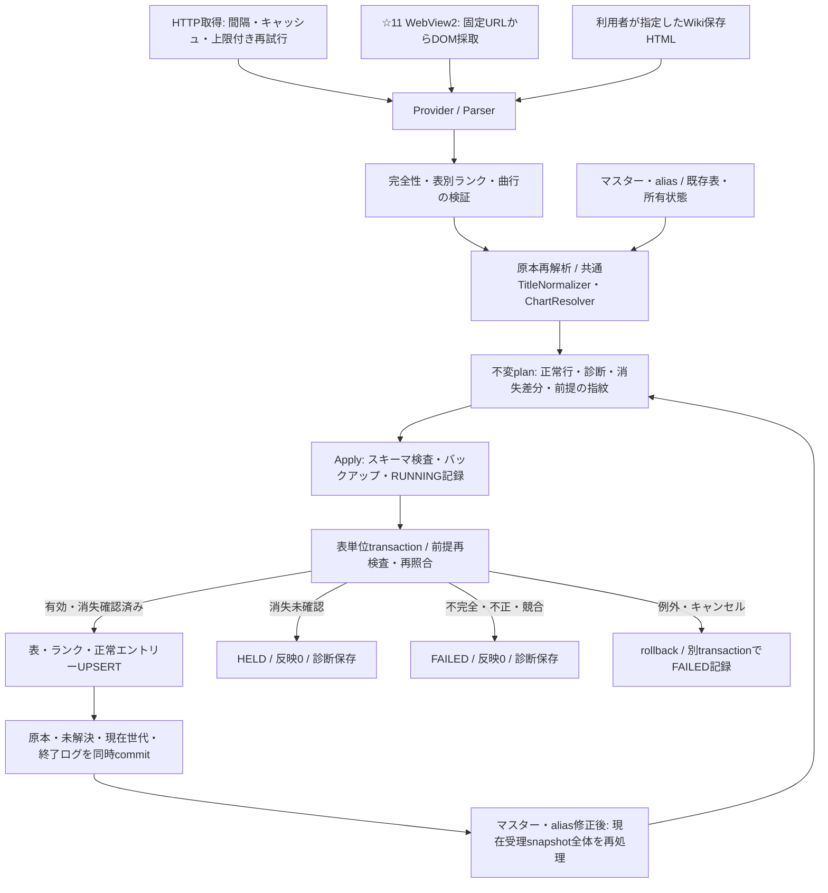

# Phase 5: 非公式難易度4表の取得・照合・安全な更新

実装・検証時点: 2026-09-22。対象は[Issue #21](https://github.com/xidinor/IIDXProgressDashboard/issues/21)のPhase 5、今回の追加作業は第6・7項の未チェック項目。
[仕様](../SPECS.md)第4.2・6・22・27・29章、[作業ルール](../AGENTS.md)に基づく。通常UI接続・個人履歴移行・v1全体の完了とは区別する。

## 全体構成



|主要ファイル|役割|
|---|---|
|[DifficultyModels](../Difficulty/DifficultyModels.cs)|4表定義、ランク辞書、出典・原本・解析結果|
|[DifficultyTableProvider](../Difficulty/DifficultyTableProvider.cs)|HTTP非同期取得、保存HTML読込、Parser呼出し。DB更新は行わない|
|[DifficultyTableParser](../Difficulty/DifficultyTableParser.cs)|AngleSharpによるWiki解析、☆12 JSON解析、完全性・行検証|
|[DifficultyMatchingService](../Difficulty/DifficultyMatchingService.cs)|原本再検証、共通照合、同一chart競合検出|
|[DifficultyMatchingAudit](../Difficulty/DifficultyMatchingAudit.cs)|元入力・未解決・世代の監査、現在世代のPENDING解決|
|[DifficultyUpdateService](../Difficulty/DifficultyUpdateService.cs)|Prepare/Apply/再処理、バックアップとtransaction境界|
|[DifficultyUpdateStorage](../Difficulty/DifficultyUpdateStorage.cs)|スキーマ・所有状態検査、指紋、安定キーUPSERT|
|[DifficultyUpdateModels](../Difficulty/DifficultyUpdateModels.cs)|不変plan、消失差分、予定・確定件数、所有状態|
|[合成統合テスト](../tests/IIDXProgressDashboard.Tests/Difficulty/DifficultyUpdateTests.cs)|公開APIから実SQLite更新・再適用・保全を検証|
|[実入力検証プログラム](../tests/Phase5Validation/Program.cs)|CIと分離した任意検証。新規DB、理由別件数、原本ハッシュ確認|

## 4表の入力と識別

|対象|直接取得元|table_code|原本|
|---|---|---|---|
|SP☆11 NORMAL|[Wiki page22](https://w.atwiki.jp/bemani2sp11/pages/22.html)|ATWIKI_BEMANI2SP11_SP11_NORMAL|HTML|
|SP☆11 HARD|[Wiki page21](https://w.atwiki.jp/bemani2sp11/pages/21.html)|ATWIKI_BEMANI2SP11_SP11_HARD|HTML|
|SP☆12 NORMAL|[iidx-sp12](https://iidx-sp12.github.io/songs.json)|IIDX_SP12_GITHUB_SP12_NORMAL|JSON normal/n_value|
|SP☆12 HARD|同上|IIDX_SP12_GITHUB_SP12_HARD|同じJSON hard/h_value|

Checker・ScoreViewerの変換済みJSONは比較用。自動的な出典切替や結合はしない。詳細は[5-1入力契約](phase5-1-difficulty-source-contract.md)、[5-2更新契約](phase5-2-difficulty-update-contract.md)。

Wikiは対象本文、既知16節、曲列・ヘッダー・節の曲数・TexTageリンクを検査する。ページ全体のtdやリンクを曲行として拾わない。譜面指定H/A/Lは曲名正規化前に抽出し、CR基準をNORMAL/HARD評価に使わない。☆12では必須プロパティ、譜面表記、評価文字列と数値の整合性を検査する。片ゲージの不正は当該表に限定する。空表・途中取得・未知構造・重複競合は正常更新しない。

表はtable_code、ランクは(table_id, rank_code)、エントリーは(table_id, chart_id)で識別する。ゲージNORMAL/HARDは譜面難易度N/Hとは別。NORMAL/HARDで同じchartに別のランクを保持する。

地力はJIRIKI、個人差はKOJINSA。☆11 HARDの超個人差はSPECIAL。Wikiの未定はUNDECIDED、☆12の空評価はUNRATED（表示: 評価未割当）。後二者のrank_kindはUNDECIDEDだがrank_codeを分ける。sort_order降順で地力→同段階の個人差、特殊枠・未定枠を含む表別の固定順を使う。☆11各16、☆12各21ランク。0件のランクも保存し、未知値を未定へ変換しない。

曲はtag、譜面はchart_id。原曲名・SP・H/A/L・取得できたtag/notes・表level・出典を共通Resolverへ渡す。同名・alias衝突・tag不在・level/notes矛盾を推測で解決しない。非アクティブでも安全に一意照合できれば登録するが、活動状態は変更しない。履歴のない譜面も登録でき、架空のplay_historyは生成しない。

## 反映・保全・監査

1表単位で反映する。完全かつ有効な入力なら正常行を反映し、照合未解決は元行・理由を保存する。不完全取得・不正・重複競合は表全体を保留する。前回受理入力から1行でも消失すれば具体的差分の確認待ち。確認後も欠落エントリーを削除せず、保持した旧評価と今回確認した評価を所有状態で区別する。

同値エントリーのupdated_at/import_run_idは維持する。songs/charts/play_history/aliasは変更しない。古いplan、所有外変更、壊れた所有状態、未知版、残存RUNNINGを拒否する。マスター・alias変更後は新しいplanを準備する。

|結果|status / applyStatus|確定件数|
|---|---|---|
|全行解決・欠落保持なし|SUCCESS / APPLIED|added / updated / unchanged|
|未解決又は欠落保持あり|PARTIAL / APPLIED|正常行分のみ|
|消失未確認|PARTIAL / HELD|反映0|
|取得・解析・競合・処理失敗|FAILED / FAILED|反映0|

監査はsource_type=DIFFICULTY_TABLE、source_name=table_code。`records_read`は曲行数、`records_imported=added+updated`、`records_unresolved=unresolved+invalid+conflict`。ページ障害は行数に加えない。予定件数はplannedCounts、commit済み件数はcountsに分離する。原本、SHA-256、要求/最終URL、取得方式・日時、Parser/契約版、診断を保存する。snapshot保存によりDB容量は増え、自動削除はしない。

未解決を再処理する場合は最新APPLIED runと受理世代を指定し、そのsnapshot全体を再照合する。反映した現在世代・同じ元行のPENDINGだけをRESOLVEDへ変更する。A→B→Aは別世代とし、古い未解決から新しい評価を逆戻りさせない。詳細は[5-4](phase5-4-difficulty-matching-explained.md)と[5-5](phase5-5-difficulty-update-explained.md)。

## API利用例

```csharp
// outputDbは入力原本と別の初期化済みv1 DB。呼出側で出力先を決定する。
using var client = new HttpClient();
var provider = new DifficultyTableProvider(client);
var updater = new DifficultyUpdateService(outputDb, backupDirectory);
var parsed = await provider.FetchAsync(DifficultyTableKind.Sp12Normal, token);
var plan = await updater.PrepareAsync(parsed, cancellationToken: token);
var result = await updater.ApplyAsync(plan, cancellationToken: token);

// HELDならMissingRowsを提示し、その差分への明示確認後だけ実行する。
if (result.ApplyStatus == "HELD" && userConfirmedThisPlan)
    result = await updater.ApplyAsync(plan, confirmedPlanId: plan.PlanId,
        cancellationToken: token);

// Wiki保存HTMLは明示的な入力経路。HTTP失敗時の自動fallbackではない。
var wiki = await provider.ReadSavedHtmlAsync(DifficultyTableKind.Sp11Normal,
    selectedHtmlPath, token);

// 現在受理run/世代は保存されたoptions_json.difficultyStateから取得する。
var retry = await updater.PrepareCurrentAsync(DifficultyTableKind.Sp12Normal,
    latestAcceptedRunId, acceptedGenerationId, cancellationToken: token);
```

公開APIは非同期。DB・解析処理はワーカーで行うが、UI接続と結果表示はPhase 6。SQLiteの同期処理・バックアップ中の厳密なキャンセル期限は保証しない。

## バックアップと復旧

非空DB更新前にスキーマ検査・書込予約下のバックアップを行い、その後RUNNINGを別commitする。反映transactionでは表・診断・所有状態・PENDING解決・終了ログを一括確定。例外時はrollbackし、別transactionでFAILEDを記録する。失敗ログも書けなければ両例外を返す。バックアップ失敗ならRUNNINGも作らない。

残存RUNNINGを成功化しない。実行中処理がないことを確認し、snapshot・例外・直前受理状態を調査する。現在DBを保全し、バックアップを別の新規パスへ復元して整合性・外部キー・参照を確認する。元DBへ直接上書きしない。継続利用時の当該runのFAILED化にはrollback・所有状態の整合確認が必要で、自動復旧APIは未実装。復旧後は新しいplanを作る。詳細手順は[5-5の障害と復旧](phase5-5-difficulty-update-explained.md#障害と復旧)。

## 検証結果と完了境界

合成検証・実4表の件数と取得証跡・再実行方法は[5-6検証報告](phase5-6-integration-validation.md)と[機械可読証跡](phase5-6-evidence.json)に分離して記録する。実表全体・個人DB・原本・絶対パスはGitへ収録しない。

5-6・5-7の対象は統合検証と全体解説。その後、同日追補の[WebView2取得検証](phase5-3-webview2-acquisition.md)でIssue #21の5-3追加項目を実装・実証した。Wiki NORMAL/HARD各608行を製品のWebView2経路から取得し、既存ParserでCOMPLETE / VALID、診断0を確認した。Phase 5の取得・解析・照合・安全な更新APIと検証が揃った。通常UI接続やv1全体の完了を意味しない。

[Issue #13](https://github.com/xidinor/IIDXProgressDashboard/issues/13)の現行HTTPマスター取得・通常プレイ可能範囲の確認、[Issue #16](https://github.com/xidinor/IIDXProgressDashboard/issues/16)の譜面修正と誤照合の区別も残る。今回の照合は配置済みTextage snapshotを正式Providerで解析した範囲に限定する。未解決の強制登録・alias自動追加は行わない。次工程はPhase 6のUI・保持評価の表示方針。DDL変更、通常DB置換、個人履歴移行、配布完了は今回の対象外。
