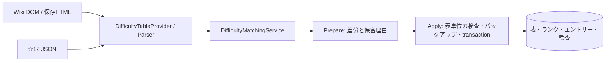

# Phase 5：非公式難易度表

対象：[Issue #21](https://github.com/xidinor/IIDXProgressDashboard/issues/21)、運用接続の[Issue #37](https://github.com/xidinor/IIDXProgressDashboard/issues/37)。整理時点：2026-09-30。取得、解析、照合、安全なDB更新APIは実装済みで、通常UI接続と配布検証は残る。

## 4表と処理

| 表 | 取得元 | 入力 |
| --- | --- | --- |
| SP☆11 NORMAL / HARD | Wikiの2ページ | WebView2または明示的な保存HTML |
| SP☆12 NORMAL / HARD | `iidx-sp12.github.io/songs.json` | JSONのnormal/hardを別表として使用 |

CheckerやScoreViewerの変換済みJSONは比較資料であり、自動的に出典を切り替えない。表は`table_code`、ランクは表内の`rank_code`、エントリーは`(table_id, chart_id)`で識別する。NORMAL/HARDはゲージ別の表で、譜面難易度のN/Hとは別の概念である。Wikiの未定はUNDECIDED、☆12の空評価はUNRATEDとして区別する。

[DifficultyTableProvider](../Difficulty/DifficultyTableProvider.cs)と[DifficultyTableParser](../Difficulty/DifficultyTableParser.cs)が取得・解析・完全性を担う。Wikiの実サイト取得には[WebView2DifficultyFetcher](../Difficulty/WebView2DifficultyFetcher.cs)を使い、HTML解析はAngleSharpを使う。取得障害、challenge、403/429、形式変更を正常な空表とみなさない。[DifficultyMatchingService](../Difficulty/DifficultyMatchingService.cs)は元行を共通Resolverで照合し、同名・譜面違い・level/Notes矛盾を推測で解消しない。

[DifficultyUpdateService](../Difficulty/DifficultyUpdateService.cs)はPrepareとApplyを分け、1表単位で反映する。完全取得で一意に解決した正常行は反映し、照合未解決は元行と理由を保存する。不完全取得・不正・重複競合なら表全体を保留。前回受理入力から1件でも消失すれば具体的な差分を確認するまでHELDとし、確認後も欠落エントリーは削除しない。旧評価と今回確認した評価を所有状態で区別する。再照合は現在受理したrun・世代の原本全体だけを対象にする。表更新によって曲・譜面の活動状態や履歴は変更しない。

## 検証と残課題

合成統合テストで表別原子性、再適用、消失確認、未解決、古いplanの拒否、バックアップ・ロールバックを確認した。実4表は原本と別の検証用DBで独立に検証し、入力・出力ハッシュと件数を[検証記録](phase5-6-integration-validation.md)および[JSON証跡](phase5-6-evidence.json)に残した。後続のWebView2取得ではWiki NORMAL/HARD各608行をCOMPLETE/VALID、診断0として解析した。これらは個人DBへの適用やクリーン環境での配布確認ではない。

[Issue #37](https://github.com/xidinor/IIDXProgressDashboard/issues/37)には更新と消失確認のUI、実表の未解決行の調査、取得障害・復旧の案内、WebView2 RuntimeとLoaderの配布検証が残る。[Issue #13](https://github.com/xidinor/IIDXProgressDashboard/issues/13)のマスター範囲と[Issue #16](https://github.com/xidinor/IIDXProgressDashboard/issues/16)の譜面修正判断にも依存する。

## 原記録

| 領域 | 記録 |
| --- | --- |
| 全体 | [統合解説](phase5-difficulty-tables-explained.md) |
| 入力と更新契約 | [取得元・構造](phase5-1-difficulty-source-contract.md)、[表・ランク・監査](phase5-2-difficulty-update-contract.md) |
| 実装 | [Provider](phase5-3-difficulty-provider-explained.md)、[WebView2](phase5-3-webview2-acquisition.md)、[照合](phase5-4-difficulty-matching-explained.md)、[DB反映](phase5-5-difficulty-update-explained.md) |
| 検証 | [合成・実4表](phase5-6-integration-validation.md)、[取得証跡](phase5-1-source-evidence.json)、[WebView2証跡](phase5-3-webview2-evidence.json)、[反映証跡](phase5-6-evidence.json) |

原記録の検証日時と対象版を保持し、後の取得結果で当時の実測値を書き換えない。
