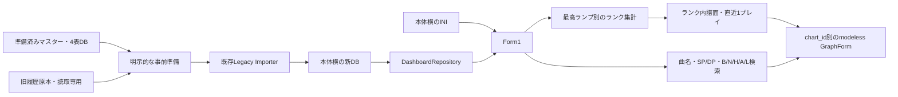

# Phase 6 ベータ版：旧履歴の表示

2026-09-23実装。[Issue #38](https://github.com/xidinor/IIDXProgressDashboard/issues/38)のベータ範囲を対象とする。Phase 6全体・配布版の完成ではない。

## 起動と配置

ローカル確認用の実行ファイルは `artifacts/beta-preview/IIDXProgressDashboard.exe`。Windows / .NET 8 Desktop Runtimeを使用する開発ビルドであり、self-contained / single-fileの配布確認は後続とする。生成された依存DLL・runtimesフォルダーもそのまま保持する。

INIとデータは実行ファイル横へ平置きする。作業ディレクトリ、レジストリ、AppDataに依存しない。

|ファイル|役割|
|---|---|
|IIDXProgressDashboard.exe|Form1で起動|
|IIDXProgressDashboard.ini|UTF-8の設定。直接編集|
|iidx-progress.db|新形式のマスター・4表・解決済み履歴・未解決記録|
|legacy-history.db|選択した旧履歴DBの入力コピー|
|master-日時-GUID.db|既存Importerが作成する更新前バックアップ。同じ階層に配置|
|beta-preparation-result.txt|事前準備の結果件数|
|beta-preparation-error.txt|失敗時の詳細。成功時には作成しない|
|beta-preparation.lock|準備コマンドの排他制御。ファイルの存在だけで実行中とは判定しない|

INIの例（GUIDは実際の準備時に発行・保存する）：

```ini
[Beta]
Database=iidx-progress.db
Legacy=legacy-history.db
SourceId=11111111-1111-1111-1111-111111111111
ExcludeMissingBp=False
```

DB指定は本体横のファイル名のみ。未知キー・重複キー・不正GUID・下位ディレクトリ・入力出力の同名指定は拒否する。`ExcludeMissingBp` は各グラフを開くときの初期値（既定OFF）。グラフ内の切替はそのウィンドウだけに適用し、INIへ自動保存しない。

## データの事前準備

通常起動は取込・ネットワーク取得を実行しない。Phase 1～5の既存APIで用意した**履歴0件の新形式マスター・難易度表DB**をseedにして、明示コマンドで準備する。旧形式のマスターDBをseedに指定しない。

この作業では既存のPhase 5-6検証DB（Textage保存入力・Wiki保存HTML・☆12配信JSONから作成）を利用した。最新のWebマスターを再取得したという意味ではない。seedの作成経路は[Phase 5-6検証](phase5-6-integration-validation.md)を参照。

新しい配置先へビルド後、リポジトリ直下で実行する例：

```powershell
dotnet build IIDXProgressDashboard.csproj -o artifacts/beta-preview
dotnet artifacts/beta-preview/IIDXProgressDashboard.dll --prepare-beta artifacts/phase5-6-validation/validation.db data/iidx-progress.db
```

このコマンドは**未準備の配置先で一度だけ**実行する。引数はseedと移行元の明示選択であり、別の旧DBへ自動フォールバックしない。旧統合DBを優先し、旧Python出力の `infinitas_log.db` は必要時に明示指定する。両方を連結しない。

1. 配置先を排他ロックし、既存INI・出力・入力コピーがあれば停止する。
2. seedにマスターがあり、履歴が0件であることを確認する。
3. 移行元GUIDを発行してINIへ保存・flushする。既存INIは上書きしない。
4. SQLite backup APIでseedと旧履歴を別名へコピーする（入力は読取専用）。
5. 出力コピーを既存MigrationRunnerで検証し、必要な既知Migrationだけ適用する。
6. Phase 3のImporterで旧履歴を取り込む。未解決は保存し、通常一覧へ含めない。

失敗した準備を自動的に初期化・やり直ししない。エラー、INI、DB、バックアップを残す。新しい配置先での準備し直しは別の表示用コピーであり、以前の表示用DBと結合しない。継続取込の運用画面は後続で、保存済みGUIDを維持してImporterへ渡す。競合を回避する目的でGUIDを変更しない。

通常起動はINIを読み、既存DBのmigration情報を確認する。DB不在・空DB・旧DBはエラーにし、空DBを自動生成しない。既知DBのMigrationには既存Runnerのバックアップ契約が適用される。バックアップからの復旧はアプリを閉じ、現在のDBを別名へ保全してから行う。INIのSourceIdとDBの取込記録の組を保持する。

## 画面と実装



- [BetaSettings](../Dashboard/BetaSettings.cs)：厳密なINI読込と初回作成。既存設定の自動修復・上書きはしない。
- [BetaPreparation](../Dashboard/BetaPreparation.cs)：読取専用の入力コピーと既存Importerの接続。新たな照合規則は追加しない。
- [DashboardRepository](../Dashboard/DashboardRepository.cs)：読取専用トランザクションで表示snapshotを取得。履歴は `played_at, play_id` 順。譜面ごとに1..Nを付与する。
- [表示モデル](../Dashboard/DashboardModels.cs)：直近行、最高値、欠損を除く最小BP、整数交差乗算によるDJ LEVEL、四捨五入した小数点以下2桁のレート。
- [Form1](../Form1.cs)：4表選択、ランク集計、譜面一覧、表外も含む検索、再読込。既存LampManager / DbHelperを通常表示から外した。旧実装ファイルの除去はPhase 7へ残す。
- [GraphForm](../GraphForm.cs)：上下のスコア/BPグラフと履歴一覧。同一譜面の再選択は既存窓を前面へ出す。別譜面は並行表示できる。

一覧のランプ・スコア・BPは同じ直近行。ランク集計は最高ランプを使用する。未プレイと履歴ありNO PLAYを分ける。未解決件数は履歴だけでなく難易度表等のPENDING監査行も含む。

BP NULLには点を作らず、前後の有効点を接続する。除外ONでは対応するスコア点も省く。番号は詰め直さず、X軸は常に全履歴1..Nを基準とし、上下の独立ズームは無効にした。ツールチップは実点の近傍だけを対象にする。

Score Rate / DJ LEVELは現行Notesのみを使用する。NULL・0は理由付き計算不能。当時Notesへフォールバックしない。現行Notesの理論値を超える保存スコアも生値は表示し、算出欄は範囲外として計算不能にする。履歴やResolverは変更しない。

日時はOSローカルゾーンを画面に明示し、旧履歴は分まで表示する。同時刻内は保存ID順であり、実プレイの先後を新たに推定しない。非アクティブ・保持した旧評価・今回の入力で確認された評価を一覧に表示する。

## 今回の最小検証と結果

ユーザー指定に従い、Phase 1～5の全テストを再実行せず、新しい接合点へ絞った。

- ソリューションのビルド成功。既存のNuGet互換性・旧コード由来警告あり。
- [BetaDisplayTests](../tests/IIDXProgressDashboard.Tests/BetaDisplayTests.cs)の3件成功：合成旧DB→準備→Importer→表示の接合、同時刻・直近/最高・NULL/0・未プレイ/NO PLAY・未解決除外・原本不変、DJ LEVEL境界、INIと既存出力の保全。
- 実旧統合DB：3,413件読込、3,176件登録、237件未解決、無効・競合・重複0件。PARTIALであり全件解決ではない。元DBとseedのSHA-256は準備前後で一致した。
- 実画面：Form1起動、☆11 NORMALのランク件数・直近値・分精度日時・表選択欄・検索欄を確認。
- クリック操作はComputer Useがユーザー入力検出で拒否したため中断。グラフ実描画・ツールチップ・複数窓・切替操作・高DPIの目視確認は未実施。全テスト、Reflux取込、Web再取得、self-contained publishは未実施。

## 次の確認

起動後、ランク行→下段の曲名をクリックして履歴・グラフを開く。検索で表外の譜面も選択できる。まず実機でグラフと表示を確認し、追加運用画面の詳細・順序を決める。取込・更新・未解決解消・設定・復旧の専用UIは今回実装していない。

## 履歴・グラフの追加改善（2026-09-26）

その後の局所的な追加は、[オプション列](phase6-history-options.md)、[整数の横軸目盛り](phase6-history-axis.md)、[多重記録の表示フィルタ](phase6-history-repeated-filter.md)に分けて記録した。この節より上の検証結果は2026-09-23時点の記録であり、追加改善の検証結果は各文書を参照する。
