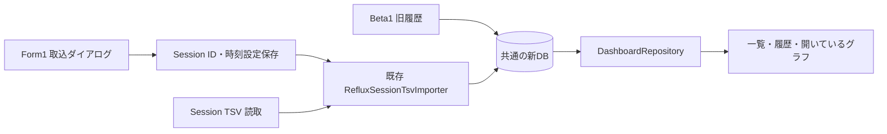

# Phase 6 Beta2：Reflux取込の接続

2026-09-23実装。Beta1の旧履歴入りDBへ、既存Phase 4 ImporterからReflux Session TSVを追加し、一覧・履歴・グラフに表示する最小範囲。Phase 6全体の完了ではない。

## 操作

1. `artifacts/beta-preview/IIDXProgressDashboard.exe`を起動し、「Reflux取込」を押す。Beta1のINI・DBをそのまま使う。
2. 初回は「新しいSession」でSession TSVを選ぶ。best一覧の`reflux.tsv`は対象外。
3. 日時は初期値UTC。Refluxの`uselocaltime`を有効にして出力したファイルはLocalを選び、出力元のタイムゾーンを明示的に選ぶ。実サンプルの出力設定は未確認のため推測しない。
4. 「取り込む」で実行する。完了すると同じDBを再読込し、一覧と開いているグラフへ反映する。結果には登録・重複・未解決・不正・競合と全体保留を表示する。
5. 再取込・追記は保存済みSessionを選ぶ。同じパスは自動認識する。コピー・改名先を初めて読む場合は元のSessionを選び、そのTSVを指定する。以後はそのパスも記憶する。異なるパスの内容だけから同一Sessionとは推測しない。

Session設定は本体横の`reflux-sessions/<GUID>.json`に取込前に保存する。DBと一緒に保持する。登録済み時刻設定の変更や、競合を避けるためのID再発行は行わない。設定ファイルの削除・手編集による新規登録は行わず、紛失時はバックアップから復元する。INIの形式はBeta1から変更しない。

## 接続と保全

- [BetaRefluxImport](../Dashboard/BetaRefluxImport.cs)：Session設定保存、同一パスのID再利用、明示的なコピー・改名対応、排他制御、既存Importer呼出し。
- [RefluxImportDialog](../Dashboard/RefluxImportDialog.cs)：TSV・Session・UTC/Localの選択。
- [Form1](../Form1.cs)：バックグラウンド取込と完了後の画面再読込。取込中の再実行・画面終了を抑止する。
- [Phase 4 Importer](../Import/RefluxSessionTsvImporter.cs)：既存のまま。バックアップ、トランザクション、再取込・追記判定、未解決保存、実行ログを再利用する。入力TSVを書き換えず、旧履歴を削除・統合しない。
- [DashboardRepository](../Dashboard/DashboardRepository.cs)：既存のまま。同じchart_idの旧履歴・Reflux履歴を時系列に表示モデルへ渡す。

DDL・共通Resolver・Importer内部・集計式への変更はない。コピー・改名の同一性は利用者の選択で指定する。既存部分が変更されたSessionは既存Importerの規則に従って全体保留される。未解決解消、時刻訂正、フォルダー監視・一括取込は今回の範囲外。

## 最小検証

- `dotnet build IIDXProgressDashboard.sln --no-restore`成功。既存由来の警告あり。
- [BetaDisplayTests](../tests/IIDXProgressDashboard.Tests/BetaDisplayTests.cs)の接合テスト`LegacyPreparationFeedsChartScopedLatestAndBestWithoutChangingInput`のみ実行、1件成功。合成旧DB→Beta1準備→Reflux→一覧・グラフ共通表示モデル、再取込、コピー後の追記とID再利用、直近・最高スコア、BP NULL/0、分/秒精度、旧入力不変を確認した。
- 既存Phase 4内部テスト・全体テストは未再実行。Beta1のその他の表示テストも未再実行。
- 実TSVの取込、ダイアログ操作・グラフ再描画の目視確認、self-contained配布確認は未実施。個人DBへのReflux追加は行っていない。

Beta1の準備方法・表示仕様は[Beta1解説](phase6-beta-display.md)、Importerの詳細は[Phase 4解説](phase4-reflux-session-importer-explained.md)を参照。

## 起動先DBの修復（2026-09-23）

Beta2配置更新時にビルド出力フォルダー全体をコピーしたため、その中に残っていた旧形式の`iidx-progress.db`が表示用DBへ混入した。旧形式には`schema_migrations`・`difficulty_tables`・`play_id`等がなく、起動時の新形式検査で停止した。Migrationの値だけを補えば解決する状態ではなかった。

正常なBeta1配置の新DBからSQLite Backup APIで`artifacts/beta-preview/unified-beta.db`を新規作成し、既存INIをバックアップしたうえでDatabaseだけを変更した。旧形式DBはそのまま保持した。新DBはMigration履歴2件、譜面16,916件、履歴3,176件、難易度表4表で、表示Repositoryによる読出しを確認した。旧履歴の未解決237件はそのままであり、新たな解決・Reflux取込は行っていない。

今後の実行物更新は、ビルド後に`./scripts/Update-BetaPreview.ps1`を実行する。実行物・依存DLL・runtimes・ライセンスだけをコピーし、DB・INI・Session設定は対象外とする。DBスキーマやImporterの変更はない。

修復後に実アプリを起動し、Beta2の☆11 NORMALランク集計・譜面一覧・直近スコア/BPの表示を目視確認した。更新スクリプト実行前後で新DB・旧DB・INIのSHA-256が不変であることも確認した。アプリコード変更はなく、再ビルド・既存テストの再実行は行っていない。
