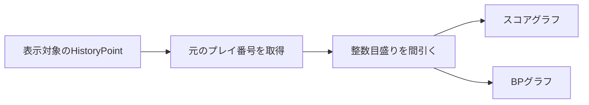

# Phase 6 履歴・グラフ：横軸の整数目盛り

2026-09-26実装。Phase 6の履歴・グラフ画面で、スコア・BP両グラフの横軸をプレイ番号として表示する。

[GraphForm](../GraphForm.cs)はScottPlotの横軸目盛りを明示的に設定し、小数の目盛りを作らない。件数が多い場合は約10区間を目安に表示を間引く。上下のグラフは同じ表示対象から目盛りを決め、BP不明の点がなくても番号の対応を保つ。履歴の番号やX軸の全履歴範囲は詰め直さない。

ソリューションのビルドでAPIの使用を確認した。実画面での目盛り間隔、高DPI表示の目視確認は未実施。
