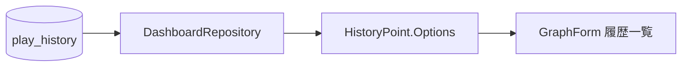

# Phase 6 履歴・グラフ：プレイオプション表示

2026-09-26実装。Phase 6の履歴・グラフ画面に対する局所的な追加であり、取込やDB定義は変更しない。

## 動作と役割

- [DashboardRepository](../Dashboard/DashboardRepository.cs)は`raw_data`、`option_style_1`、`option_style_2`を読み、譜面単位の履歴モデルへ渡す。
- [表示モデル](../Dashboard/DashboardModels.cs)は旧履歴の`raw_data.row.played_option`を優先し、Reflux履歴は`option_style_1`と`option_style_2`を` / `で連結する。値がなければ`—`とする。
- [GraphForm](../GraphForm.cs)は履歴一覧の「Options」列に表示する。元の記録は書き換えない。

`gauge_type`は使用ゲージでありクリアランプとは別の意味を持つ。`gauge_type`、`assist_type`、`range_type`、`source_system`はこの画面のオプション表示のためには取得しない。`assist_type`の表示は必要になった際の劣後対応とする。

## 検証と残課題

[BetaDisplayTests](../tests/IIDXProgressDashboard.Tests/BetaDisplayTests.cs)の合成旧DB・Reflux TSVの接合テストで、旧履歴の`RANDOM`、Refluxの`RANDOM`/`MIRROR`、値なしの`—`を確認した。実画面の目視確認と実データに含まれる全オプション値の調査は未実施。
