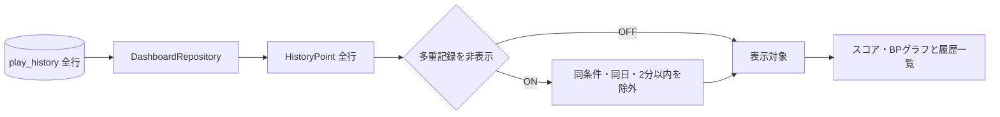

# Phase 6 履歴・グラフ：多重記録の表示フィルタ

2026-09-26実装。Phase 6の履歴・グラフ画面で、多重記録と思われる行を表示上だけ省く。保存済み履歴、DB取得SQL、集計値は変更しない。

## 判定と画面

[表示モデル](../Dashboard/DashboardModels.cs)の`DisplayValues.Visible`は、チェック時に取得済みの履歴を時刻・保存ID順で比較する。同じ譜面、OSローカル日付、ランプ、EX SCORE、BP、表示用オプションが一致し、同条件の直前の記録から2分以内なら後の行を表示対象から外す。連続する記録はその系列の最初を残す。日時以外の比較は現在の履歴表示モデルに保持される上記の項目を対象とする。

[GraphForm](../GraphForm.cs)の「多重記録された履歴を表示しない」は初期状態OFF。ON/OFFのたびに一覧と両グラフを同じ表示対象から描き直す。「ミスカウント取得不可を除外」と併用でき、多重記録判定を先に行う。元のプレイ番号を詰め直さず、横軸は全履歴の範囲を維持する。元行の削除・統合や、ベスト値の再集計は行わない。

## 検証と残課題

[BetaDisplayTests](../tests/IIDXProgressDashboard.Tests/BetaDisplayTests.cs)の合成データで、2分以内の連続記録、間に別条件が入る場合、スコア・BP・オプションの差、日付の違い、BP除外との併用、元履歴不変を確認した。関連テスト4件成功、ソリューションのビルド成功。実画面のチェック操作・実データでの目視確認は未実施。
