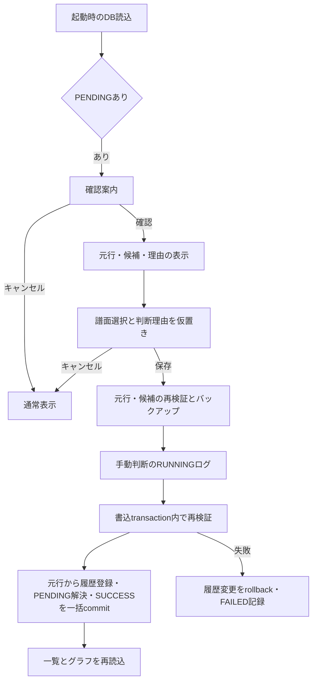

# Phase 6 Beta3：未解決履歴の手動確認・確定

2026-09-26実装。Beta3では、起動時の未解決確認と、旧履歴・Reflux Sessionの元行に対する手動譜面選択を追加した。Phase 6全体の完了ではない。

## 操作

起動時のDB読込に成功すると、PENDINGがある場合に確認を促す。確認をキャンセルすると通常画面へ進む。「未解決行を確認」ボタンから再度開ける。

1. 上段で未解決の元行を選ぶ。再試行による同一キー・同一元行の監査記録はまとめて表示する。別キーのプレイはまとめない。
2. 元データ・保存時の理由・現在の照合根拠を確認する。
3. 下段で曲名またはtagを検索する。「同じ譜面種別をすべて表示」から、元の曲名表記では検索できない曲も選べる。
4. 譜面を選択し、判断理由を入力して「選択を確定予定に追加」を押す。上段の確定予定欄で選択結果を確認できる。
5. 「確定予定を保存」で一括保存する。成功後は通常一覧と開いている履歴・グラフへ新しいsnapshotを反映する。表外の譜面は曲名検索から表示できる。

2026-09-27追加：同じ取込元ID・種別・元曲名・譜面表記の未解決プレイが複数ある場合は、「同じ取込元・曲名・譜面を一括選択」で選択中の譜面と判断理由をまとめて確定予定へ追加できる。取込元は単なる`source_system`ではなく、元行キーに保存された移行元GUID／Session GUID単位とする。対象行をそれぞれ再検証し、1件でも不正なら一括選択しない。保存前には一括対象の件数と総件数を表示して確認を求める。キャンセル時は保存を開始しない。各元行は独立したプレイとして保存し、同じ曲名・譜面であることを理由に間引かない。

画面のキャンセル・Esc・閉じる操作では、確定予定をすべて破棄する。閲覧・選択・取消はメモリー内の操作であり、履歴・状態・操作ログ・バックアップを書き込まない。保存処理中だけ閉じる操作を止め、部分保存を防ぐ。

## 設計と保存



| ファイル | 役割 |
| --- | --- |
| [Form1.cs](../Form1.cs) | 起動時案内、手動確認ボタン、保存後の表示更新 |
| [UnresolvedImportDialog.cs](../Dashboard/UnresolvedImportDialog.cs) | 元行・候補の表示、検索、判断理由、確定予定とキャンセル |
| [ManualPlayResolution.cs](../Import/ManualPlayResolution.cs) | 読取専用の調査、元行復元、保存時の再検証、監査・履歴の一括保存 |
| [LegacyInfinitasLogImporter.cs](../Import/LegacyInfinitasLogImporter.cs) / [RefluxSessionTsvImporter.cs](../Import/RefluxSessionTsvImporter.cs) | 既存の履歴INSERTを共用。元行の変換も既存Converterを利用 |
| [ManualPlayResolutionTests.cs](../tests/IIDXProgressDashboard.Tests/ManualPlayResolutionTests.cs) | 実Importer→未解決→手動選択→表示Repositoryの接合確認 |

従来の「alias整備後に再取込」に加え、今回は**元行単位の明示的な譜面選択**を追加した。曲名・tag・外部IDによる自動照合で確定しない場合も、利用者が選択した譜面へ当該元行だけを登録する。グローバルalias・将来の自動照合規則・マスターは変更しない。

SP/DP、B/N/H/A/Lは元行から確定する。選択先とのlevel・Notes矛盾は従来どおり拒否し、マスターの活動状態だけでは過去譜面を除外しない。不正な日時・スコア・ランプ等もConverterの検証を維持する。level/Notes修正や既存履歴の付替えは含めない。

元の`source_system`、`source_record_key`、`raw_data`をそのまま履歴へ保存する。同じ元行の再取込は既存Importerが重複として扱う。同じキーで最初に保存した元行と異なる競合は拒否する。選択後に対象が解決済みになった場合、または選択先のマスターが変更された場合も画面の開き直しを求める。

監査は既存`import_runs`へ`source_type=MANUAL_PLAY_RESOLUTION`として記録する。`options_json`の契約版1に、対象unresolved_id、元import_run_id、source/key、元理由、選択先譜面のsnapshot、判断理由、一括選択した元行IDを保存する。新しい履歴のimport_run_idは手動確定runを指す。対応する同一キー・同一raw_dataのPENDINGだけをRESOLVEDにし、resolved_chart_id・resolved_atを設定する。元の理由とraw_dataは保全する。DDL追加・Migration追加はない。

保存開始前の検証失敗では変更しない。バックアップ成功後にRUNNINGを確定し、別transactionで再検証・全選択の登録・解決状態・成功件数を一括確定する。途中失敗では履歴変更を戻してFAILEDを残す。処理中の強制終了ではRUNNINGが残る可能性があり、成功扱いにしない。

## 実装範囲と検証

一覧には履歴以外のPENDINGも表示するが、難易度表・外部マスター・Session全体の競合は確認用とし、確定不可の理由を表示する。これらは各Providerの受理世代・更新契約に従う処理が必要で、履歴として登録しない。IGNOREDへの変更や一括alias登録も今回の操作には含めない。

ビルド成功。既存のNuGet互換性・旧コードの警告あり。自動テストは旧履歴・Refluxの手動確定2ケースと、一括確定の対象限定1ケースを実行し成功した。合成入力から未解決行を作り、選択した譜面にスコア・ランプ・BP NULL・日時・オプションが表示Repositoryを通じて反映されることを確認した。読取・選択段階のDB無変更、Notes矛盾の拒否、重複操作と再取込の二重登録防止、元データ保全、同一元行の監査記録の解決も確認した。一括確定では同じソースGUIDの別元行2件だけを登録し、別ソースGUID・別曲名・別譜面の未解決行を残すことを確認した。

```powershell
dotnet build IIDXProgressDashboard.sln --no-restore
dotnet test tests/IIDXProgressDashboard.Tests/IIDXProgressDashboard.Tests.csproj --no-build --no-restore --filter FullyQualifiedName~ManualPlayResolutionTests
```

全数回帰テスト・実個人DBへの適用・実画面のクリック操作は未実施。表示確認は一覧・グラフで共用する表示Repository/モデルまでである。

関連：[外部ID照合](phase2-followup-external-song-id-matching.md)、[旧履歴取込](phase3-legacy-importer-explained.md)、[Reflux取込](phase4-reflux-session-importer-explained.md)、[Beta表示](phase6-beta-display.md)。
