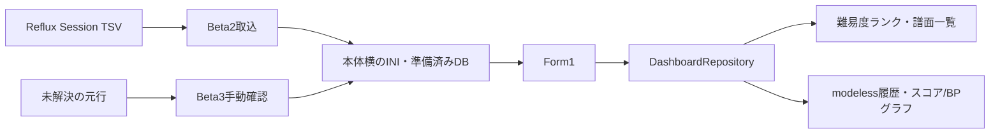

# Phase 6：表示と運用画面（Beta1～3）

対象：[Issue #38](https://github.com/xidinor/IIDXProgressDashboard/issues/38)と、各Phaseから引き継いだ運用接続。整理時点：2026-09-30、`codex/phase6-beta`の`d11abab`。現在は準備済み新形式DBを使うベータ版であり、Phase 6とv1全体の完了宣言ではない。

## 起動・表示・取込

Beta1は`Form1`から新形式DBのランク別集計、直近結果の譜面一覧、曲名検索、`chart_id`ごとの履歴・modelessグラフを表示する。[DashboardRepository](../Dashboard/DashboardRepository.cs)は最高ランプ等の集計と直近1プレイの値を分ける。一覧のランプ・スコア・BPは同じ最新履歴行から取り、直近BPがNULLなら欠損のまま示す。ランプ0の履歴ありと履歴なしは別である。通常のScore RateとDJ LEVELは現行Notesが有効なときのみ計算し、不明・0なら計算不能とする。レートの表示だけを小数点以下2桁へ丸め、DJ LEVELの境界判定は丸め前の整数比較を使う。UTC保存値はOSローカル時刻へ変換して表示し、旧履歴の分精度を実測秒数に見せない。

グラフは譜面の実履歴に1..Nの番号を付け、同時刻は安定した第二キーで整列する。BP NULLは点を作らず、前後の有効点をつなぎ、0として補わない。「ミスカウント取得不可を除外」は表示系列を切り替え、元のプレイ番号を詰めない。「多重記録された履歴を表示しない」は初期OFFで、同条件・同日・2分以内の後続行を表示上だけ省く。DB行と集計は変更しない。履歴一覧には取得できたプレイオプションを示し、横軸は整数目盛りにする。

Beta2は保存済みSession GUIDと時刻設定を使ってReflux TSVを既存Importerへ渡し、同じDBの一覧と開いているグラフを再読込する。コピー・改名先は利用者が既存Sessionを選び、別Sessionを内容一致だけで推測しない。本体横のSession設定はDBとともに保全する。配置更新では[scripts/Update-BetaPreview.ps1](../scripts/Update-BetaPreview.ps1)がDB・INI・Session設定を上書きしない。

Beta3は起動時のPENDING案内と、旧履歴・Refluxの未解決元行を確認・手動確定する画面を追加した。閲覧・選択はメモリー内に留め、キャンセルで破棄する。保存時に元行と選択譜面を再検証し、元のsource/key/raw_dataを保ったまま履歴登録・PENDING解決・`MANUAL_PLAY_RESOLUTION`監査を一括確定する。同じ移行元／Session GUID・種別・元曲名・譜面表記の元行は件数を示して一括選択できるが、各行は独立したプレイとして保存する。SP/DP・譜面種別・level/Notes矛盾、不正値、登録済み履歴の付替えは拒否する。難易度表やSession全体保留など履歴以外のPENDINGは閲覧のみ。

## 検証と残課題

Beta1～3の合成テストは表示Repositoryへの接合、直近と最高値、欠損BP、表示フィルタ、旧履歴とRefluxの再取込、手動確定と一括対象の限定を扱う。Beta2配置修復後の実アプリではランク集計・一覧を目視確認した。一方、Beta3手動確認画面の実クリック、全数回帰、個人DBでの手動確定は未実施。各変更の実行コマンド、成功件数、未再実行項目は原記録に残す。

[Issue #38](https://github.com/xidinor/IIDXProgressDashboard/issues/38)には未チェック項目が多数あるが、Beta版で実装済みでもIssueへ反映されていない項目がある。残る主な仕事は同名複数tagの判断根拠と保存済みCandidatesの扱い、マスター・旧履歴・難易度表の通常運用画面、初期設定・失敗復旧・配布検証である。[Issue #3](https://github.com/xidinor/IIDXProgressDashboard/issues/3)、[Issue #13](https://github.com/xidinor/IIDXProgressDashboard/issues/13)、[Issue #16](https://github.com/xidinor/IIDXProgressDashboard/issues/16)、[Issue #20](https://github.com/xidinor/IIDXProgressDashboard/issues/20)、[Issue #37](https://github.com/xidinor/IIDXProgressDashboard/issues/37)と照合して扱う。

## 原記録

- [Beta1表示・準備](phase6-beta-display.md)、[Beta2 Reflux接続と配置修復](phase6-beta2-reflux.md)、[Beta3手動確認と一括確定](phase6-manual-play-resolution.md)。
- [整数目盛り](phase6-history-axis.md)、[オプション表示](phase6-history-options.md)、[多重記録の表示フィルタ](phase6-history-repeated-filter.md)。
- [Issue #38](https://github.com/xidinor/IIDXProgressDashboard/issues/38)。
